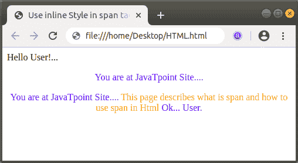
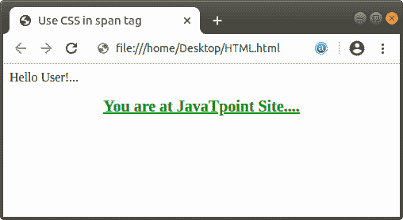

# span 在 Html 中做什么

> 原文:[https://www.javatpoint.com/what-does-span-do-in-html](https://www.javatpoint.com/what-does-span-do-in-html)

跨度是 Html 中的一个标记。Html 标签用于对内嵌元素进行分组，并将样式应用于它们。该标记通过使用类或 id 属性来应用样式。这个标签类似于 [Html < div >标签](https://www.javatpoint.com/html-div-tag)，但是它是一个内嵌标签。当没有其他语义标签存在时，使用这个标签。

**< span >** 标签是一个配对标签，即它既有打开标签也有关闭标签，所以必须关闭这个标签。

我们可以通过例子很容易地理解 [< span >标签](https://www.javatpoint.com/html-span-tag)。因此，我们将提供以下各种示例。

**示例 1:** 以下示例使用带有内嵌样式属性的 span 标记。

```

<!Doctype Html>
<Html>   
<Head>    
<Title>   
Use inline Style in span tag
</Title>
</Head>
<Body> 
Hello User!...
<center>
<p><span style = "color:blue;">
You are at JavaTpoint Site....
</span>
</p>
<p><span style = "color:blue;">
You are at JavaTpoint Site....<span style = "color:orange;"> This page describes what is span and how to use span in Html</span>
Ok... User. 
</span>
</p>
</center>
</Body> 
</Html>

```

[Test it Now](https://www.javatpoint.com/oprweb/test.jsp?filename=what-does-span-do-in-html1)

上述 Html 代码的输出如下图所示:



**示例 2:** 以下示例使用带有[内部 CSS](https://www.javatpoint.com/internal-css) 的跨度标签。

```

<!Doctype Html>
<Html>   
<Head>    
<Title>   
Use CSS in span tag
</Title>
<style type=text/css> 
span{ 
color: green; 
font-size: 20px;
text-decoration: underline; 
font-weight: bold; 
}  
</style> 
</Head>
<Body> 
Hello User!...
<center>
<p><span>
You are at JavaTpoint Site....
</span>
</p>
</center>
</Body> 
</Html>

```

[Test it Now](https://www.javatpoint.com/oprweb/test.jsp?filename=what-does-span-do-in-html2)

以上 [Html](https://www.javatpoint.com/html-tutorial) 代码的输出如下截图所示:



* * *