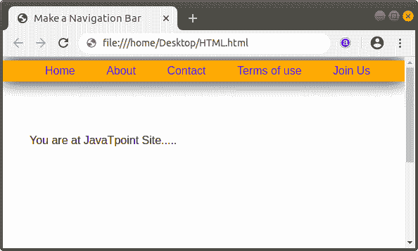

# 如何用 Html 制作导航栏

> 原文：<https://www.javatpoint.com/how-to-make-a-navigation-bar-in-html>

如果我们想用 Html 制作一个导航栏，那么我们必须遵循下面给出的步骤。使用这些步骤，我们可以轻松创建导航栏。

**第一步:**首先，我们必须在任何文本编辑器中键入 [Html](https://www.javatpoint.com/html-tutorial) 代码，或者在我们想要制作导航栏的文本编辑器中打开现有的 Html 文件。

```html

<!Doctype Html>
<Html>   
<Head>    
<Title>   
Make a Navigation Bar
</Title>
</Head>
<Body> 
</Body> 
</Html>

```

**第二步:**现在，我们要定义 [<主体>标签](https://www.javatpoint.com/html-body-tag)中的 [<导航>标签](https://www.javatpoint.com/html-nav-tag)我们要制作酒吧的地方。

```html

<Body> 
<nav>

</nav>
You are at JavaTpoint Site.....
</Body> 
</Html>

```

**第三步:**然后我们要定义 [< ul >标签](https://www.javatpoint.com/html-unordered-list)，用来展示无序列表。然后，我们必须在< li >标签中定义列表项。我们必须定义那些我们想在导航栏中显示的项目。

```html

<Body> 
<nav>
<ul>
<li>
<a href="#"> Home </a>
</li>
<li>
<a href="#"> About </a>
</li>
<li>
<a href="#"> Contact </a>
</li>
<li> <a href="#"> Terms of use </a>
</li>
<li>
<a href="#"> Join Us </a>
</li>
</ul>
</nav>
You are at JavaTpoint Site.....
</Body> 
</Html>

```

**第四步:**之后，我们要将光标放在 [<头>](https://www.javatpoint.com/html-head) 上，就在标题标签关闭之后。然后，我们要定义 [<风格>标签](https://www.javatpoint.com/html-style)。第四步:然后，我们必须在标题标签关闭后将光标放在<头>上。然后，我们要定义<样式>标签。

```html

<Head>    
<Title>   
Make a Navigation Bar
</Title>
<style type=text/css> 

</style> 
</Head>

```

**第五步:**现在，我们要指定不同的 id 属性，用来设置导航栏的位置、颜色。因此，我们必须在 head 标签中使用以下代码。我们也可以根据自己的要求改变房产的价值。

```html

<style type=text/css> 
body 
{
height: 125vh;
margin-top: 80px;
padding: 30px;
background-size: cover;
font-family: sans-serif;
}
header {
background-color: orange;
position: fixed;
left: 0;
right: 0;
top: 5px;
height: 30px;
display: flex;
align-items: center;
box-shadow: 0 0 25px 0 black;
}
header * {
display: inline;
}
header li {
margin: 20px;
}
header li a {
color: blue;
text-decoration: none;
}
</style> 

```

**第六步:**之后，我们要在打开<导航>标签之前，输入 [<标题>标签](https://www.javatpoint.com/html-header-tag)。我们还必须关闭这个标签。最后，我们必须保存 Html 文件，然后在[浏览器](https://www.javatpoint.com/browsers)中运行该文件。

```html

<!Doctype Html>
<Html>   
<Head>    
<Title>   
Make a Navigation Bar
</Title>
<style type=text/css> 
body 
{
height: 125vh;
margin-top: 80px;
padding: 30px;
background-size: cover;
font-family: sans-serif;
}
header {
background-color: orange;
position: fixed;
left: 0;
right: 0;
top: 5px;
height: 30px;
display: flex;
align-items: center;
box-shadow: 0 0 25px 0 black;
}
header * {
display: inline;
}
header li {
margin: 20px;
}
header li a {
color: blue;
text-decoration: none;
}
</style> 
</Head>
<Body> 
<header>
<nav>
<ul>
<li>
<a href="#"> Home </a>
</li>
<li>
<a href="#"> About </a>
</li>
<li>
<a href="#"> Contact </a>
</li>
<li> <a href="#"> Terms of use </a>
</li>
<li>
<a href="#"> Join Us </a>
</li>
</ul>
</nav>
</header>
You are at JavaTpoint Site.....
</Body> 
</Html>

```

[Test it Now](https://www.javatpoint.com/oprweb/test.jsp?filename=how-to-make-a-navigation-bar-in-html1)

上述 Html 代码的输出如下图所示:



* * *