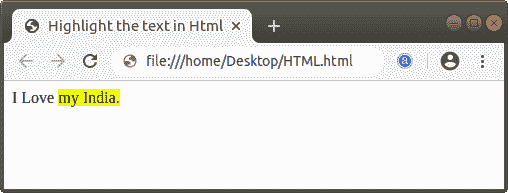
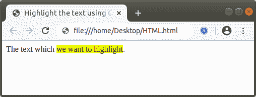

# 如何突出显示 Html 中的文本

> 原文：<https://www.javatpoint.com/how-to-highlight-text-in-html>

## 用 Html5 <mark>标记突出显示文本</mark>

如果我们想使用<mark>标记突出显示 Html 文档中的文本，那么我们必须遵循下面给出的步骤。使用这些步骤，我们可以轻松突出显示文本。</mark>

**第一步:**首先，我们必须在任何文本编辑器中键入 [Html](https://www.javatpoint.com/html-tutorial) 代码，或者在文本编辑器中打开我们想要突出显示文本的现有 Html 文件。

```

<!Doctype Html>
<Html>   
<Head>    
<Title>   
Highlight the text in Html
</Title>
</Head>
<Body> 
The text which we want to highlight.
</Body> 
</Html>

```

**第二步:**现在，我们必须将光标放在要高亮显示的文本的开始处。然后，我们必须键入开头的 [<标记>标签](https://www.javatpoint.com/html-mark-tag)。<标记>标记是一个成对的标记，所以我们必须在那个文本之后关闭这个标记，我们想要标记一个高亮。

```

I Love <mark> my India.</mark>

```

**第三步:**最后，我们要保存好这个 Html 文件，然后在[浏览器](https://www.javatpoint.com/browsers)中运行这个文件。

```

 <!Doctype Html>
<Html>   
<Head>    
<Title>   
Highlight the text in Html
</Title>
</Head>
<Body> 
I Love <mark> my India.</mark>
</Body> 
</Html>

```

[Test it Now](https://www.javatpoint.com/oprweb/test.jsp?filename=how-to-highlight-text-in-html1)

下面的截图显示了上述 Html 代码的输出:



## 使用内部 CSS 突出显示文本

如果我们想使用[内部级联样式表](https://www.javatpoint.com/internal-css)突出显示文本，那么我们必须遵循下面给出的步骤。使用这些步骤，我们可以轻松突出显示文本。

**第一步:**首先，我们必须在任何文本编辑器中键入 Html 代码，或者在文本编辑器中打开我们想要突出显示文本的现有 Html 文件。

```

<!Doctype Html>
<Html>   
<Head>    
<Title>   
Highlight the text using CSS
</Title>
</Head>
<Body> 
The text which we want to highlight.
</Body> 
</Html>

```

**第二步:**现在，我们必须将光标放在 [Html](https://www.javatpoint.com/html-tutorial) 文档标题标签之后的标题标签中，然后定义 [**<样式>** 标签](https://www.javatpoint.com/html-style)内的样式，如下图所示。然后在类中输入 [**背景色**属性](https://www.javatpoint.com/html-background-color)。

```

<Head>    
<Title>   
Highlight the text using CSS
</Title>
<style>
.class_name
{ 
background-color : yellow; 
}
</style>
</Head>

```

**第三步:**现在，我们必须使用 [< span >标签](https://www.javatpoint.com/html-span-tag)中的类来突出显示文本。

```

<span class="class_name"> the text we want to mark as highlight</span>

```

**第四步:**最后，我们要保存 Html 文件，然后在浏览器中运行该文件。

```

<!Doctype Html>
<Html>   
<Head>    
<Title>   
Highlight the text using CSS
</Title>
<style>
.highlighttext
{ 
background-color:#FFFF00; 
}
</style>
</Head>
<Body> 
The text which <span class="highlighttext"> we want to highlight</span>.
</Body> 
</Html>

```

[Test it Now](https://www.javatpoint.com/oprweb/test.jsp?filename=how-to-highlight-text-in-html2)


* * *