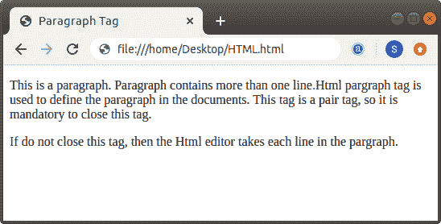
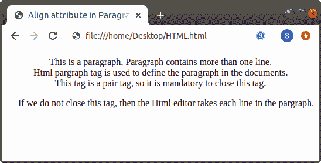

# p 在 Html 中是什么意思

> 原文:[https://www.javatpoint.com/what-does-p-mean-in-html](https://www.javatpoint.com/what-does-p-mean-in-html)

p 是 Html 中的一个标签。Html **< p >** 标签用于定义文档中的段落。 **< p >** 标签是配对标签，因此必须关闭该标签。如果我们不关闭这个标签，那么 Html 编辑器将获取段落中的每一行。

我们也可以在段落标记中使用 align 属性。**对齐**属性对齐段落内的文本。

我们可以通过例子很容易地理解 [< p >标记](https://www.javatpoint.com/html-paragraph)。因此，我们将提供以下各种示例。

**示例 1:** 本示例描述了如何在 [Html](https://www.javatpoint.com/html-tutorial) 文档中使用< p >标签。

```

<!Doctype Html>
<Html>   
<Head>    
<Title>   
Paragraph Tag
</Title>
</Head>
<Body> 
<p>This is a paragraph. Paragraph contains more than one line.Html pargraph tag is used to define the paragraph in the documents. This tag is a pair tag, so it is mandatory to close this tag. </p> If do not close this tag, then the Html editor takes each line in the pargraph. 
</Body> 
</Html>

```

[Test it Now](https://www.javatpoint.com/oprweb/test.jsp?filename=what-does-p-mean-in-html-1)

上述 Html 代码的输出如下图所示:



**示例 2:** 本示例使用了 Html 文档中段落标记中的 align 属性。

```

<!Doctype Html>
<Html>   
<Head>    
<Title>   
Align attribute in Paragraph Tag
</Title>
</Head>
<Body> 
<p align="center">This is a paragraph. Paragraph contains more than one line.<br>Html pargraph tag is used to define the paragraph in the documents.<br> This tag is a pair tag, so it is mandatory to close this tag.</p> 
<p align="right">If we do not close this tag, then the Html editor takes each line in the pargraph. </p>
</Body> 
</Html>

```

[Test it Now](https://www.javatpoint.com/oprweb/test.jsp?filename=what-does-p-mean-in-html-2)


* * *