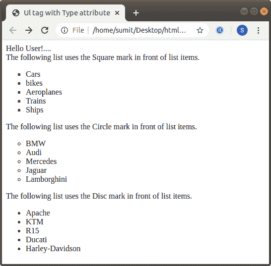
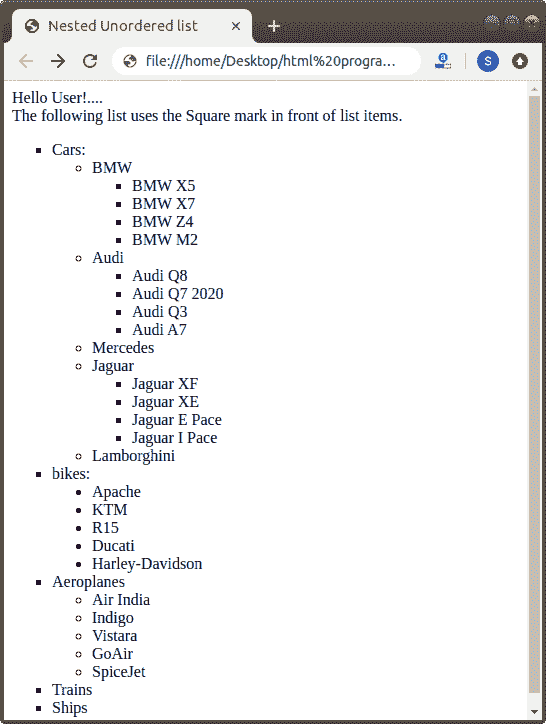

# ul 在 Html 中是什么意思

> 原文：<https://www.javatpoint.com/what-does-ul-mean-in-html>

ul 是 Html 中的一个标签。Html **< ul >** 标签用于设计物品的无序列表。 **< ul >** 标签是配对标签，因此必须关闭该标签。为了定义列表中的项目，我们必须在 **< ul >** 标签中使用 **< li >** 标签。如果我们想在 [Html](https://www.javatpoint.com/html-tutorial) 文档中创建项目的有序列表，那么我们必须使用 [**< ol >** 标记](https://www.javatpoint.com/html-ordered-list)。

该标签还使用属性**类型**，为列表项设置项目符号样式。我们可以在 type 属性中指定以下值:

*   唱片
*   圆
*   平方

我们可以通过例子很容易地理解[**<【ul】>**标签](https://www.javatpoint.com/html-unordered-list)。因此，我们将提供以下各种示例。

**示例 1:** 本示例使用不同值的类型属性。

```

<!Doctype Html>
<Html>   
<Head>    
<Title>   
Ul tag with Type attribute
</Title>
</Head>
<Body> 
Hello User!.... <br>
The following list uses the Square mark in front of list items. 
<ul type="square">
<li> Cars </li>
<li> bikes </li>
<li> Aeroplanes </li>
<li> Trains </li>
<li> Ships </li>
</ul>
The following list uses the Circle mark in front of list items. 
<ul type="Circle">
<li> BMW </li>
<li> Audi </li>
<li> Mercedes </li>
<li> Jaguar </li>
<li> Lamborghini </li>
</ul>
The following list uses the Disc mark in front of list items. 
<ul type="disc">
<li> Apache </li>
<li> KTM </li>
<li> R15 </li>
<li> Ducati </li>
<li> Harley-Davidson </li>
</ul>
</Body> 
</Html>

```

[Test it Now](https://www.javatpoint.com/oprweb/test.jsp?filename=what-does-ul-mean-in-html-1)

下面的截图显示了示例 1 的输出:



示例 2:这个示例描述了如何在 Html 中创建嵌套的无序列表:

```

<!Doctype Html>
<Html>   
<Head>    
<Title>   
Nested Unordered list
</Title>
</Head>
<Body> 
Hello User!.... <br>
The following list uses the Square mark in front of list items. 
<ul type="square">
<li> Cars: </li>
<ul type="Circle">
<li> BMW </li>
<ul type="square">
<li> BMW X5 </li>
<li> BMW X7 </li>
<li> BMW Z4 </li>
<li> BMW M2 </li>
</ul>
<li> Audi </li>
<ul type="square">
<li> Audi Q8 </li>
<li> Audi Q7 2020 </li>
<li> Audi Q3 </li>
<li> Audi A7 </li>
</ul>
<li> Mercedes </li>
<li> Jaguar </li>
<ul type="square">
<li> Jaguar XF </li>
<li> Jaguar XE </li>
<li> Jaguar E Pace </li>
<li> Jaguar I Pace </li>
</ul>
<li> Lamborghini </li>
</ul>
<li> bikes: </li>
<ul type="disc">
<li> Apache </li>
<li> KTM </li>
<li> R15 </li>
<li> Ducati </li>
<li> Harley-Davidson </li>
</ul>
<li> Aeroplanes </li>
<ul type="circle">
<li> Air India </li>
<li> Indigo</li>
<li> Vistara </li>
<li> GoAir </li>
<li> SpiceJet </li>
</ul>
<li> Trains </li>
<li> Ships </li>
</ul>
</Body> 
</Html>

```

[Test it Now](https://www.javatpoint.com/oprweb/test.jsp?filename=what-does-ul-mean-in-html-2)

下面的截图显示了示例 2 的输出:



* * *