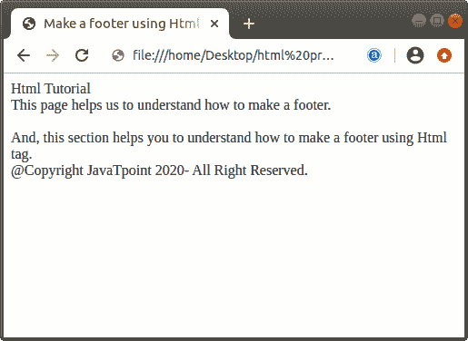
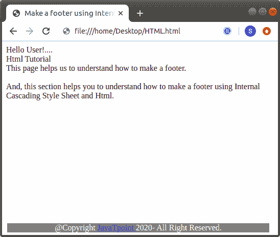

# 如何在 Html 中制作页脚

> 原文:[https://www.javatpoint.com/how-to-make-a-footer-in-html](https://www.javatpoint.com/how-to-make-a-footer-in-html)

在 HTML 中，我们可以使用以下两种不同的方法轻松地在要显示在网页上的文档中制作页脚:

1.  使用 Html 标签
2.  使用内部 CSS

## 使用 Html 标签

如果我们想使用 Html 标签在 [Html](https://www.javatpoint.com/html-tutorial) 文档中制作页脚，那么我们必须遵循下面给出的步骤。使用这些步骤，我们可以在浏览器中轻松查看网页的页脚:

**第一步:**首先，我们必须在任何文本编辑器中键入 Html 代码，或者在文本编辑器中打开现有的 Html 文件，我们希望在其中使用 Html 来制作页脚。

```

<!Doctype Html>
<Html>   
<Head>    
<Title>   
Make a footer using Html tag
</Title>
</Head>
<Body> 
Hello User!....   <br>
Html Tutorial   <br>
This page helps us to understand how to make a footer.  <br>
<br>
And, this section helps you to understand how to make a footer using Html tag.
You are at JavaTpoint Site.... 
</Body>
</Html>

```

**第二步:**现在，我们必须将光标放在要插入页脚的文本的开头。然后，在该点输入 [<页脚>标签](https://www.javatpoint.com/html-footer-tag)。

```

<footer>
The Text which we want to insert in footer.

```

**第三步:**然后我们要关闭</页脚>标签。

```

<footer>
The Text which we want to insert in footer.
</footer>

```

**第四步:**最后，我们要保存 Html 文件，然后在浏览器中运行该文件。

```

<!Doctype Html>
<Html>   
<Head>    
<Title>   
Make a footer using Html tag
</Title>
</Head>
<Body>
<header>
Html Tutorial   <br>
This page helps us to understand how to make a footer.  <br>
<br>
And, this section helps you to understand how to make a footer using Html tag.
</header>
<footer>
@Copyright JavaTpoint 2020- All Right Reserved. 
</footer>
</Body>
</Html>

```

[Test it Now](https://www.javatpoint.com/oprweb/test.jsp?filename=how-to-make-a-footer-in-html-1)

上述 Html 代码的输出如下图所示:



## 使用内部 CSS

如果我们想使用[内部级联样式表](https://www.javatpoint.com/internal-css)在 Html 文档中制作页脚，那么我们必须遵循下面给出的步骤。使用这些步骤，我们可以轻松制作出时尚的页脚:

**第一步:**首先，我们要在任何文本编辑器中键入 Html 代码，或者在文本编辑器中打开现有的 Html 文件，我们要在其中使用内部 CSS 来制作页脚。

```

<!Doctype Html>
<Html>   
<Head>    
<Title>   
Make a footer using Internal CSS and Html
</Title>
</Head>
<Body> 
Hello User!....   <br>
Html Tutorial   <br>
This page helps us to understand how to make a footer.  <br>
<br>
And, this section helps you to understand how to make a footer using Internal Cascading Style Sheet and Html.
@Copyright JavaTpoint 2020- All Right Reserved. 
</Body>
</Html>

```

**第二步:**现在，我们要将光标放在 [**头标签**](https://www.javatpoint.com/html-head) 上，就在 Html 文档中的标题标签结束之后，然后定义 [**<样式>** 标签](https://www.javatpoint.com/html-style)的开始和结束标签，如下块所示。

```

<Head>    
<Title>   
Make a footer using Internal CSS and Html
</Title>
<style>     
</style>
</Head>

```

**第三步:**现在，我们要制作一个属性不同的页脚类。

```

<style>
.classname {
position: fixed;
left: 10px;
bottom: 5px;
right: 10px; 
width: 95%;
background-color: gray;
color: white;
text-align: center;
}
</style>

```

**第四步:**然后我们要在 [< div >标签](https://www.javatpoint.com/html-div-tag)中定义同一个类，内部 CSS 中做的。

```

<div class="classname">
The Text which we want to insert in footer.
</div>

```

**第五步:**最后，我们要保存 Html 文件，然后在浏览器中运行该文件。

```

<!Doctype Html>
<Html>   
<Head>    
<Title>   
Make a footer using Internal CSS and Html
</Title>
<style>
.footer {
position: fixed;
left: 10px;
bottom: 5px;
right: 10px; 
width: 95%;
background-color: gray;
color: white;
text-align: center;
}
</style>
</Head>
<Body> 
Hello User!....   <br>
Html Tutorial   <br>
This page helps us to understand how to make a footer.  <br>
<br>
And, this section helps you to understand how to make a footer using Internal Cascading Style Sheet and Html.
<div class="footer">
@Copyright <a href=https://www.javatpoint.com/"> JavaTpoint </a> 2020- All Right Reserved. 
</div>
</Body>
</Html>

```

[Test it Now](https://www.javatpoint.com/oprweb/test.jsp?filename=how-to-make-a-footer-in-html-2)

上述 Html 代码的输出如下图所示:



* * *