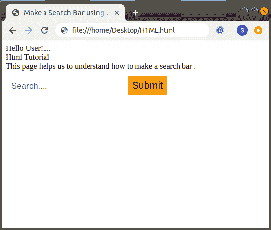

# 如何用 Html 制作搜索栏

> 原文：<https://www.javatpoint.com/how-to-make-a-search-bar-in-html>

## 使用 Html 和 CSS

如果我们想使用 Html 和[内部 CSS](https://www.javatpoint.com/internal-css) 制作搜索栏，那么我们必须遵循下面给出的步骤。使用这些步骤，我们可以在浏览器中轻松查看网页上的搜索栏:

**第一步:**首先，我们必须在任何文本编辑器中键入 [Html](https://www.javatpoint.com/html-tutorial) 代码，或者在文本编辑器中打开现有的 Html 文件，我们希望在其中使用 CSS 和 Html 代码来制作搜索栏。

```html

<!Doctype Html>
<Html>   
<Head>    
<Title>   
Make a Search Bar using Html and CSS
</Title>
</Head>
<Body> 
Hello User!....   <br>
Html Tutorial   <br>
This page helps us to understand how to make a search bar .  <br>
</Body>
</Html>

```

**第二步:**现在，我们必须将光标放在主体标签中我们想要制作搜索栏的那个点上。然后，在该点输入 [**<形成>** 标记](https://www.javatpoint.com/html-form)。

**第三步:**现在，我们要用 [**<输入>** 标签](https://www.javatpoint.com/html-input-tag)加上**类型**属性。然后，将文本值放在 type 属性中。然后，在 **<中输入>** 标签，输入**占位符**和**名称**属性。

```html

<form> 
<input type="text" placeholder=" Search...." name="search"> 

```

**第四步:**现在，我们必须使用带有**类型**属性的按钮标签。然后，将提交值放在 type 属性中。然后，我们必须关闭[</按钮>标签](https://www.javatpoint.com/html-button-tag)。而且，最后我们还要关闭**</表单>** 标签。

```html

<form> 
<input type="text" placeholder=" Search...." name="search"> 
<button type="submit">Submit</button> 
</form>

```

第五步:**然后，在<头>标签的开始和**结束之间，我们必须使用以下 CSS 代码。

```html

<style>
.searchbox {
float: left;
}
input[type=text] {
padding: 6px;
margin-top: 8px;
font-size: 17px;
border: none;
}
.searchbox button {

padding: 8px;
margin-top: 10px;
margin-left: 10px;
background: orange;
font-size: 20px;
border: none;
cursor: pointer;
}
.searchbox button:hover {
background: blue;
}
</style>

```

**第六步:**最后，我们要保存 Html 文件，然后在浏览器中运行该文件。

```html

<!Doctype Html>
<Html>   
<Head>    
<Title>   
Make a Search Bar using Html and CSS
</Title>
<style>
.searchbox {
float: left;
}
input[type=text] {
padding: 6px;
margin-top: 8px;
font-size: 17px;
border: none;
}
.searchbox button {

padding: 8px;
margin-top: 10px;
margin-left: 10px;
background: orange;
font-size: 20px;
border: none;
cursor: pointer;
}
.searchbox button:hover {
background: blue;
}
</style>
</Head>
<Body> 
Hello User!....   <br>
Html Tutorial   <br>
This page helps us to understand how to make a search bar . <br>
<div class="searchbox">
<form> 
<input type="text" placeholder=" Search...." name="search"> 
<button type="submit">Submit</button> 
</form>
</div> 
</Body>
</Html>

```

[Test it Now](https://www.javatpoint.com/oprweb/test.jsp?filename=how-to-make-a-search-bar-in-html-1)

上述 Html 代码的输出如下图所示:



* * *