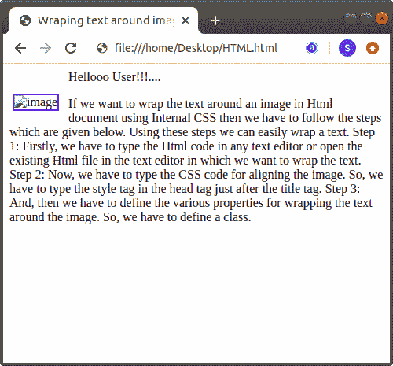

# 如何用 Html 将文本环绕在图像上

> 原文：<https://www.javatpoint.com/how-to-wrap-text-around-an-image-in-html>

## 使用内部 CSS

如果我们想使用[内部 CSS](https://www.javatpoint.com/internal-css) 将文本环绕在一个 Html 文档中的图像周围，那么我们必须遵循下面给出的步骤。使用这些步骤，我们可以轻松地换行。

**第一步:**首先，我们必须在任何文本编辑器中键入 Html 代码，或者在文本编辑器中打开现有的 [Html](https://www.javatpoint.com/html-tutorial) 文件，我们想要在其中包装文本。

```html

<!Doctype Html>
<Html>   
<Head>    
<Title>   
Wrap a text around an image
</Title>
</Head>
<Body> 
Hello User!....   <br>
Html Tutorial   <br>
This page helps us to understand how to wrap the text around an image in Html using CSS. 
</Body>
</Html>

```

**第二步:**现在，我们要输入 [CSS](https://www.javatpoint.com/css-tutorial) 代码来对齐图像。所以，我们必须在 [<头>标签](https://www.javatpoint.com/html-head)后面的 [<标题>标签](https://www.javatpoint.com/html-title)中键入[风格>标签](https://www.javatpoint.com/html-style)。

```html

<Head> 
<Title> 
Wraping text around image
</Title> 
<style> 
</style> 
</head> 

```

**第三步:**然后，我们必须定义将文本环绕在图像周围的各种属性。所以，我们必须定义一个类。

```html

.wrapingimage
{
float: left; 
margin: 30px 12px 3px 4px; 
border: 2px solid blue;
}

```

**第四步:**现在，我们必须使用 body 标签中定义的类，如下图截图所示。

```html

<div class="wrapingimage"> 
  
</div> 

```

**第五步:**最后，我们必须保存 Html 文件，然后在浏览器中运行该文件。

```html

<!DOCTYPE html> 
<Html> 
<Head> 
<Title> 
Wraping text around image
</Title> 
<style> 
.wrapingimage
{
float: left; 
margin: 30px 12px 3px 4px; 
border: 2px solid blue;
} 
</style> 
</head> 
<body> 
Hellooo User!!!....
<div class="wrapingimage"> 
  
</div> 
<p> 
If we want to wrap the text around an image in Html document using Internal CSS then we have to follow the steps which are given below. Using these steps we can easily wrap a text. 
Step 1: Firstly, we have to type the Html code in any text editor or open the existing Html file in the text editor in which we want to wrap the text. 
Step 2: Now, we have to type the CSS code for aligning the image. So, we have to type the style tag in the head tag just after the title tag. 
Step 3: And, then we have to define the various properties for wrapping the text around the image. So, we have to define a class. 
</p> 
</Body> 
</Html> 

```

[Test it Now](https://www.javatpoint.com/oprweb/test.jsp?filename=how-to-wrap-text-around-an-image-in-html-1)

上述 Html 代码的输出如下图所示:



* * *