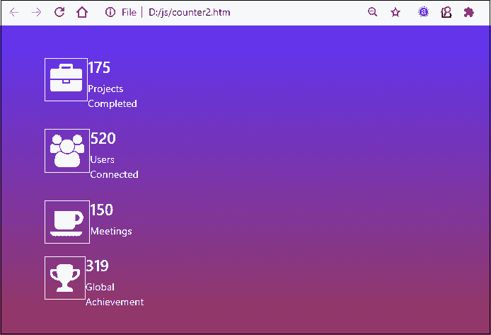

# HTML计数器

> 原文：<https://www.javatpoint.com/html-counter>

在大多数网站上，你都见过柜台区。它告诉用户业务进展如何。这个部分包含了兴趣、访问、喜欢的数量，以及更多的东西，并向访问者展示。这个计数器随着用户兴趣和访问的增加而增加。

大多数情况下，这个计数器部分被添加在网页的底部(页脚)。它包含网站的增长细节，说明你的业务增长的好坏。这个计数器随着业务的增长而增加。你大部分时间都在网站的页脚看到如下所示的 HTML 计数器。


使用 [HTML](https://www.javatpoint.com/html-tutorial) ，可以为这个计数器创建前端，并使用 JavaScript 动态实时获取和统计访客。我们将代表用户和访问者预测网站数据。

在本章中，我们将把计数器创建过程分为两个部分。在第一部分，我们将研究简单的计数器设计，在另一部分，我们将研究计数器的 CSS 设计。你会在这一章看到不同的例子。

## 创建 HTML 计数器的步骤

这里，我们有几个步骤来使用 HTML 和 [CSS](https://www.javatpoint.com/css-tutorial) 创建一个静态计数器。遵循下面给出的步骤:

**步骤 1:** 使用 [HTML < div >标签](https://www.javatpoint.com/html-div-tag) s 创建简单结构

**第二步:**加入 CSS，让柜台更有吸引力。

**第三步:**要将小图标(如行李箱、咖啡杯、Smylie、用户图标、书籍等)添加到计数器中，请使用**引导 cdn 链接并编码**。

**第四步:**关于 bootstrap cdn 代码，点击以下链接[https://www.bootstrapcdn.com/fontawesome/](https://www.bootstrapcdn.com/fontawesome/)从这里获取 Font Awesome 代码。


**第五步:**从这里复制这个**字体 Awesome CSS** 链接，粘贴到 href 参数的 [<链接>](https://www.javatpoint.com/html-link-tag) 标签里面。在 HTML 代码的 [<头>里面加上这个。](https://www.javatpoint.com/html-head)

**例如-**

```

<link rel="stylesheet" href="https://stackpath.bootstrapcdn.com/font-awesome/4.7.0/css/font-awesome.min.css">

```

**第五步:**除此之外，还需要在<主体>标签里面再添加一个代码，添加特定计数器的图标。

**第六步:**现在，要获取不同的图标，前往**字体牛逼图标**([https://fontawesome.com/v4.7.0/icons/](https://fontawesome.com/v4.7.0/icons/))。在这里，你会得到成千上万的图标，在那里选择一个你想要添加的图标，并为它们获取代码。

**比如**我们会增加一个行李箱按钮。在搜索栏图标中搜索行李箱图标并获取代码。


**第七步:**从这里复制代码，粘贴到想要添加这个图标的地方。您可以从中删除不必要的代码。


您也可以只编写下面给出的代码。

**复制行李箱图标代码:**

```

<i class="fa fa-suitcase"></i>

```

现在，看看下面添加和设计计数器部分的 HTML 和 CSS 代码。

## 创建计数器的结构

在这里，我们将使用 HTML 代码创建简单的计数器设计，分为四个部分来显示网站的四个不同统计数据。对于这个例子，我们将使用 **fontawesome** 图标来表示不同的功能。

将以下链接添加到您的代码中，以设置图标和令人敬畏的字体的样式。

**超赞字体和图标的 CDN 链接:**

```

<link rel="stylesheet" href="https://cdnjs.cloudflare.com/ajax/libs/font-awesome/4.7.0/css/font-awesome.min.css">

```

## 例子

这是一个使用简单的 HTML 设计的静态计数器的简单例子。在这个例子中，计数器的值是由 web 开发人员设置的，因此它不会改变。这些值只能从 HTML 代码中更改。

**HTML 代码示例**

```

<html> 
<head> 
    <!-- add the following awesome font to the webpage -->
	<link rel="stylesheet" href= 
"https://cdnjs.cloudflare.com/ajax/libs/font-awesome/4.7.0/css/font-awesome.min.css"> 

</head> 

<body> 
<center>
     <h1 style="color:green"> Javatpoint </h1> 
     <h3> Counter Section using HTML and CSS </h3> 
     <p> Hello, Welcome to our Website! </p>
     <p> Look at the counter section above, which basically shows the growth of the business. </p>

     <div class="row"> 
	<div class="column"> 
        <div class="block">
        	<!-- Add user icon to the counter -->
		<p><i class="fa fa-user"></i></p> 
		<h3> 65+ </h3> 
		<p> Projects </p> 
	</div> 
        </div>

	<div class="column"> 
        <div class="block">
            	<!-- Add book icon to the counter -->
		<p><i class="fa fa-book"></i></p> 
		<h3> 75k+ </h3> 
		<p> Articles </p> 
        </div>
	</div> 

	<div class="column"> 
        <div class="block">
           	<!-- Add smilie icon to the counter -->
		<p><i class="fa fa-smile-o"></i></p> 
		<h3> 150+ </h3> 
		<p> Happy Clients </p> 
        </div>
	</div> 

	<div class="column"> 
        <div class="block">
           	<!-- Add coffee cup icon to the counter -->
		<p><i class="fa fa-coffee"></i></p> 
		<h3> 100+ </h3> 
		<p> Meetings </p> 
        </div>
	</div> 
    </div> 
</center>
</body> 
</html>

```

[Test it Now](https://www.javatpoint.com/oprweb/test.jsp?filename=html-counter1)

**输出**

执行代码并在网页底部添加计数器。它将显示一个带有图标的简单计数器，如下图所示:


### CSS 代码示例

现在，我们将创建 CSS 与上面的代码一起使用来设计计数器部分的样式。该代码将有助于通过提供样式使柜台结构设计更具吸引力。

```

<style> 
	* { 
		box-sizing: border-box; 
	} 	

	.column { 
        	            /* box toward left of the window screen */
		float: left; 
        	            /*set size for each counter box */
		width: 25%; 
       		/*spacing between each box */
		padding: 4px; 
	} 

	.row { 
	            /* Specify the margin for the row class */
		margin: 3px;
	}  

	/* Style the class named block */
	.block { 
		padding: 10px; 
		text-align: center; 
		background-color: green; 
		color: white; 
		} 

	/* Provide styling for when mouse will move over the counter*/		
	.block:hover { 
		transform: scale(1.1); 
		background-color: brown; 
		transition-duration: 2s; 
		color: white; 
	} 

	.fa { 
		font-size: 50px; 
	} 
</style> 

```

### 用 CSS 完成计数器部分的代码

结合 HTML 和 CSS 代码，做一个完整的计数器部分的代码。查看在其中添加 CSS 样式后，HTML 代码将如何工作的结果。

**复制代码**

```

<html> 
<head> 
    	<!-- add the following awesome font to the webpage -->
	<link rel="stylesheet" href= 
"https://cdnjs.cloudflare.com/ajax/libs/font-awesome/4.7.0/css/font-awesome.min.css">

<style> 
	* { 
		box-sizing: border-box; 
	} 	

	.column { 
        	/* box toward left of the window screen */
		float: left; 
        	/*divide each counter box in equal size*/
        	/* 4 counters of 25% of screen size*/
		width: 25%; 
       		/*spacing between each box */
		padding: 4px; 
	} 

	.row { 
	            /* Specify the margin for the row class */
		margin: 3px;
	} 

	/* Style the class named block*/
	.block { 
		padding: 10px; 
		text-align: center; 
		background-color: green; 
		color: white; 
		} 

	/* Provide styling for when mouse will move over the counter*/	
	.block:hover { 
		transform: scale(1.1); 
		background-color: brown; 
		transition-duration: 2s; 
		color: white; 
	} 

	.fa { 
		font-size: 50px; 
	} 
	</style> 

</head> 

<body> 
<center>
     <h1 style="color:green"> Javatpoint </h1> 
     <h3> Counter Section using HTML and CSS </h3> 
     <p> Hello, Welcome to our Website! </p>
    <p> Look at the counter section above, which basically shows the growth of the business. </p>

     <div class="row"> 
	<div class="column"> 
        <div class="block">
        	<!-- Add user icon to the counter -->
		<p><i class="fa fa-user"></i></p> 
		<h3> 65+ </h3> 
		<p> Projects </p> 
	</div> 
        </div>

	<div class="column"> 
        <div class="block">
            	<!-- Add book icon to the counter -->
		<p><i class="fa fa-book"></i></p> 
		<h3> 75k+ </h3> 
		<p> Articles </p> 
        </div>
	</div> 

	<div class="column"> 
        <div class="block">
           	<!-- Add smilie icon to the counter -->
		<p><i class="fa fa-smile-o"></i></p> 
		<h3> 150+ </h3> 
		<p> Happy Clients </p> 
        </div>
	</div> 

	<div class="column"> 
        <div class="block">
           	<!-- Add coffee cup icon to the counter -->
		<p><i class="fa fa-coffee"></i></p> 
		<h3> 100+ </h3> 
		<p> Meetings </p> 
        </div>
	</div> 
    </div> 

</center>
</body> 
</html>

```

[Test it Now](https://www.javatpoint.com/oprweb/test.jsp?filename=html-counter3)

**输出**

当您将保存并在网络浏览器上执行此代码时，您将获得添加到网页的计数器。谷歌 Chrome 上面的代码响应见截图:


我们在这些计数器盒上使用了**悬停效果**。因此，当您将鼠标放在这些计数器框上时，相应框的颜色会随着过渡效果而变化。自己看效果。


#### 注意:更改屏幕大小，查看不同屏幕大小的输出。

## 示例 2: HTML 计数器

这是 HTML 计数器的另一个例子。我们现在将创建一个 HTML 计数器，它的计数器将一直到开发人员设置的数字。然而，它不是一个动态计数器。

在这个例子中，我们还将提供背景颜色，并使用 HTML 和 CSS 创建四个计数器变量，垂直显示。

### 完全码

请看下面 HTML counterUP 的完整代码:

**复制代码**

```

<html>
<head>
<title> Counter using HTML </title>

<!-- Add bootstrap cdn code link to the code -->
<link rel="stylesheet" href="https://stackpath.bootstrapcdn.com/bootstrap/4.5.2/css/bootstrap.min.css">

<!-- Add awesome font CSS link to the code -->
<link rel="stylesheet" href="https://stackpath.bootstrapcdn.com/font-awesome/4.7.0/css/font-awesome.min.css">

<script src="https://code.jquery.com/jquery-1.12.4.min.js"></script>

</head>

<style>
    * {
	margin: 0;
	padding: 0;
	box-sizing: border-box;
     }

     /* Add colors in the background */
     body {
	background-image: linear-gradient(rgba(49,0,255,0.8), rgba(132,5,29,0.8)),url(banner.jpg);
	background-size: cover;
     }
     .counter-section {
	margin: 10% auto;
	color: white;
     }
     .row {
	margin: 5px;
     }
     .col-md-3 { 
	width: 25%; 
	padding: 4px;
     } 

     /* provide styling to icons */
     .fa { 
	float: left;
	font-size: 50px; 
	padding: 8px; 
	border: 1px solid #fff;
     } 

</style>

<body>
<div class="container counter-section">
<div class="row">
<div class="col-md-3">
<i class="fa fa-briefcase"> </i>
<h4 class="counter"> 175 </h4>
<p> Projects Completed </p>
</div>
</div>

<div class="row">
<div class="col-md-3">
<i class="fa fa-users"> </i>
<h4 class="counter"> 520 </h4>
<p> Users Connected </p>
</div>
</div>

<div class="row">
<div class="col-md-3">
<i class="fa fa-coffee"> </i>
<h4 class="counter"> 150 </h4>
<p> Meetings </p>
</div>
</div>

<div class="row">
<div class="col-md-3">
<i class="fa fa-trophy"> </i>
<h4 class="counter"> 319 </h4>
<p> Global Achievement </p>
</div>
</div>

</div>

<script src="jquery.counterup.min.js"></script>
<script src="http://cdnjs.cloudflare.com/ajax/libs/waypoints/2.0.3/waypoints.min.js"></script>
<script>
jQuery(document).ready(function( $ )
{
	$('.counter').counterUp({
    	delay: 10,
   	time: 1000
	});
});
</script>
</body>
</html>

```

[Test it Now](https://www.javatpoint.com/oprweb/test.jsp?filename=html-counter4)

**输出**

执行上面的代码，得到如下截图所示的响应:



每当您运行或刷新页面时，该计数器的数值将一直上升到开发人员在代码中设置的数值。

### 解释了上述代码的步骤

这里，我们有几个步骤来使用 HTML、CSS 和添加几个 jquery 代码链接来创建一个 HTML 计数器。遵循下面给出的步骤:

**步骤 1:** 使用带有类的 HTML < div >标签创建简单的结构进行样式化。

**第二步:**加入 CSS，让柜台更有吸引力。

**第三步:**要将小图标(如行李箱、咖啡杯、Smylie、用户图标、书籍等)添加到计数器中，请使用**引导 cdn 链接并编码**。

**第四步:**关于 bootstrap cdn 代码，点击以下链接[https://www.bootstrapcdn.com/fontawesome/](https://www.bootstrapcdn.com/fontawesome/)从这里获取 Font Awesome 代码。


**第五步:**从这里复制这个**字体牛逼 CSS** 链接，粘贴到 href 参数的<链接>标签里面。在 HTML 代码的<头>里面加上这个。

**例如-**

```

<link rel="stylesheet" href="https://stackpath.bootstrapcdn.com/font-awesome/4.7.0/css/font-awesome.min.css">

```

**第五步:**除此之外，还需要在<主体>标签里面再添加一个代码，添加特定计数器的图标。

**第六步:**现在，要获取不同的图标，前往**字体牛逼图标**([https://fontawesome.com/v4.7.0/icons/](https://fontawesome.com/v4.7.0/icons/))。在这里，你会得到成千上万的图标，在那里选择一个你想要添加的图标，并为它们获取代码。

**比如**我们会增加一个行李箱按钮。在搜索栏图标中搜索行李箱图标并获取代码。


**第七步:**从这里复制代码，粘贴到想要添加这个图标的地方。您可以从中删除不必要的代码。


您也可以只编写下面给出的代码。

**复制行李箱图标代码:**

```

<i class="fa fa-suitcase"></i>

```

现在，是时候在 HTML 代码中添加一些脚本链接来弥补了。

### 向 HTML 代码添加 jquery 链接

**第八步:**点击此处**([https://code.jquery.com/](https://code.jquery.com/))获取代码。点击 JQuery 1.x 下的**缩小后的**，如下图截图所示:**

**

你会从这里得到一个密码。请从这里复制下面的代码，粘贴到标签里面的 HTML 代码中。

```

<script src="https://code.jquery.com/jquery-1.12.4.min.js"></script>

```

**第九步:**现在，**点击这里**(https://github.com/bfintal/Counter-Up)打开 github 上的 counter-up.js，从这里下载 zip 文件。


**第十步:**提取 zip 文件，从提取的文件夹中复制**query . counterup . min . js**JavaScript 文件，粘贴到你的 HTML 文件所在的文件夹中。


**第 11 步:**在 github 的同一页，向下滚动页面。您将在**用法/包含**部分获得两行脚本代码。


将此代码复制并粘贴到您的 HTML 代码中的标签内。

**复制代码**

```

<script src="http://cdnjs.cloudflare.com/ajax/libs/waypoints/2.0.3/waypoints.min.js"></script>
<script src="jquery.counterup.min.js"></script>

```

**第 12 步:**最后，复制下面的 jQuery 代码，并粘贴到上一步代码的正下方。

**复制代码**

```

jQuery(document).ready(function( $ )
{
	$('.counter').counterUp({
    	delay: 10,
   	time: 1000
	});
});

```

#### 注意:要对数字进行计数，请用该数字添加一个类。例如-

#### 150

* * ***