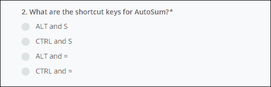

# 中级 Excel 测试

> 原文：<https://www.javatpoint.com/intermediate-excel-test>

中级电子表格测试是一种在微软电子表格中测试一个人技能的工具或软件。通常，招聘人员使用此工具来检查候选人对 Excel 的熟练程度。招聘人员在招聘过程中使用此中级 Excel 测试工具。考试的难度取决于你申请的职位。

在 excel 技能的中级阶段，用户学习 Excel 函数**在单元格上应用或复制/粘贴/拖动时如何思考**和**如何表现**。在本章中，我们将讨论您需要的每个细节。

以下主题，我们将在本章讨论:

*   [为什么选择中级 Excel 考试？](#Why-Choose)
*   [Excel 水平测试](#Levels)
*   [Excel 测试的格式](#Formats)
*   [Excel 考试在哪里准备？](#Where-to-prepare)
*   Excel 测试题示例

市场/互联网上的几个网站提供模拟备考，为面试前的考试做准备。这些测试现在变得非常普遍，因为它们是测试某人技能的有效且省时的方法。

#### 注:有些公司称中间 Excel 测试为“标准测试”，有些公司称之为“普通用户”。

## 为什么选择中级 Excel 考试？

正如我们已经告诉你的，中级 Excel 考试是招聘人员用来测试应聘者在 [MS-Excel](https://www.javatpoint.com/excel-tutorial) 中的熟练程度的工具或软件。这种测试工具目前变得越来越普遍，使用非常广泛，因为它节省了时间，提高了效率。

考试的难度取决于你申请的职位。招聘人员的主要目标是测试求职者执行基本 excel 任务的能力，如**打印、格式化单元格、插入表格**等。除此之外，他们还寻找对**相对、混合**和**绝对**的了解。

说到对 excel 的深入了解，招聘人员期待 Excel 的超前工作知识，要求具备这样的 Excel 功能:SUMIF、VLOOKUP、COUNTIF 等。

## Excel 测试的级别

通常，Excel 评估测试分为三个级别。中级 Excel 考试就是其中之一。

1.  **基础 Excel 测试**
2.  **中级 Excel 测试**
3.  **高级 Excel 测试**

这些不同考试的及格分数因公司而异。每家公司可以决定每项测试的及格分数。

本章完全基于中级 Excel 测试，但我们将向您简要介绍基本和高级 Excel 测试。

### 基本 Excel 测试

基本 Excel 测试是在很低的水平上进行的测试，不需要对 Excel 有深入的了解。该测试旨在雇佣那些真正擅长执行 Excel 最常见任务的候选人。

**角色:**这是行政或文书角色。

基本的 Excel 文本是对初级职位或行政职位的测试。

**基本测试级别的任务**

以下是在基本 Excel 测试中可能要求的基本任务:

*   了解最常见的数学函数，如总和、平均值、计数、最小值和最大值。
*   在 Excel 中创建基本图表。
*   单元格格式-对齐、阴影、边框格式、货币格式、数字格式、文本换行等。
*   除了上述所有任务之外，以多种格式保存 excel 文件。

### 中级 Excel 测试

中级 Excel 测试是在中级水平上进行的测试，不需要中级 Excel 知识。基本上，这些测试是为了更高层次的工作目的而进行的。它测试的是想在更高层次上工作的具有 excel 的候选人的能力。

**角色:**基本上这个测试是针对那些需要计算的角色。

虽然中考级别的人知识比基础好，但他们不是全面了解 Excel 功能的 Excel 专家。

**中级测试级别的任务**

以下是中级 Excel 测试中可能会询问的任务:

*   在这个层次上，您必须创建比 Basic excel 测试更复杂的公式(如 IF 和 LOOKUP)。
*   执行 Excel 中更重要的任务，如自定义图表、数据验证和使用文本字符串的操作(如 CONCATENATION)
*   以下类型的**单元格格式**要求:条件格式、打印布局、文本列、页面调整。

### 高级 Excel 测试

**高级 Excel 测试**是在更高层次上进行的测试，不需要中等的 Excel 知识。这需要对 Excel 有深入的了解。在这个层次上，候选人应该是 Excel 的专业知识。基本上，这些测试是为了更高层次的工作目的而进行的。它测试的是想在更高层次上工作的具有 excel 的候选人的能力。

**角色:**这是针对需要做数据分析的角色。

在这个 excel 测试级别，候选人将是 Excel 的专家，几乎知道关于 Excel 的每一条信息。他们可以称为 Excel 的**专家。**

**高级测试级别的任务**

以下是高级 Excel 测试中可能会询问的任务:

*   在 Excel 的这个高级级别上，至少您必须具备创建数据透视表和数据透视图的知识。
*   候选人必须知道如何建立数据库。
*   格式化功能，如锁定单元格。
*   高级 Excel 测试期望考生知道如何使用复杂版本的 IF 和 CONCATENATE 函数。

## Excel 测试的格式

通常，公司使用以下 Excel 测试格式:

1.  **选择题**
2.  **Excel 交互式电子表格**

首先，他们对候选人进行 MCQ 测试。第二个模块提供了一个内置的 Excel 交互式电子表格，用于实际实施，以检查候选人的实践知识。

### 选择题

中级 Excel 考试的第一个模块是选择题。在这一部分，将给出问题以及四个选项。候选人需要从给定的选项中选择最佳答案(正确答案)。

**例如-**

请看下面选择题的截图:

或者

可以像下面截图所示。

### Excel 交互式电子表格

中间 Excel 测试的第二个模块是 Excel 交互式电子表格。在这一部分，一个交互式电子表格将提供给候选人，他/她需要对其执行 excel 操作的地方。

这一部分将包含用户需要在这个交互式电子表格上执行的一些任务的问题。该问题可能在单个问题中包含单个或多个任务。执行并保存在电子表格上执行的每个任务，完成后提交。

## 中级 Excel 考试在哪里准备

你已经看到很多备考网站为用户准备这类考试提供了一个平台。其中，有些网站是免费使用的，有些可能是付费的。

他们提供教程、视频教程、提示和模拟测试。模拟测试从候选人身上进行，以检查用户学到了多少。模拟测试包含教程中准备的与 Excel 相关的问题。本教程的教学大纲是通过关注中级 Excel 考试而设计的。

以下是一些准备此类测试的网站参考:

*   **job prep**([https://www . job prep . com/](https://www.jobtestprep.com/)
*   **iPrep**([https://www.iprep.online/courses/excel-assessment-test/](https://www.iprep.online/courses/excel-assessment-test/))
*   **CFI**([https://corporaefinance institute . com/resources/knowledge/tests/excel-test/](https://corporatefinanceinstitute.com/resources/knowledge/tests/excel-test/))
*   **美世**([https://mettl . com/test/Microsoft-excel-技能-知识-评估/](https://mettl.com/test/microsoft-excel-skills-knowledge-assessment/) )
*   **测试穹顶**([https://www.testdome.com/tests/excel-test/132](https://www.testdome.com/tests/excel-test/132))

这里，我们有一些问题是如何出现在基础、中级和高级问题中的示例:

## 基本 Excel 测试水平问题

**例如-**

1.  按字母顺序(从 A 到 Z)对列“名称”进行排序。
2.  如何计算“费用”栏的费用总额。
3.  打开表格的过滤器。
4.  清除表中的所有数据。
5.  用黄色突出显示包含以下内容的行

## 中级 Excel 试题

**例如-**

1.  用绿色填收入高于 35000。(使用条件格式)
2.  在**全名**列(字段)下，组合名字和姓氏。(连接操作)
3.  哪个公式用于删除特定字符？
4.  哪个公式用于替换任何特定的字符或符号？
5.  冻结行的顶部

## 高级 Excel 试题

**例如-**

1.  为每个类别的总价创建一个透视表。
2.  如何防止他人在 Excel 中更改数据？
3.  怎么锁牢房？
4.  进行数据验证
5.  使用多个字段对表格进行排序。

* * *