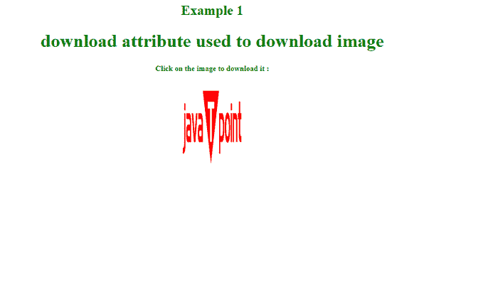
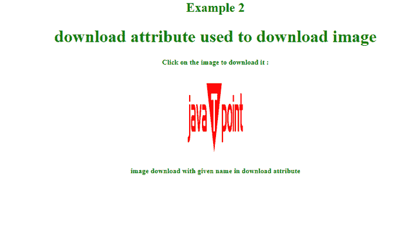
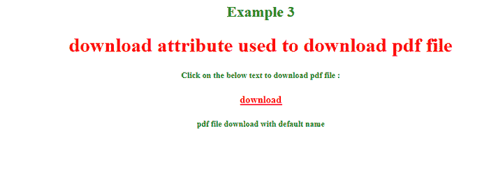
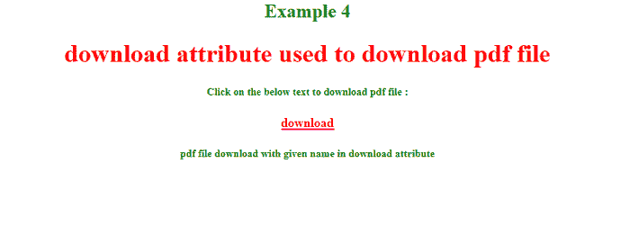
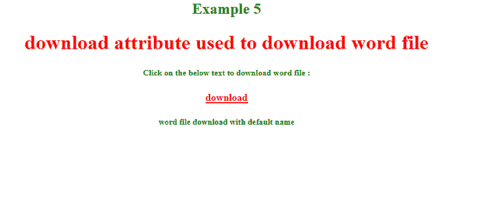
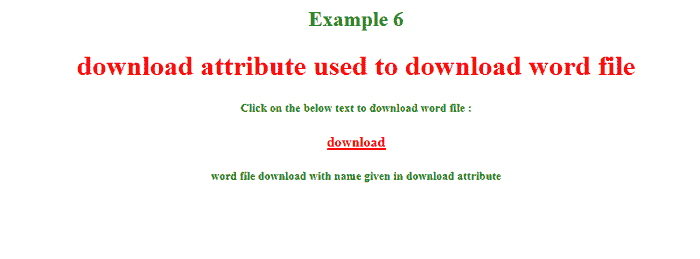

# 使用 HTML 下载 pdf 文件

> 原文：<https://www.javatpoint.com/download-pdf-file-using-html>

在本文中，我们将学习如何使用 HTML 下载 pdf 文件。为此，我们使用了一个 HTML5 

## HTML

[HTML](https://www.javatpoint.com/html-tutorial) 代表**HTML**。HTML 是最广泛使用的标记语言，为了在网页上标记内容，我们使用了各种被称为**标签**的命令。标签是直接嵌入到 HTML 文档文本中的指令。每个 HTML 标记指定了浏览器在网页上显示文本时应该使用的一些操作。 [HTML](https://www.javatpoint.com/html-full-form) 是构建和设计网页的标准语言。

## HTML5:

[HTML 5](https://www.javatpoint.com/html5-tutorial) 是 HTML 的最新版本。HTML5 于 2014 年 10 月 28 日成为 W3 标准。W3C 代表**万维网联盟**。W3C 是万维网的主要国际标准组织。

这也叫 [**主播**标签](https://www.javatpoint.com/html-anchor)。它用于在 html 中创建链接或超链接。任何东西，即文本、图像、文件，在开始的< a >标签和结束的< /a >标签之间可以是任何扩展名，成为用户可以在浏览器中点击的链接的一部分。用户可以点击开始< a >标签和结束< /a >标签之间的任何内容。您可以使用“href”属性指定要链接的页面。

### 语法:

```

<a href ="Document URL" attributes-list> Link Text </a>

```

在上面的语法中，

**<一个>** 标记用于创建链接，

**Href** 指定文档的位置，链接将指向该位置。

**html 中的链接类型:**

*   **绝对超链接**:也叫外部超链接。绝对超链接使用完整的网址，即完整的网站地址。当我们想要将我们的页面链接到网络上的任何其他网站时，我们需要提供该网页的完整网址。这种类型的地址称为绝对超链接。
    **示例:**
    <a href = " http://www . Microsoft . com "属性-列表>链接文本< /a >
*   **相对超链接**:也叫内部超链接。相对网址指向网站中的一个文件。相对链接制作页面，搜索所有链接并更改其名称。相对链接基于服务器知道链接文档的位置这一事实。
    **示例:**
    < a href ="about.html "属性-列表>链接文本< /a >

### 下载链接:

利用

您可以创建一个文本链接，使您的 PDF 或 DOC 或 ZIP 文件可下载。这非常简单，您只需要提供可下载文件的完整网址如下:

### 语法:

```

<a href ="Document URL" attributes-list download > Link Text </a>

```

在上面的语法中，

**<一个>** 标签用于创建一个链接，

**href** 指定文档的位置，链接将指向该位置。

**下载**指定属性。

您还可以为下载属性赋予可选值。下载属性的可选值将是文件下载后的新名称。如果省略该值，则使用原始文件名。以下是给下载属性赋予可选值的语法:

### 语法:

```

<a href ="Document URL" attributes-list download ="optional-value" > Link Text </a>

```

让我们举一些例子。

### 例 1:

创建一个使用<的>标签下载属性下载**图像**的例子。

```

<! DOCTYPE html>
<html>
<meta name="viewport" content="width=device-width, initial-scale=1">
<head> 
	<title> 
		Download image using <a> tag download attribute
	</title> 
<style> 
		h1 { 
			color: green;
		} 
		h5 { 
			color: green; 
		} 
		h2 { 
			color: green; 
		} 
		p {
		color: red; 
		}
</style>
</head>
<body>
<center>
<h2> Example 1 </h2>
<h1>download attribute used to download image</h1>
<h5>Click on the image to download it :</h5>
<a href="logo 2.png" download >
  
</a>
</center>
</body>
</html>

```

**说明:**

在这个例子中，我们使用了图像的相对路径。

在这一部分中，我们创建了一个图像的可下载链接，当用户点击图像时，图像将以相同的名称下载。

**输出:**



当我们点击图像时，图像将被下载，名称与上面提到的相同。

### 例 2:

```

Create an example to download image using <a> tag download attribute with given name.
<! DOCTYPE html>
<html>
<meta name="viewport" content="width=device-width, initial-scale=1">
<head> 
	<title> 
		Download image using <a> tag download attribute
	</title> 
<style> 
		h1 { 
			color: green;
		} 
		h5 { 
			color: green; 
		} 
		h2 { 
			color: green; 
		} 
		p {
		color: red; 
		}
</style>
</head>
<body>
<center>
<h2> Example 2 </h2>
<h1>download attribute used to download image </h1>
<h5>Click on the image to download it : </h5>
<a href="logo 2.png" download ="logo">
  
</a>
<h5> image download with given name in download attribute </h5>
</center>
</body>
</html>

```

**说明:**

在这个例子中，我们使用了图像的相对路径。

在这一部分，我们已经创建了一个图像的可下载链接，当我们点击图像时，图像将下载名称标志。

**输出:**



当我们点击图像时，图像将被下载，名称在下载属性中给出。

### 例 3:

创建一个使用<的>标签下载属性下载 **pdf 文件**的例子。

```

<! DOCTYPE html>
<html>
<meta name="viewport" content="width=device-width, initial-scale=1">
<head> 
	<title> 
		Download pdf file using <a> tag download attribute
	</title> 
<style> 
		h1 { 
			color: red;
		} 
		h5 { 
			color: green; 
		} 
		h2 { 
			color: green; 
		} 
		p {
		color: red; 
		}
		a {
		color: red; 
		}
</style>
</head>
<body>
<center>
<h2> Example 3 </h2>
<h1>download attribute used to download pdf file </h1>
<h5>Click on the below text to download pdf file :</h5>
<a href = "dosfiles.pdf" download >
 <b> download </b>
</a>
<h5> pdf file download with default name </h5>
</center>
</body>
</html>

```

**说明:**

在这个例子中，我们使用了 pdf 文件的相对路径。

**下载**

在这一部分中，我们创建了一个 pdf 文件的可下载链接，当我们点击 pdf 文件时，pdf 将以相同的名称下载。

**输出:**



当我们点击文本时，pdf 文件将以下载属性中给出的名称下载。

### **例 4:**

创建一个使用给定名称的<标签下载属性下载 **pdf 文件**的示例。

```

<! DOCTYPE html>
<html>
<meta name="viewport" content="width=device-width, initial-scale=1">
<head> 
	<title> 
		Download pdf file using <a> tag download attribute
	</title> 
<style> 
		h1 { 
			color: red;
		} 
		h5 { 
			color: green; 
		} 
		h2 { 
			color: green; 
		} 
		p {
		color: red; 
		}
		a {
		color: red; 
		}
</style>
</head>
<body>
<center>
<h2> Example 4 </h2>
<h1>download attribute used to download pdf file </h1>
<h5>Click on the below text to download pdf file : </h5>
<a href = "dosfiles.pdf" download = "file">
 <b> download </b>
</a>
<h5> pdf file download with given name in download attribute </h5>
</center>
</body>
</html>

```

**说明:**

在这个例子中，我们使用了 pdf 文件的相对路径。

**下载**

在这一部分中，我们已经创建了一个 pdf 文件的可下载链接，当我们点击 pdf 文件时，该 pdf 文件将以下载属性中提到的名称下载。

**输出:**



当我们点击文本时，pdf 文件将以下载属性中给出的名称下载。

### 例 5:

创建一个使用<的>标签下载属性下载**单词文件**的例子。

```

<! DOCTYPE html>
<html>
<meta name="viewport" content="width=device-width, initial-scale=1">
<head> 
	<title> 
		Download word file using <a> tag download attribute
	</title> 
<style> 
		h1 { 
			color: red;
		} 
		h5 { 
			color: green; 
		} 
		h2 { 
			color: green; 
		} 
		p {
		color: red; 
		}
		a {
		color: red; 
		}
</style>
</head>
<body>
<center>
<h2> Example 5 </h2>
<h1>download attribute used to download word file </h1>
<h5>Click on the below text to download word file :</h5>
<a href = "example.docx" >
 <b> download </b>
</a>
<h5> word file download with default name </h5>
</center>
</body>
</html>

```

**说明:**

在这个例子中，我们使用了 word 文件的相对路径。

**下载**

在这一部分中，我们创建了 **word 文件**的可下载链接，当我们点击 word 文件时，该文件将以相同的名称下载。

**输出:**



当我们点击文本时，word 文件将以默认名称下载。

### 示例 6:

创建一个使用给定名称的

```

<! DOCTYPE html>
<html>
<meta name="viewport" content="width=device-width, initial-scale=1">
<head> 
	<title> 
		Download word file using <a> tag download attribute
	</title> 
<style> 
		h1 { 
			color: red;
		} 
		h5 { 
			color: green; 
		} 
		h2 { 
			color: green; 
		} 
		p {
		color: red; 
		}
		a {
		color: red; 
		}
</style>
</head>
<body>
<center>
<h2> Example 6 </h2>
<h1>download attribute used to download word file </h1>
<h5>Click on the below text to download word file : </h5>
<a href = "example.docx" download = "file">
 <b> download </b>
</a>
<h5> word file download with name given in download attribute </h5>
</center>
</body>
</html>

```

**说明:**

在这个例子中，我们使用了 word 文件的相对路径。

**下载**

在这一部分中，我们创建了一个 **word 文件**的可下载链接，当我们点击 word 文件时，word 文件将以下载属性中提到的名称下载。

**输出:**



当我们点击文本时，word 文件将以下载属性中给出的名称下载。

* * *