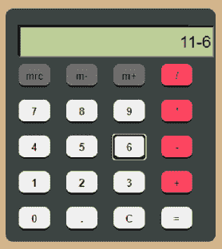
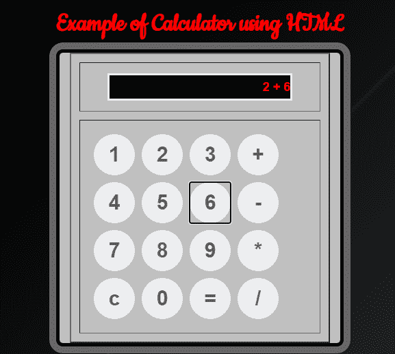
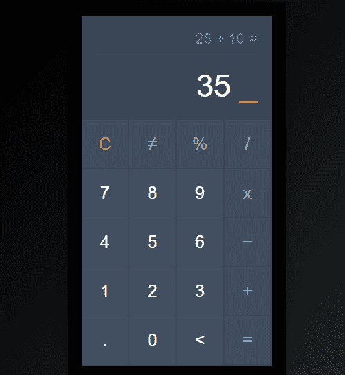
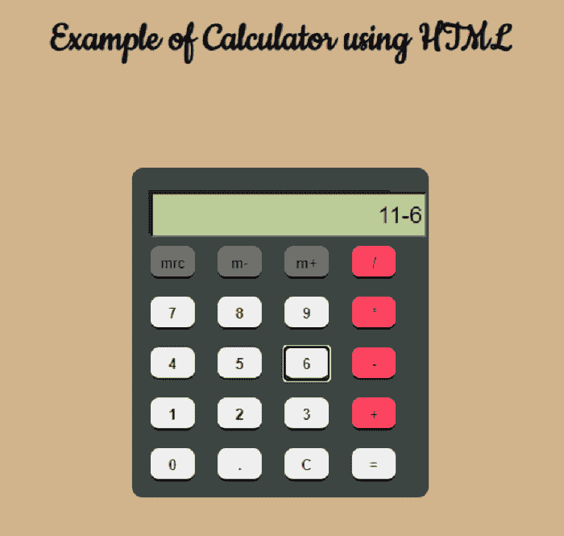

# 超文本标记语言计算器

> 原文：<https://www.javatpoint.com/html-calculator>

在本文中，我们将借助各种示例，使用 HTML 创建一个计算器。在本文的开始，我们将学习 HTML 的基本方面。之后，我们将知道如何用 HTML 创建一个基本的计算器。

## **什么是 HTML？**

超文本标记语言是设计用于在网络浏览器中显示的文档的标准标记语言。它可以与各种技术(如 CSS)和脚本语言(如 JavaScript 和 PHP)一起使用。

HTML 是基于文本的；一个 HTML 文件只需在记事本++、记事本、崇高程序等中打开就可以编辑。文本编辑器可用于创建或编辑 HTML 文件。它以. html 文件扩展名命名。

## 什么是计算器？

A **计算器**是一种能够进行各种数学计算的电子设备，如加法、乘法、减法、除法等。卡西欧公司在 1957 年开发了第一台电子计算器。它可以在电脑、智能手机和平板电脑上的各种操作系统上运行。我们可以借助各种开发工具、语言来创建一个计算器。



**我们来举几个借助 HTML 的计算器的例子。**

### 例 1:

```

<! DOCTYPE html>
<html>
	<head>
	<meta charset="utf-8">
	<title>
		 Calculator using HTML Example
	</title>
	<link href="https://fonts.googleapis.com/css2?family=Cookie&display=swap" rel="stylesheet">
	<!-- CSS property to create interactive
		calculator interface -->
	<style>
	html {
  height: 100vh;
  display: flex;
  align-items: center;
  justify-content: center;
  background-color: #2d3436;
  background-image: linear-gradient(315deg, #2d3436 0%, #000000 74%);
  font-family: 'Cookie', cursive;
}
.title {
margin-bottom: 10px;
padding: 5px 0;
font-size: 40px;
font-weight: bold;
text-align: center;
color: red;
font-family: 'Cookie', cursive;
}
input[type=button] {
  width: 60px;
  height: 60px;
  float: left;
  padding: 0;
  margin: 5px;
  box-sizing: border-box;
  background: #ecedef;
  border: none;
  font-size: 30px;
  line-height: 30px;
  border-radius: 50%;
  font-weight: 700;
  color: #5E5858;
  cursor: pointer;  
}
input[type=text] {
  width: 270px;
  height: 60px;
  float: left;
  padding: 0;
  box-sizing: border-box;
  border: none;
  background: none;
  color: red;
  text-align: right;
  font-weight: 700;
  font-size: 60px;
  line-height: 60px;
  margin: 0 25px;
  }
.calculator {
  background-color: #c0c0c0;
  box-shadow: 0px 0px 0px 10px #666;
  border: 5px solid black;
  border-radius: 10px;
}
#display {
  height: 40px;
  text-align: right;
  background-color: black;
  border: 3px solid white;
  font-size: 18px;
  left: 2px;
  top: 2px;
  color: red;
}
.btnTop {
  color: white;
  background-color: #6f6f6f;
  font-size: 14px;
  margin: auto;
  width: 50px;
  height: 25px;
}	
	</style>
</head>
<body>
	<div class = "title"  align="center">
		Example of Calculator using HTML
	</div>
	<form name="Calculator" class = "calculator" >
<table border="2" align="center" cellpadding="15" cellspacing="12" bgcolor="#c0c0c0">
<tr>
<td>
<input type="text" name="Input" Size="35" id="display">
<br>
</td>
</tr>
<tr>
<td>
<input type="button" name = "one" style="font-size:30px" value=" 1 " OnClick="Calculator.Input.value += '1'">
<input type="button" name = "two" style = "font-size:30px" value=" 2 " OnCLick="Calculator.Input.value += '2'">
<input type="button" name = "three" style="font-size:30px" value=" 3 " OnClick="Calculator.Input.value += '3'">
<input type="button" name="add" class ="btnTop" style="font-size:30px" value=" + " OnClick="Calculator.Input.value += ' + '">
<br>
<input type="button" name = "four" style="font-size:30px" value=" 4 " OnClick="Calculator.Input.value += '4'">
<input type="button" name = "five" style="font-size:30px" value=" 5 " OnCLick="Calculator.Input.value += '5'">
<input type="button" name = "six" style="font-size:30px" value=" 6 " OnClick="Calculator.Input.value += '6'">
<input type="button" name = "minus" style="font-size:30px" value=" - " OnClick="Calculator.Input.value += ' - '">
<br>
<input type="button" name = "seven" style="font-size:30px" value=" 7 " OnClick="Calculator.Input.value += '7'">
<input type="button" name = "eight" style="font-size:30px" value=" 8 " OnCLick="Calculator.Input.value += '8'">
<input type="button" name = "nine" style="font-size:30px" value=" 9 " OnClick="Calculator.Input.value += '9'">
<input type="button" name = "mul" style="font-size:30px" value=" * " 
OnClick="Calculator.Input.value += ' * '">
<br>
<input type="button" name = "clear" style="font-size:30px" value=" c " OnClick="Calculator.Input.value = ''">
<input type="button" name="zero" style="font-size:30px" value=" 0 " OnClick="Calculator.Input.value += '0'">
<input type="button" name="DoIt" style="font-size:30px" value=" = " OnClick="Calculator.Input.value = eval(Calculator.Input.value)">
<input type="button" name="div" style="font-size:30px" value=" / " OnClick="Calculator.Input.value += ' / '">
<br>
</td>

</tr>
</table>
</form>
</body>
</html>	

```

**说明:**在上面的例子中，我们借助 HTML 创建了一个基本的计算器。借助这个计算器，我们可以做一个必不可少的计算功能，如加、减、乘、除等。

**下面是这个例子的输出:**



### 例 2:

```

<! DOCTYPE html>
<html>
	<head>
	<meta charset="utf-8">
	<title>
		 Calculator using HTML Example
	</title>
	<link href="https://fonts.googleapis.com/css2?family=Cookie&display=swap" rel="stylesheet">
	<!-- CSS property to create interactive
		calculator interface -->
	<style>
		* {
  box-sizing: border-box;
  font-family: 'Roboto', sans-serif;
}
body {
  background: black;
}
.container {
  width: auto;
  margin: 20px;
  color:black;
}
.calc-body {
  width: 275px;
  margin: auto;
  min-height: 400px;
  border: solid 1px #3A4655;
  box-shadow: 0 8px 50px -7px black;
}
.calc-screen {
  background: #3A4655;
  width: 100%;
  height: 150px;
  padding: 20px;
}
.calc-operation {
  text-align: right;
  color: #727B86;
  font-size: 21px;
  padding-bottom: 10px;
  border-bottom: dotted 1px;
}
.calc-typed {
  margin-top: 20px;
  font-size: 45px;
  text-align: right;
  color: #fff;
}
.calc-button-row {
  width: 100%;
  background: #3C4857;
}
.button {
  width: 25%;
  background: #425062;
  color: #fff;
  padding: 20px;
  display: inline-block;
  font-size: 25px;
  text-align: center;
  vertical-align: middle;
  margin-right: -4px;
  border-right: solid 2px #3C4857;
  border-bottom: solid 2px #3C4857;
  transition: all 0.2s ease-in-out;
}
.button.l {
  color: #AEB3BA;
  background: #404D5E;
}
.button.c {
  color: #D95D4E;
  background: #404D5E;
}
.button:hover {
  background: #E0B612;
  transform: rotate(5deg);
}
.button.c:hover {
  background: #E0B612;
  color: #fff;
}
.button.l:hover {
  background: #E0B612;
  color: #fff;
}
.blink-me {
  color: #E0B612;
}
html {
  height: 100vh;
  display: flex;
  align-items: center;
  justify-content: center;
  background-color: #2d3436;
  background-image: linear-gradient(315deg, #2d3436 0%, #000000 74%);
  font-family: 'Cookie', cursive;
}
.title:hover {
  background: #E0B612;
  color: #fff;
}
.title {
margin-bottom: 10px;
padding: 5px 0;
font-size: 40px;
font-weight: bold;
text-align: center;
color: #AEB3BA;
font-family: 'Cookie', cursive;
}
input[type=button] {
  width: 60px;
  height: 60px;
  float: left;
  padding: 0;
  margin: 5px;
  box-sizing: border-box;
  background: #ecedef;
  border: none;
  font-size: 30px;
  line-height: 30px;
  border-radius: 50%;
  font-weight: 700;
  color: #5E5858;
  cursor: pointer;  
}
input[type=text] {
  width: 270px;
  height: 60px;
  float: left;
  padding: 0;
  box-sizing: border-box;
  border: none;
  background: none;
  color: red;
  text-align: right;
  font-weight: 700;
  font-size: 60px;
  line-height: 60px;
  margin: 0 25px;
  }
.calculator {
  background-color: #c0c0c0;
  box-shadow: 0px 0px 0px 10px #666;
  border: 5px solid black;
  border-radius: 10px;
}	
</style>
</head>
<body>
	<div class="container">
  <div class="calc-body">
    <div class="calc-screen">
      <div class="calc-operation"> 25 + 10 = </div>
      <div class="calc-typed"> 35 <span class="blink-me"> _ </span> </div>
    </div>
    <div class="calc-button-row">
      <div class="button c"> C </div>
      <div class="button l"> ? </div>
      <div class="button l"> % </div>
      <div class="button l"> / </div>
    </div>
    <div class="calc-button-row">
      <div class="button"> 7 </div>
      <div class="button"> 8 </div>
      <div class="button"> 9 </div>
      <div class="button l"> x </div>
    </div>
    <div class="calc-button-row">
      <div class="button"> 4 </div>
      <div class="button"> 5 </div>
      <div class="button"> 6 </div>
      <div class="button l"> ? </div>
    </div>
    <div class="calc-button-row">
      <div class="button"> 1 </div>
      <div class="button"> 2 </div>
      <div class="button"> 3 </div>
      <div class="button l"> + </div>
    </div>
    <div class="calc-button-row">
      <div class="button"> . </div>
      <div class="button"> 0 </div>
      <div class="button">
        < </div>
          <div class="button l"> = </div>
      </div>
    </div>
  </div>
</body>
</html>

```

**说明:**在上面的例子中，我们借助 HTML 创建了一个基本的计算器。借助这个计算器，我们可以做一个必不可少的计算功能，如加、减、乘、除等。

**下面是这个例子的输出:**



### 例 3:

```

<! DOCTYPE html>
<html>
	<head>
	<meta charset="utf-8">
	<title>
		 Calculator using HTML Example
	</title>
	<link href="https://fonts.googleapis.com/css2?family=Cookie&display=swap" rel="stylesheet">
	<!-- CSS property to create interactive
		calculator interface -->
	<style>
body  
{  
background-color: tan;  
}  
.box  
{  
background-color: #3d4543;  
height: 300px;  
width: 270px;  
border-radius: 10px;  
position: relative;  
top: 80px;  
left: 40%;  
} 
.display  
{  
background-color: #222;  
width: 220px;  
position: relative;  
left: 15px;  
top: 20px;  
height: 40px;  
}  
.display input  
{  
position: relative;  
left: 2px;  
top: 2px;  
height: 35px;  
color: black;  
background-color: #bccd95;  
font-size: 21px;  
text-align: right;  
} 
.keys  
{  
position: relative;  
top: 15px;  
}  
.button  
{  
width: 40px;  
height: 30px;  
border: none;  
border-radius: 8px;  
margin-left: 17px;  
cursor: pointer;  
border-top: 2px solid transparent;  
}  
.button.gray  
{  
color: black;
font-color: black;  
background-color: #6f6f6f;  
border-bottom: black 2px solid;  
border-top: 2px #6f6f6f solid;  
}
.title:hover {
   color: #fff;
}
.title {
margin-bottom: 10px;
margin-top: 30px;
padding: 5px 0;
font-size: 40px;
font-weight: bold;
text-align: center;
color: black;
font-family: 'Cookie', cursive;
}

.button.pink  
{  
color: black;  
background-color: #ff4561;  
border-bottom: black 2px solid;  
}  
.button.black  
{  
color: black;  
background-color: 303030;  
border-bottom: black 2px solid;  
border-top: 2px 303030 solid;  
font-weight: bold;
}  
.button.orange  
{  
color: black;  
background-color: FF9933;  
border-bottom: black 2px solid;  
border-top: 2px FF9933 solid;  
}  
.gray:active  
{  
border-top: black 2px solid;  
border-bottom: 2px #6f6f6f solid;  
}  
.pink:active  
{  
border-top:black 2px solid;  
border-bottom:#ff4561 2px solid;  
}  
.black:active  
{  
border-top: black 2px solid;  
border-bottom: #303030 2px solid;  
}  
.orange:active  
{  
border-top: black 2px solid;  
border-bottom: FF9933 2px solid;  
}  
p  
{  
line-height: 10px;  
} 
</style>
</head>
<body>
	<div class = "title? align="centre">
		Example of Calculator using HTML
	</div>
	<div class="box">  
        <div class="display">
		<input type="text" readonly size="18" id="d">
		</div>  
        <div class="keys">  
               <p> <input type="button" class="button gray" value="mrc" onclick='c("Created....................")'>
			   <input type="button" class="button gray" value="m-" onclick='c("...............by............")'>
			   <input type="button" class="button gray"  
value="m+" onclick='c(".....................Anoop")'>
<input type="button" class="button pink" value="/" onclick='v("/")'> </p>  
               <p> <input type="button" class="button black" value="7" onclick='v("7")'>
			   <input type="button" class="button black" value="8" onclick='v("8")'>
			   <input type="button" class="button black" value="9" onclick='v("9")'>
			   <input type="button" class="button pink" value="*" onclick='v("*")'> </p>  
               <p> <input type="button" class="button black" value="4" onclick='v("4")'>
			   <input type="button" class="button black" value="5" onclick='v("5")'>
			   <input type="button" class="button black" value="6" onclick='v("6")'>
<input type="button" class="button pink" value="-" onclick='v("-")'> </p>  
               <p> <input type="button" class="button black" value="1" onclick='v("1")'>
			   <input type="button" class="button black" value="2" onclick='v("2")'>
			   <input type="button" class="button black" value="3" onclick='v("3")'>
			   <input type="button" class="button pink" value="+" onclick='v("+")'> </p>  
               <p> <input type="button" class="button black" value="0" onclick='v("0")'> 
			   <input type="button" class="button black" value="." onclick='v(".")'>
			   <input type="button" class="button black" value="C" onclick='c("")'>
			   <input type="button" class="button orange" value="=" onclick='e()'> </p>  
        </div>  
</div> 
</body>
<script>
function c(val)  
{  
document.getElementById("d").value=val;  
}  
function v(val)  
{document.getElementById("d").value+=val;  
}  
function e()  
{  
try  
    {  
     c(eval(document.getElementById("d").value))  
    }  
    catch(e)  
    {  
     c('Error') }  
}
</script>
</html>

```

**说明:**在上面的例子中，我们借助 HTML 创建了一个基本的计算器。借助这个计算器，我们可以做一个必不可少的计算功能，如加、减、乘、除等。

**下面是这个例子的输出:**



* * *