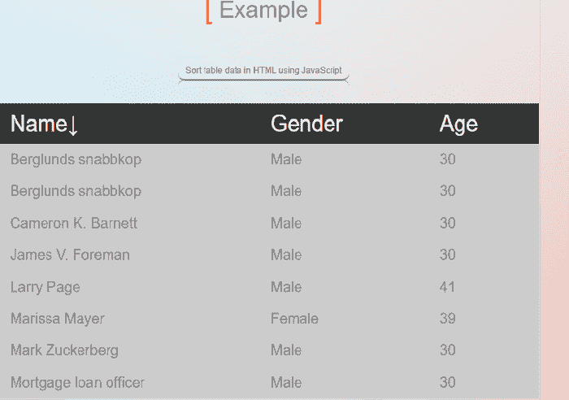
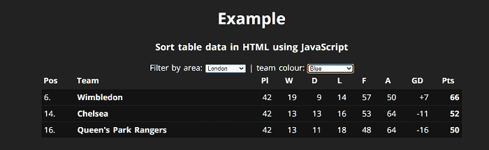

# 如何用 JavaScript 对 HTML 中的表格数据进行排序？

> 原文：<https://www.javatpoint.com/how-to-sort-table-data-in-html-using-javascript>

在本文中，我们将学习如何使用 JavaScript 对 HTML 中的表数据进行排序。我们可以按升序或降序对表数据进行排序。首先，我们将了解 JavaScript 的基本含义和元素。之后，我们将学习借助各种示例对表数据进行排序。

## 你说的 JavaScript 是什么意思？

JavaScript 是一种基于对象的高级语言，因为它可以访问网页上的各种 HTML 对象。

## 元素是什么意思？

在 HTML 中，表格是由元素创建的。在

元素中，使用标签插入行，

| Tags are used to specify the contents of cells. Each cell in the row should be assigned a tag in pairs. |

**我们举几个例子来说明如何使用 JavaScript 对表数据进行排序。**

### 例 1:

```

<! DOCTYPE html>  
 <html>  
      <head>  
	  <meta name="viewport" content="width=device-width, initial-scale=1">
           <title> Sort table data in HTML using JavaScript </title>  
      </head>  
	  <style>
body {
  background: -webkit-gradient(linear, left top, left bottom, from(lightgrey), to(transparent)), -webkit-gradient(linear, left top, right top, from(skyblue), to(transparent)), -webkit-gradient(linear, right top, left top, from(coral), to(transparent));
  background: -webkit-linear-gradient(lightgrey, transparent), -webkit-linear-gradient(left, skyblue, transparent), -webkit-linear-gradient(right, coral, transparent);
  background: -o-linear-gradient(lightgrey, transparent), -o-linear-gradient(left, skyblue, transparent), -o-linear-gradient(right, coral, transparent);
  background: linear-gradient(lightgrey, transparent), linear-gradient(90deg, skyblue, transparent), linear-gradient(-90deg, coral, transparent);
  background-blend-mode: screen;
  border-radius: 5px;
  -webkit-box-shadow: 0 1px 2px rgba(0, 0, 0, 0.3);
          box-shadow: 0 1px 2px rgba(0, 0, 0, 0.3);
  margin-top: 25px;
  margin-left: 25px;
  margin-bottom: 50px;
  min-width: 768px;
  padding-bottom: 20px;
  padding-top: 10px;
  display: inline-block;
  text-align: center;
}
h1 {
 font-size: 32px; 
margin-bottom: 50px;
}
h1.sixth {
 position: relative;
 }
h1.sixth:before {
content: '[';
	display: inline-block;
	position: relative;
	top: 1px;
	font-size: 1.25em;
	color: tomato;
	transition: all 0.5s ease;
}
h1.sixth:after {
	content: '[';
	display: inline-block;
	position: relative;
	top: 1px;
	font-size: 1.25em;
	color: tomato;
	transition: all 0.5s ease;
}
h1.sixth:after { content: ']';  }
h1.sixth:hover:before { 
	transform: translateX(-5px);
}
h1.sixth:hover:after { 
	transform: translateX(5px);
}
h3.second {
	font-weight: 800;
	font-size:30px;
}
* {
    color: #7F7F7F;
    font-family: Arial, sans-serif;
    font-size: 12px;
    font-weight: normal;
}
h3.second span {
	position: relative;
	display: inline-block;
	padding: 5px 10px ;
	border-radius: 10px;
	border-bottom: 2px solid mediumseagreen;
}
h3.second span:after {
	content: '';
	position: absolute;
	bottom: calc(-100% - 1px);
	margin-left: -10px;
	display: block;
	width: 100%; height: 100%;
	border-radius: 10px;
	border-top: 1px solid mediumseagreen;
	font-weight: bold;
}
#ceo {
border-collapse: collapse;
  width: 100%;
  border: 1px solid #ddd;
  font-size: 18px;
}
#ceo th {
  padding: 10px 30px;
  text-align: left;
}
#ceo td {
  padding: 10px 30px;
   font-size:20px;
}
#ceo th {
  background: #333;
  color: white;
  font-size:30px;
}
#ceo th.asc:after {
  display: inline;
  content: '?';
}
#ceo th.desc:after {
  display: inline;
  content: '?';
}
#ceo td {
  background: #ccc;
}
  </style>
     <body>  
	<h1 align="center" class="sixth"> Example </h3> 		   
           <h3 align="center" class="second"> <span> Sort table data in HTML using JavaScript </span> </h3>
             <table id="ceo" align="center">
    <thead>
        <tr>
            <th title="Name"> Name </th>
            <th title="Gender"> Gender </th>
            <th title="Age"> Age </th>
        </tr>
    </thead>
    <tbody>
<tr>
            <td> James V. Foreman  </td>
            <td> Male </td>
            <td> 30 </td>
        </tr>
        <tr>
            <td> Marissa Mayer </td>
            <td> Female </td>
            <td> 39 </td>
        </tr>
        <tr>
            <td> Larry Page </td>
            <td> Male </td>
            <td> 41 </td>
        </tr>
        <tr>
            <td> Mark Zuckerberg </td>
            <td> Male </td>
            <td> 30 </td>
        </tr>
	<tr>
            <td> Cameron K. Barnett </td>
            <td> Male </td>
            <td> 30 </td>
        </tr>
	<tr>
            <td> Berglunds snabbkop </td>
            <td> Male </td>
            <td> 30 </td>
        </tr>
	<tr>
            <td> Mortgage loan officer </td>
            <td> Male </td>
            <td> 30 </td>
        </tr>
     <tr>
            <td> Berglunds snabbkop </td>
            <td> Male </td>
            <td> 30 </td>
        </tr>
    </tbody>
</table>                
      </body>  
 </html>  
 <script src="https://cdnjs.cloudflare.com/ajax/libs/jquery/3.1.0/jquery.min.js"> </script>  
 <script>  
           $(function () {
  $('table')
    .on('click', 'th', function () {
      var index = $(this).index(),
          rows = [],
          thClass = $(this).hasClass('asc') ? 'desc' : 'asc';
      $('#ceo th').removeClass('asc desc');
      $(this).addClass(thClass);
      $('#ceo tbody tr').each(function (index, row) {
        rows.push($(row).detach());
      });
      rows.sort(function (a, b) {
        var aValue = $(a).find('td').eq(index).text(),
            bValue = $(b).find('td').eq(index).text();
        return aValue > bValue
             ? 1
             : aValue < bValue
             ? -1
             : 0;
      });
      if ($(this).hasClass('desc')) {
        rows.reverse();
      }
      $.each(rows, function (index, row) {
        $('#ceo tbody').append(row);
      });
    });
});
 </script>  

```

**说明:**

在上面的例子中，我们已经在 JavaScript 的帮助下创建了排序表数据。您可以按升序或降序对表数据进行排序。

**输出:**

**下面是这个例子的输出:**



### 例 2:

```

<! DOCTYPE html>
<html>
<head>
<title> Sort a HTML Table Alphabetically </title>
<style>
   @import url(https://fonts.googleapis.com/css?family=Open+Sans:400,700);
a {
  color: white;
}
body {
  background-color: #222;
  font-family: 'Open Sans', sans-serif;
  text-align: center;
  color: white;
  line-height: 1.4;
  font-size: 18px;
  word-spacing: .125em;
}
.table-wrapper {
  width: 70%;
  margin: 0 auto;
}
.floatThead-container {
  margin-top: -2px !important;
}
table {
  width: 100%;
  text-align: left;
  border-collapse: separate;
  border-spacing: 0 2px;
}
th,
td {
  padding: .25em;
  text-align: right;
}
th:hover {
  cursor: pointer
}
th {
  background-color: #222;
}
td {
  background: rgba(0, 0, 0, .2);
  border-color: rgba(0, 0, 0, .3);
  border-width: 1px 0;
  border-style: solid;
}
td:first-child {
  border-width: 1px 0 1px 1px;
}
td:last-child {
  border-width: 1px 1px 1px 0;
}
tr:nth-child(even) td {
  background: rgba(0, 0, 0, .4);
}
.league__pos,
.league__team {
  text-align: left
}
.league__team,
.league__points {
  font-weight: bold;
}

.league__champs td {
  background: rgba(5, 100, 5, .5);
}
tr.league__relegated td {
  background: rgba(100, 5, 5, .7);
}
th.headerSortDown:after {
  content: "?"
}
th.headerSortUp:after {
  content: "?"
}
</style>
</head>
<body>
<h1 align="center"> Example </h3> 		   
<h3 align="center"> <span> Sort table data in HTML using JavaScript </span> </h3>  
Filter by <label for="areaFilter"> area: </label> <select class="js-filter-drop" data-target="data-area" name="areaFilter" id="areaFilter">
 <option value="0">Any</option>
  <option value="North West">North West</option>
  <option value="North East">North East</option>
  <option value="Midlands">Midlands</option>
  <option value="London">London</option>
  <option value="South">South</option>
  <option value="Other">Other</option>
</select> | <label for="colourFilter">team colour:</label> <select class="js-filter-drop" data-target="data-colour" name="colourFilter" id="colourFilter"><option value="0">Any</option>
                  <option value="blue">Blue</option>
                  <option value="red">Red</option>
                  <option value="white">White</option>
                  <option value="yellow">Yellow</option>
                  <option value="claret">Claret & Blue</option>
                </select> 
<div class="table-wrapper">
  <table id="js-sort-table" class="league">
    <thead>
      <tr>
        <th class="league__pos">Pos</th>
        <th class="league__team">Team</th>
        <th>Pl</th>
        <th>W</th>
        <th>D</th>
        <th>L</th>
        <th>F</th>
        <th>A</th>
        <th>GD</th>
        <th>Pts</th>
      </tr>
    </thead>
    <tbody>
      <tr class="league__champs" data-colour="blue" data-area="North West">
        <td class="league__pos">1.</td>
        <td class="league__team">Everton</td>
        <td>42</td>
        <td>26</td>
        <td>8</td>
        <td>8</td>
        <td>76</td>
        <td>31</td>
        <td class="league__gd">+45</td>
        <td class="league__points">86</td>
      </tr>
      <tr data-colour="red" data-area="North West">
        <td class="league__pos">2.</td>
        <td class="league__team">Liverpool</td>
        <td>42</td>
        <td>23</td>
        <td>8</td>
        <td>11</td>
        <td>72</td>
        <td>42</td>
        <td class="league__gd">+30</td>
        <td class="league__points">77</td>
      </tr>
      <tr data-colour="white" data-area="London">
        <td class="league__pos">3.</td>
        <td class="league__team">Tottenham Hotspur</td>
        <td>42</td>
        <td>21</td>
        <td>8</td>
        <td>13</td>
        <td>68</td>
        <td>43</td>
        <td class="league__gd">+25</td>
        <td class="league__points">71</td>
      </tr>
      <tr data-colour="red" data-area="London">
        <td class="league__pos">4.</td>
        <td class="league__team">Arsenal</td>
        <td>42</td>
        <td>20</td>
        <td>10</td>
        <td>12</td>
        <td>58</td>
        <td>35</td>
        <td class="league__gd">+23</td>
        <td class="league__points">70</td>
      </tr>
      <tr data-colour="yellow" data-area="Other">
        <td class="league__pos">5.</td>
        <td class="league__team">Norwich City</td>
        <td>42</td>
        <td>17</td>
        <td>17</td>
        <td>8</td>
        <td>53</td>
        <td>51</td>
        <td class="league__gd">+2</td>
        <td class="league__points">68</td>
      </tr>
      <tr data-colour="blue" data-area="London">
        <td class="league__pos">6.</td>
        <td class="league__team">Wimbledon</td>
        <td>42</td>
        <td>19</td>
        <td>9</td>
        <td>14</td>
        <td>57</td>
        <td>50</td>
        <td class="league__gd">+7</td>
        <td class="league__points">66</td>
      </tr>
      <tr data-colour="white" data-area="London">
        <td class="league__pos">7.</td>
        <td class="league__team">Luton Town</td>
        <td>42</td>
        <td>18</td>
        <td>12</td>
        <td>12</td>
        <td>47</td>
        <td>45</td>
        <td class="league__gd">+2</td>
        <td class="league__points">66</td>
      </tr>
      <tr data-colour="red" data-area="Midlands">
        <td class="league__pos">8.</td>
        <td class="league__team">Nottingham Forest</td>
        <td>42</td>
        <td>18</td>
        <td>11</td>
        <td>13</td>
        <td>64</td>
        <td>51</td>
        <td class="league__gd">+13</td>
        <td class="league__points">65</td>
      </tr>
      <tr data-colour="yellow" data-area="London">
        <td class="league__pos">9.</td>
        <td class="league__team">Watford</td>
        <td>42</td>
        <td>18</td>
        <td>9</td>
        <td>15</td>
        <td>67</td>
        <td>54</td>
        <td class="league__gd">+13</td>
        <td class="league__points">63</td>
      </tr>
      <tr data-colour="blue" data-area="Midlands">
        <td class="league__pos">10.</td>
        <td class="league__team">Coventry City</td>
        <td>42</td>
        <td>17</td>
        <td>12</td>
        <td>13</td>
        <td>50</td>
        <td>45</td>
        <td class="league__gd">+5</td>
        <td class="league__points">63</td>
      </tr>
      <tr data-colour="red" data-area="North West">
        <td class="league__pos">11.</td>
        <td class="league__team">Manchester United</td>
        <td>42</td>
        <td>14</td>
        <td>14</td>
        <td>14</td>
        <td>52</td>
        <td>45</td>
        <td class="league__gd">+7</td>
        <td class="league__points">56</td>
      </tr>
      <tr data-colour="red" data-area="South">
        <td class="league__pos">12.</td>
        <td class="league__team">Southampton</td>
        <td>42</td>
        <td>14</td>
        <td>10</td>
        <td>18</td>
        <td>69</td>
        <td>68</td>
        <td class="league__gd">+1</td>
        <td class="league__points">52</td>
      </tr>
      <tr data-colour="blue" data-area="Midlands">
        <td class="league__pos">13.</td>
        <td class="league__team">Sheffield Wednesday</td>
        <td>42</td>
        <td>13</td>
        <td>13</td>
        <td>16</td>
        <td>58</td>
        <td>59</td>
        <td class="league__gd">-1</td>
        <td class="league__points">52</td>
      </tr>
      <tr data-colour="blue" data-area="London">
        <td class="league__pos">14.</td>
        <td class="league__team">Chelsea</td>
        <td>42</td>
        <td>13</td>
        <td>13</td>
        <td>16</td>
        <td>53</td>
        <td>64</td>
        <td class="league__gd">-11</td>
        <td class="league__points">52</td>
      </tr>
      <tr data-colour="claret" data-area="London">
        <td class="league__pos">15.</td>
        <td class="league__team">West Ham United</td>
        <td>42</td>
        <td>14</td>
        <td>10</td>
        <td>18</td>
        <td>52</td>
        <td>67</td>
        <td class="league__gd">-15</td>
        <td class="league__points">52</td>
      </tr>
      <tr data-colour="blue" data-area="London">
        <td class="league__pos">16.</td>
        <td class="league__team">Queen's Park Rangers</td>
        <td>42</td>
        <td>13</td>
        <td>11</td>
        <td>18</td>
        <td>48</td>
        <td>64</td>
        <td class="league__gd">-16</td>
        <td class="league__points">50</td>
      </tr>
      <tr data-colour="white" data-area="North East">
        <td class="league__pos">17.</td>
        <td class="league__team">Newcastle United</td>
        <td>42</td>
        <td>12</td>
        <td>11</td>
        <td>19</td>
        <td>47</td>
        <td>65</td>
        <td class="league__gd">-18</td>
        <td class="league__points">47</td>
      </tr>
      <tr data-colour="yellow" data-area="Midlands">
        <td class="league__pos">18.</td>
        <td class="league__team">Oxford United</td>
        <td>42</td>
        <td>11</td>
        <td>13</td>
        <td>18</td>
        <td>44</td>
        <td>69</td>
        <td class="league__gd">-25</td>
        <td class="league__points">46</td>
      </tr>
      <tr data-colour="red" data-area="London">
        <td class="league__pos">19.</td>
        <td class="league__team">Charlton Athletic</td>
        <td>42</td>
        <td>11</td>
        <td>11</td>
        <td>20</td>
        <td>45</td>
        <td>55</td>
        <td class="league__gd">-10</td>
        <td class="league__points">44</td>
      </tr>
      <tr class="league__relegated" data-colour="blue" data-area="Midlands">
        <td class="league__pos">20.</td>
        <td class="league__team">Leicester City</td>
        <td>42</td>
        <td>11</td>
        <td>9</td>
        <td>22</td>
        <td>54</td>
        <td>76</td>
        <td class="league__gd">-22</td>
        <td class="league__points">42</td>
      </tr>
      <tr class="league__relegated" data-colour="blue" data-area="North West">
        <td class="league__pos">21.</td>
        <td class="league__team">Manchester City</td>
        <td>42</td>
        <td>8</td>
        <td>15</td>
        <td>19</td>
        <td>36</td>
        <td>57</td>
        <td class="league__gd">-21</td>
        <td class="league__points">39</td>
      </tr>
      <tr class="league__relegated" data-colour="claret" data-area="Midlands">
        <td class="league__pos">22.</td>
        <td class="league__team">Aston Villa</td>
        <td>42</td>
        <td>8</td>
        <td>12</td>
        <td>22</td>
        <td>45</td>
        <td>79</td>
        <td class="league__gd">-34</td>
        <td class="league__points">36</td>
      </tr>
    </tbody>
  </table>
</div>
<script src="https://code.jquery.com/jquery-2.2.4.min.js"> </script> 
<script src="https://cdnjs.cloudflare.com/ajax/libs/jquery.tablesorter/2.28.14/js/jquery.tablesorter.min.js"> </script> 
<script src="https://www.jqueryscript.net/demo/Simple-jQuery-Dropdown-Table-Filter-Plugin-ddtf-js/ddtf.js"> </script> 
<script src="https://cdnjs.cloudflare.com/ajax/libs/floatthead/1.4.0/jquery.floatThead.min.js"> </script> 
<script type="text/javascript">
$(function() {
  $('#js-sort-table').tablesorter().floatThead();
  //$("#js-sort-table").filterTable('-', 'GD');
  $('.js-filter-drop').change(function() {
    $('#js-sort-table tbody tr').hide();
    var filters = $('.js-filter-drop').filter(function() {
      return $(this).val() != '0';
    });
    var showSelector = '#js-sort-table tbody tr';
    filters.each(function(index) {
      showSelector += '[' + $(this).data('target') + '="' + $(this).val() + '"]';
    });
    $(showSelector).show();
  });
$(".js-csv").on('click', function(event) {
   exportTableToCSV.apply(this, [$('#js-sort-table'), 'export-86-87-league.csv']);
  });
});
function exportTableToCSV($table, filename) {
  var $headers = $table.find('tr:has(th)'),
    $rows = $table.find('tr:visible:has(td)')
  , tmpColDelim = String.fromCharCode(11)
    , tmpRowDelim = String.fromCharCode(0)
    , colDelim = '","', rowDelim = '"\r\n"';
   var csv = '"';
  csv += formatRows($headers.map(grabRow));
  csv += rowDelim;
  csv += formatRows($rows.map(grabRow)) + '"';
    var csvData = 'data:application/csv;charset=utf-8,' + encodeURIComponent(csv);
  if (window.navigator.msSaveOrOpenBlob) {
    var blob = new Blob([decodeURIComponent(encodeURI(csv))], {
      type: "text/csv;charset=utf-8;"
    });
    navigator.msSaveBlob(blob, filename);
  } else {
    $(this)
      .attr({
        'download': filename,
        'href': csvData
          //,'target' : '_blank' 
      });
  }
  function formatRows(rows) {
    return rows.get().join(tmpRowDelim)
      .split(tmpRowDelim).join(rowDelim)
      .split(tmpColDelim).join(colDelim);
  }
  function grabRow(i, row) {
    var $row = $(row);
    //for some reason $cols = $row.find('td') || $row.find('th')    var $cols = $row.find('td');
    if (!$cols.length) $cols = $row.find('th');
    return $cols.map(grabCol)
      .get().join(tmpColDelim);
  }
  function grabCol(j, col) {
    var $col = $(col),
      $text = $col.text();
    return $text.replace('"', '""'); 
  }
}
</script>
</body>
</html>

```

**说明:**

在上面的例子中，我们已经在 JavaScript 的帮助下创建了排序表数据。您可以按升序或降序对表数据进行排序。

**输出:**

**下面是这个例子的输出:**



* * *