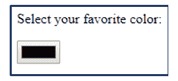

# HTML 颜色选择器

> 原文：<https://www.javatpoint.com/html-color-picker>


我们可能会遇到这样一个事实，HTML 本身只能构成我们网页或网站的骨架结构。尽管如此，它可以动态地操作每个元素。同样，颜色在 HTML 中确实扮演着重要的角色。隐含地，各种工具可以帮助我们动态地满足颜色需求，为此，我们有 HTML 颜色选择器。让我们继续了解更多。

### 什么是拾色器？

[HTML](https://www.javatpoint.com/html-tutorial) 颜色选择器主要用于选择和输入颜色。一旦提交到浏览器中，它们就会自动转换为颜色，然后将输入颜色转换为表示它的字符串。

## 如何使用？

要在 HTML 页面中添加颜色选择器，请使用 [<输入带有类型= **“颜色”的>标记**](https://www.javatpoint.com/html-input-tag)。

如果我们想在我们的 HTML 页面中添加颜色选择器，我们需要使用 **<输入>标记**并指定“颜色”作为参数。

此外，可以使用属性值分配第一个值，并且该值需要保持十六进制。这是因为 HTML 中的颜色表示为**六位**十六进制值，后跟**标签** (#)。最初的两位数字代表**红色**成分，后面两位是绿色成分。最后两个由两个蓝色部分组成。这三个分量代表了整个 RGB 颜色集。因此，格式后面是:

```

#ffoooo -> Red
#ooffoo -> Green
#ffffff -> White
# ooooff -> Blue

```

所有这些颜色可以很容易地混合，以获得更多的颜色。比如 **$#bdaa55** 给我们一个棕褐色的阴影。虽然，我们在使用 CSS 时也可能会遇到这些十六进制值，因此很难记住相同的所有颜色代码。因此，HTML 颜色选择器是一个有用的工具，通过它我们可以轻松地将颜色输入和选择到我们的 HTML 组件中，并与我们的创意模块一起执行。

考虑下面的代码，它表示拾色器如何让您使用这些十六进制数字。

```

<html>
 <head>
 </head>
 <body>
   <label for="colorpicker">Color Picker:</label>
   <input type="color" id="colorpicker" value="#0000ff">
 </body>
</html>

```

上面的例子演示了 **<输入类型= 'color' >** 标记的用法。我们已经将初始值设置为#ooooff，即蓝色。

下一个任务是学习代表**色相、饱和度、**和**明度的 HSL。**它是拾色器中的一个重要组件，可以根据您的要求调整颜色。

**色相:**取色轮上的度数，范围从 0 到 360，其中 0 为红色，120 为绿色，240 为蓝色。

**饱和度:**定义为色调的百分比值。示例 0%被认为是灰色阴影，而 100%被认为是全色。

**明度:**也是百分比定义的拾色器属性。例 0%被认为是黑色，100%被认为是白色。

考虑下面的例子来理解 HSL 的用法。

```

<html>
<style>
div {
    background-color: hsl(180, 50%, 50%);
    color: hsl(0, 0%, 100%);
    padding: 20px;
}
</style>
<body>
<div>
<p>I love learing from JavaTpoint</p>
</div> 
</body>
</html>

```

输出:


在这个例子中，很清楚上面给出的颜色的色调、饱和度和明度是如何调整的。我们使用了一些 CSS 属性，比如填充，让这个概念非常清晰。

## 创建一个 HTML 颜色选择器

在 HTML 中创建简单颜色选择器的代码如下:

```

</body>
</html>
<body>
<form action="HTMLColorPicker.html">
Select your favourite color:
<input type="color" name="favcolor" id="color">
</form>
</body>

```

在上面的 HTML 代码中，我们试图创建一个 **FORM** 元素，该元素将使用颜色类型作为输入。该输入将在标准窗口模式下创建并显示一个简单的颜色选择器。它将允许用户选择他们选择的颜色。创建的输入类型将创建默认为黑色的文本框和按钮。每当我们点击它，它就会为用户显示一个颜色选择。输出的视觉效果应该是这样的。



如果我们使用 CSS 和 JavaScript 在 HSL 方面渲染颜色，我们可以进一步使它变得巨大。同样，我们可以在构建网络应用程序或网站时选择在 HTML 中创建额外的颜色选择器。

### 摘要

在本教程中，我们学习了颜色选择器如何在 HTML 中服务，以及如何利用它提供的组件。我们遇到了 HTML 颜色选择器的一些基本原理。我们还看到了 HSL 组件如何为 HTML 颜色选择方法中使用的十六进制格式定义的原色创造奇迹。HSL 为 HTML 颜色选择器提供了一个动态颜色选择器，用户可以调整所选颜色的色调、饱和度和亮度，并用混合十六进制指定它。此外，由于不可能记住所有的十六进制代码，建议参考颜色组件的表格。但是有了这个教程，我们可以创建我们的拾色器并方便地使用它。

* * *