# 如何在 HTML 中包含图像

> 原文:[https://www.javatpoint.com/how-to-include-image-in-html](https://www.javatpoint.com/how-to-include-image-in-html)

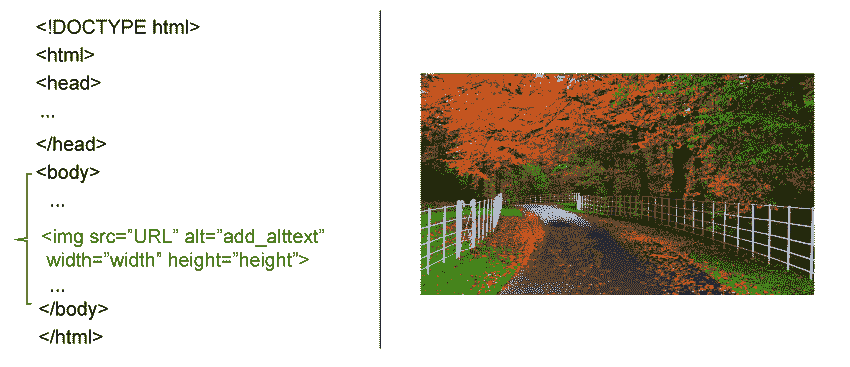

图像是一个内部部分，广泛用于以简化的方式描述任何概念。它们用于增强网页的设计和显示。page.HTML 语言提供了许多内置的标签，便于在网页中插入图像。

在本教程中，我们将学习在 [HTML](https://www.javatpoint.com/html-tutorial) 中包含图像的各种标签。

## 超文本标记语言图像语法

### 1.

从技术上讲，图像永远不会插入任何网页。相反，它们链接到各自的网页。 [HTML < img >标签](https://www.javatpoint.com/html-image)常用于在任何网页中插入图像。< img >标签通过为所选图像创建一个容纳空间来工作。默认情况下，HTML < img >标记为空，不包含任何值。它只包含不包含结束标记的属性。

标签的两个属性如下:

*   IMG src 属性-该属性定义了指定图像的路径。
*   IMG 替代属性-该属性为给定的图像提取替代文本

### 2.IMG src 属性

HTML  src 属性定义了图像的路径(URL)。

#### 注意:每当您的浏览器加载任何网页时，同时，您的浏览器有责任从网络服务器获取网页图像并将其包含到网站中。因此，HTML 程序员应该始终确保图像停留在与网页相关的同一位置。否则，您的用户将收到一个断开的链接图标，该图标会进一步显示一个文本，表明浏览器找不到图像。

**语法**

```


```

**代码:**

```

<!DOCTYPE html>
<html>
<body>
<h2>HTML  Image </h2>
<p>The  alt attribute is sued to display the specific image content, so the HTML users who cannot load the image in time can atleast get an idea of what the image include:</p>

</body>
</html>

```

**输出**

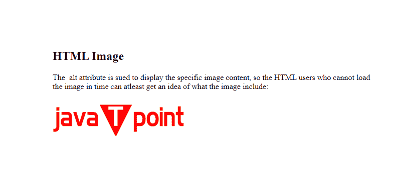

### 3.alt 属性

如果网站用户由于加载延迟、互联网连接缓慢或任何其他原因而无法查看图像，则 HTML alt 属性用于为给定图像提供替代文本。

alt 属性的内容应该是精确的，并且应该描述图像的用途。

**语法**

```


```

**代码:**

```

<!DOCTYPE html>
<html>
<body>
<h2>Alternative Image text</h2>
<p>The  alt attribute is sued to display the specific image content, so the HTML users who cannot load the image in time can atleast get an idea of what the image include:</p>

</body>
</html>

```

**输出**

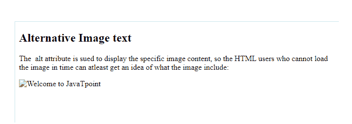

### 4.图像尺寸-宽度和高度

插入图像后，指定高度和宽度很重要，这样它就能正确地适合网页。因此，HTML 提供了样式属性来定义图像的高度和宽度。

**语法**

```


```

**代码:**

```

<!DOCTYPE html>
<html>
<body>
<h2>Image with Specified Height and Width </h2>
<p>In the following code, we have use the HTML style attribute to define the width and height of our webpage's image:</p>

</body>
</html>

```

**输出**

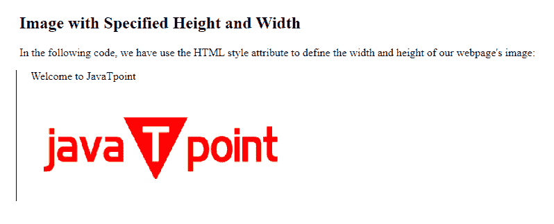

### 5.作为链接的 HTML 图像

HTML 提供了将图像用作链接的功能。为此，HTML 程序员需要使用 [HTML 里面的标签<一个>标签](https://www.javatpoint.com/html-anchor):

**语法**

```

<a href="https://www.javatpoint.com/">

</a>

```

**代码:**

```

<!DOCTYPE html>
<html>
<body>
<h2>Link an Image</h2>
<p>In the following code, we have use the HTML <a> tag to link an image.</p>
<a href="https://www.javatpoint.com/">

</a>
</body>
</html>

```

**输出**

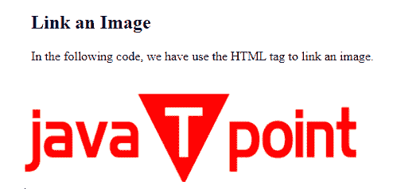

### 6.在另一个文件夹中包含图像

很多时候，用户要求在子文件夹中包含图像，在这种情况下，您必须在 src 属性中包含文件夹名称:

**语法**

```


```

**代码:**

```

<!DOCTYPE html>
<html>
<body>
<h2>Images in Another Folder</h2>
<p>We often store the main image in any sub-folder. Therefore the HTML programmer must contain the folder name as well in the HTML src attribute:</p>

</body>
</html>

```

**输出**

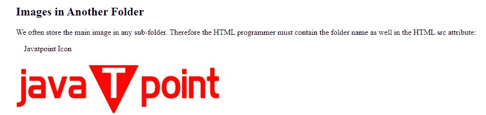

### 7.HTML 动画图像

HTML 使其用户能够在代码中嵌入运动图像或 GIF。

**语法**

```


```

**代码:**

```

<!DOCTYPE html>
<html>
<body>
<h2>Animated Images or GIF</h2>
<p>The below code enables moving images:</p>

</body>
</html>

```

**输出**

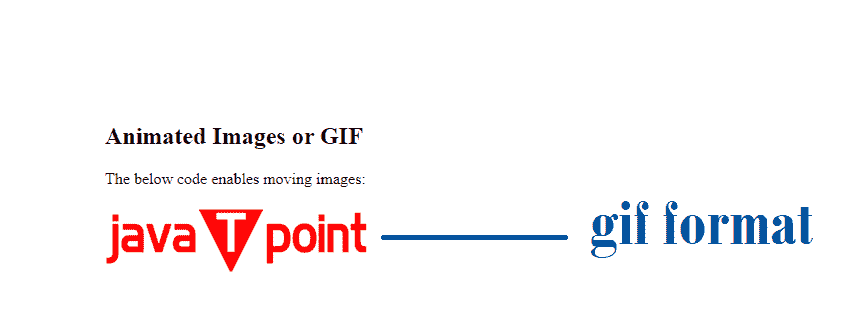

## 常用图像格式

*   。巴布亚新几内亚*   。挽救（saving 的简写）

| 图像文件格式缩写 | 完全形式 | 文件扩展名 |
| 呼吸暂停 | APNG 代表动画便携式网络图形 | .呼吸暂停 |
| GIF 格式 | GIF 代表图形交换格式 | 。可交换的图像格式 |
| 图标 | ICO 代表微软图标 | 

1.  。图标资源文件
2.  。

 |
| 巴布亚新几内亚 | 缩写巴布亚新几内亚代表便携式网络图形 |
| 挽救（saving 的简写） | SVG 的完整形式是可伸缩矢量图形 |
| 联合图像专家组 | JPEG 的完整形式是联合摄影专家组图像 | 

1.  。

2.  。

3.  。联合图象专家组
4.  。pjpeg 格式
5.  。日夫

 |

## 如何包含背景图像？

一个 HTML 程序员也可以通过使用“背景图像”属性为任何 HTML 代码指定一个背景图像。

### 1.HTML 元素上的背景图像

通过使用 HTML 样式属性和背景图像特性，HTML 程序员可以在任何 HTML 元素上实现背景图像。

**语法**

```

<div style="background-image: url('img_little_girl.jpg');">

```

**代码:**

```

<!DOCTYPE html>
<html>
<head>
<style>
div {
  background-image: url('img_girl.jpg');
}
</style>
</head>
<body>
<h2>Background Image Example</h2>
<div>
The background images can be specified<br>
<br>
for any visible element.<br>
<br>
<br>
In this code, we have applied the background image<br>
<br>
<br>
for an element named as div.<br>
<br><br><br><br>
</div>
</body>
</html>

```

**输出**

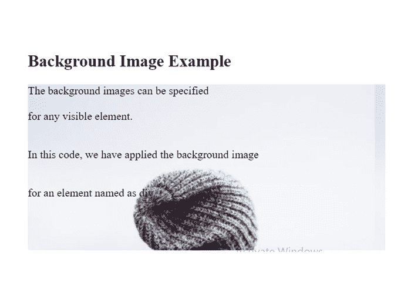

### 2.页面上的背景图像

如果 HTML 程序员想要将背景图像合并到整个页面中，他们必须使用 [HTML <主体>](https://www.javatpoint.com/html-body-tag) 元素中的背景图像:

**语法**

```

<style>
body {
  background-image: url(javatpoint_logo.jpg');
}
</style>

```

**代码:**

```

<!DOCTYPE html>
<html>
<head>
<style>
body {
  background-image: url('img_little_girl.jpg');
}
</style>
</head>
<body>
<h2>How to insert Background Image on a Page</h2>
<p>By default, HTML repeats the specified background image if the size of the image is smaller than the element where it is mentioned.</p>
</body>
</html>

```

**输出**

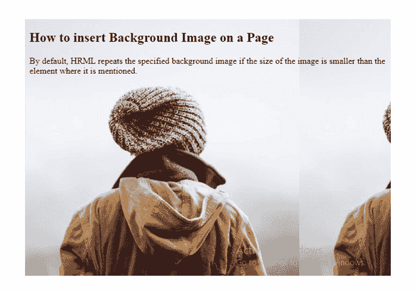

### 3.背景图像重复

如果指定的背景图像比元素小，在这种情况下，图像将自动以两种方式(水平和垂直)复制自身，除非并且直到它延伸到页面的末尾:

**语法**

```

<style>
body {
  background-image: url('example_img_girl.jpg');
}
</style>

```

**代码:**

```

<html>
<head>
<style>
body {
  background-image: url('example_img_girl.jpg');
}
</style>
</head>
<body>

<h2>Example for Background Repeat</h2>

<p>By default, the background image will repeat itself if it is smaller than the element where it is specified, in this case the body element.</p>

</body>
</html>

```

**输出**

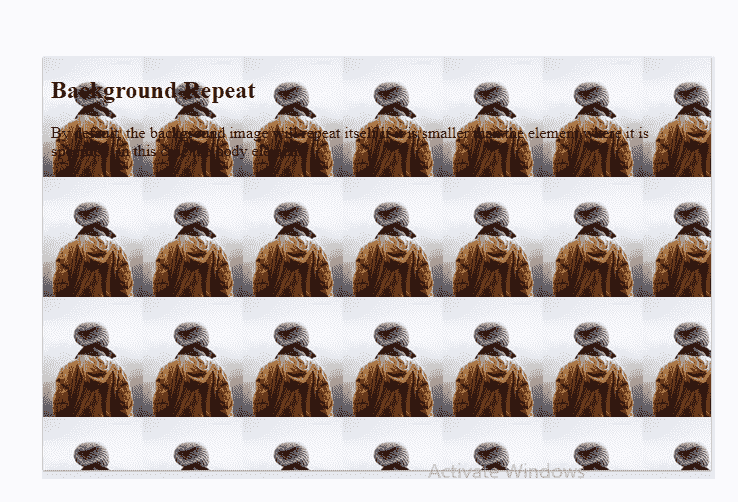

### 4.背景封面

HTML 提供了背景大小属性，帮助用户用给定的背景图像设置整个元素。此方法覆盖整个元素，而不拉伸图像，因此保留图像的原始比例。

**语法:**

```

<style>
body {
  background-image: url('example_img_girl.jpg');
  background-attachment: fixed;  
  background-repeat: no-repeat;
}
</style>

```

**代码:**

```

<html>
<head>
<style>
body {
  background-image: url('example_img_girl.jpg');
  background-attachment: fixed;  
  background-repeat: no-repeat;
  background-size: cover;
}
</style>
</head>
<body>
<h2>How  to Cover the background</h2>
<p>To enable the background cover set the background-size property to "cover" and the background image will automatically cover the entire HTML element.</p>
</body>
</html>

```

**输出**

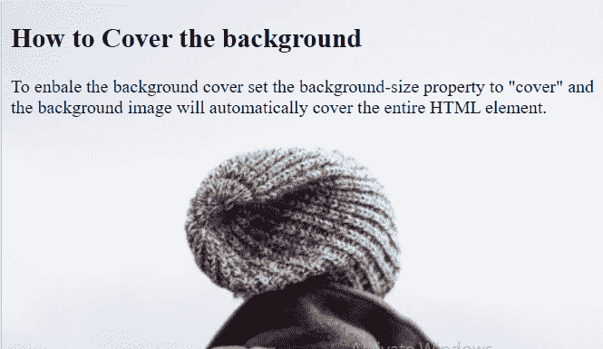

* * *