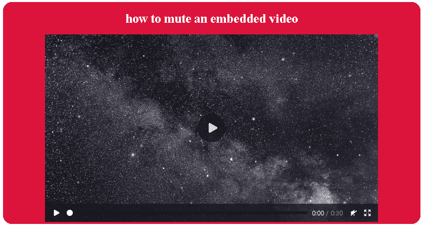

# 如何在 HTML 中静音视频？

> 原文:[https://www.javatpoint.com/how-to-mute-video-in-html](https://www.javatpoint.com/how-to-mute-video-in-html)

**<视频>标签**

HTML 5 包含一个特殊的< video >标签，可以轻松地在网页内部嵌入媒体播放器，这有助于我们支持网页文档内部的视频播放。除了视频，我们还可以播放音乐和音频。尽管如此，在 HTML 5 中， [<音频>标签](https://www.javatpoint.com/html-audio)也是一个更好的选择。

[<视频>标签](https://www.javatpoint.com/html-video)包含多个属性，可用于执行多个操作

例如

*   自动播放-一个接一个地自动开始下一个视频
*   控件-浏览器将提供对视频的控制
*   循环-一旦结束，自动开始相同的视频
*   高度-调整高度
*   宽度-调整宽度

### 有两种不同的方法可以使 HTML 中的视频静音

**步骤 1)通过使用 HTML5 中视频标签内的静音属性**

**视频>标签**的静音属性

除了上面提到的属性之外，< video >标签还包含一个名为**静音**的布尔属性，该属性指定了视频的音频输出必须静音的嵌入式媒体播放器

**语法:-**

< video controls muted >

**示例:-**

**程序显示使用静音属性**

```

<!DOCTYPE html>
<html lang="en">
<head>
  <meta charset="UTF-8">
  <meta http-equiv="X-UA-Compatible" content="IE=edge">
  <meta name="viewport" content="width=device-width, initial-scale=1.0">
      <title>muted video</title>
    <style>
      body {        
      }
      h1 {
        color: white;
      }
      p{
        color: crimson;
      }
      div{
        text-align: center;
        border: 2px solid crimson;
        border-radius: 20px;
         background-color:crimson;
      }
      video{
            border-radius:20px;
      }
    </style>
  </head>
  <body>
    <div>
    <h1>how to mute an embedded video</h1> 
    <video controls muted width="80%" height="50%">
      <source src="https://assets.mixkit.co/videos/preview/mixkit-stars-in-space-1610-large.mp4/" type="video/mp4">
     </video>
      </div>
  </body>
</html>

```

**输出**



在这个程序中，我们使用了 HTML 5 的默认视频元素，该元素分配了我们视频的源代码，并使用了静音属性，该属性将在视频屏幕下方添加一个小的静音图标，并带有其他控制选项。我们可以轻松使用静音图标在静音和非静音选项之间切换。

**步骤 2)通过使用视频 DOM 静音属性**

除了在 [HTML 5](https://www.javatpoint.com/html5-tutorial) 中使用视频标签的内置静音属性，我们还可以使用 [JavaScript](https://www.javatpoint.com/javascript-tutorial) 中的**静音**属性来执行相同的操作。我们所要做的就是声明一个变量，使用 DOM 操作将该变量链接到视频的位置，并将该变量链接到静音，并分配 true 和 false 布尔值，其中 true 表示静音，false 表示非静音

**语法:-**

视频。静音=真

**示例:-**

**用 JavaScript 编程显示静音**

```

< ! DOCTYPE html >
< html lang = " en " >
< head > 
  < meta charset = " UTF - 8 " >
  < meta http - equiv = " X - UA  -Compatible " content = " IE = edge " >
  < meta name = " viewport " content = " width = device - width , initial - scale = 1.0 " >
      < title > muted video using JavaScript < /title >
    < style >
      Button {
        Border : 0.2px solid black ;
        Border - radius : 20px ;
        Background - color : white;
        Color : crimson;
        Padding : 4px 10px;
        Margin : 0px 5px 10px 0px;
        Font - size : 13px;
              }
      div{
        border : 2px solid crimson;
        text - align : center;
         border - radius : 20px;
        background - color : crimson;
      }
      h1{
        color : white;
      }
      video{
        border - radius : 20px;
        margin : 0px 0px 10px 0px;
        }    
    < /style >
  < /head >
< body > 
  < div >
< h1 > how to mute an embedded video using Javascript < /h1 >
< button on click = " enable() " type = " button " > Mute < /button >
< button on click = " disable() " type = " button " > audio < /button >
< button on click = " check() " type = " button " > status < /button > < br > 
< video id = " myVideo " width = " 310 " height = " 176 " controls >
  < source src = " https://assets.mixkit.co/videos/preview/mixkit-stars-in-space-1610-large.mp4 /  "   type = " video / mp4 " >
  < source src = " https://assets.mixkit.co/videos/preview/mixkit-stars-in-space-1610-large.mp4/ " type = " video / ogg " >
  Your browser does not support HTML5 video.
< /video >
< /div >
< script >
var vid = document . get Element By Id ( " myVideo " );
function enable() { 
  vid . muted = true;
} 
function disable() { 
  vid . muted = false ;
} 
function check() { 
  alert ( vid . muted );
} 
< /script > 
< /body > 
< /html >

```

**输出**


在这个程序中，我们没有使用 mute 属性，而是创建了一个 JavaScript 函数来执行不同的操作，比如 mute unmute。首先，我们使用了一个**视频元素**在我们的网页上嵌入视频。我们创建了三个功能，**静音，音频**和**状态，**来使用 javascript 的点击属性分配不同的属性。我们为静音功能分配了**视频静音=真**，为音频功能分配了**视频静音=假**。最后，在第三个按钮上有一个**警报**功能

* * *