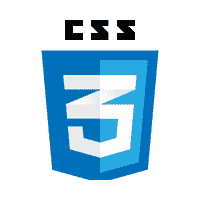

# CSS 教程

> 原文：<https://www.javatpoint.com/css-tutorial>



**CSS 教程**或 CSS 3 教程提供了 CSS 技术的基本概念和高级概念。我们的 CSS 教程是为初学者和专业人士开发的。CSS 的要点如下:

*   CSS 代表级联样式表。
*   CSS 用于设计 HTML 标签。
*   CSS 是网络上广泛使用的语言。
*   网页设计使用 HTML、CSS 和 JavaScript。它帮助网页设计师在 HTML 标签上应用风格。

## 带有 CSS 编辑器的 CSS 示例

在本教程中，您将获得大量的 CSS 示例，您可以使用我们的在线 CSS 编辑器工具编辑和运行这些示例。

```
<!DOCTYPE>
<html>
<head>
<style>
h1{
color:white;
background-color:red;
padding:5px;
}
p{
color:blue;
}
</style>
</head>
<body>
<h1>Write Your First CSS Example</h1>
<p>This is Paragraph.</p>
</body>
</html>

```

[Test it Now](https://www.javatpoint.com/oprweb/test.jsp?filename=csscss1)

输出:

## 写你的第一个 CSS 示例

这是段落。

* * *

## CSS 索引

* * *

**CSS 教程**

*   [CSS 简介](css-tutorial)
*   [什么是 CSS](what-is-css)
*   [CSS 语法](css-syntax)
*   [CSS 选择器](css-selector)
*   [如何添加 CSS](how-to-add-css)
*   内嵌 CSS
*   [内部 CSS](internal-css)
*   [外部 CSS](external-css)
*   [CSS 注释](css-comments)

**CSS 属性**

*   [CSS 背景](css-background)
*   [CSS 边框](css-border)
*   [CSS 显示](css-display)
*   [CSS 浮动](css-float)
*   CSS 字体
*   [CSS 行高](css-line-height)
*   [CSS 边距](css-margin)
*   CSS 不透明
*   [CSS 溢出](css-overflow)
*   [CSS 填充](css-padding)
*   [CSS 位置](css-position)
*   [CSS 垂直对齐](css-vertical-align)
*   [CSS 空白](css-white-space)
*   [CSS 宽度](css-width)
*   [CSS 自动换行](css-word-wrap)
*   [CSS 轮廓](css-outline)
*   [CSS 可见性](css-visibility)
*   [CSS 计数器](css-counter)

**CSS 前进**

*   CSS 动画
*   [CSS 渐变](css-gradient)
*   [CSS 转换](css-transition)
*   CSS 工具提示
*   CSS 工具提示动画
*   CSS 箭
*   CSS flex box
*   [CSS @媒体查询](css-media-query)
*   [CSS 2D 变换](css-2d-transforms)
*   [CSS 3D 变换](css-3d-transforms)
*   [CSS 听觉媒体](css-aural-media)
*   [CSS 用户界面](css-user-interface)
*   CSS 分页

**CSS 设计**

*   [CSS 布局](css-layout)
*   CSS 表

**面试问题**

*   [CSS 面试问题](css-interview-questions)

* * *

## CSS 3 教程

在本教程中，我们将学习 CSS 3 属性来设计盒子模型，应用不透明度，半径等。

* * *

## 所有 CSS 属性

在本教程中，您将获得所有 CSS 属性的详细信息，如背景、边框、字体、浮动、显示、边距、不透明度、填充、文本对齐、垂直对齐、位置、颜色等。

* * *

## 先决条件

学习 CSS 之前，必须具备 HTML 的基础知识。

## 观众

我们的 CSS 教程旨在帮助初学者和专业人士。

## 问题

如果您在我们的 CSS 教程中发现任何问题或错误，可以向我们报告。我们保证，你不会在 CSS 教程中发现任何问题。