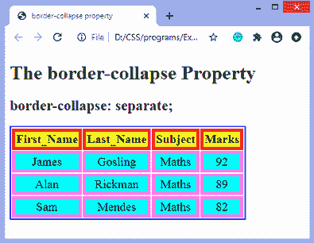
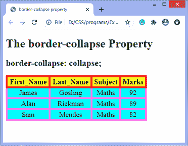

# CSS 边框折叠属性

> 原文：<https://www.javatpoint.com/css-border-collapse-property>

此 CSS 属性用于设置表格单元格的边框，并指定表格单元格是共享单独边框还是公共边框。

该属性有两个主要值，分别是**分隔**和**折叠**。当设置为值**分隔**时，可以使用**边框间距**属性定义单元格之间的距离。当**边框折叠**设置为值**折叠**时，**边框样式**属性的**插入**值表现为**凹槽**，而**开头**值表现为**脊**。

### 句法

```html

border-collapse: separate | collapse | initial | inherit;

```

这个 CSS 属性的值定义如下。

### 属性值

**分隔:**是分隔表格单元格边框的默认值。使用该值，每个单元格将显示自己的边框。

**折叠:**该值用于将边框折叠成单个边框。使用这种方法，两个相邻的表格单元格将共享一个边框。应用该值时，**边框间距**属性不影响。

**初始值:**将属性设置为默认值。

**inherit:** 它从其父元素继承属性。

现在，让我们通过一些例子来理解这个 [CSS](https://www.javatpoint.com/css-tutorial) 属性。在第一个例子中，我们使用**边界折叠**属性的**分离**值。在第二个例子中，我们使用**边框折叠**属性的**折叠**值。

### 示例-使用单独的值

有了这个值，我们可以使用**边框间距**属性来设置相邻表格单元格之间的距离。

```html

<!DOCTYPE html>
<html>

<head>
<title> border-collapse property </title>
<style>
table{
border: 2px solid blue;
text-align: center;
font-size: 20px;
width: 80%;
height: 50%;
}
th{
border: 5px solid red;
background-color: yellow;
}
td{
border: 5px solid violet;
background-color: cyan;
}
#t1 {
border-collapse: separate;
}
</style>
</head>

<body>

<h1> The border-collapse Property </h1>
<h2> border-collapse: separate; </h2>
<table id = "t1">
<tr>
<th> First_Name </th>
<th> Last_Name </th>
<th> Subject </th>
<th> Marks </th>
</tr>
<tr>
<td> James </td>
<td> Gosling </td>
<td> Maths </td>
<td> 92 </td>
</tr>
<tr>
<td> Alan </td>
<td> Rickman </td>
<td> Maths </td>
<td> 89 </td>
</tr>
<tr>
<td> Sam </td>
<td> Mendes </td>
<td> Maths </td>
<td> 82 </td>
</tr>
</table>
</body>

</html>

```

[Test it Now](https://www.javatpoint.com/oprweb/test.jsp?filename=css-border-collapse-property1)

**输出**



### 示例-使用折叠属性

**边框间距**和 [**边框半径**属性](https://www.javatpoint.com/css-border-radius-property)不能与此值一起使用。

```html

<!DOCTYPE html>
<html>

<head>
<title> border-collapse property </title>
<style>
table{
border: 2px solid blue;
text-align: center;
font-size: 20px;
width: 80%;
height: 50%;
}
th{
border: 5px solid red;
background-color: yellow;
}
td{
border: 5px solid violet;
background-color: cyan;
}
#t1{
border-collapse: collapse;
}
</style>
</head>

<body>

<h1> The border-collapse Property </h1>
<h2> border-collapse: collapse; </h2>
<table id = "t1">
<tr>
<th> First_Name </th>
<th> Last_Name </th>
<th> Subject </th>
<th> Marks </th>
</tr>
<tr>
<td> James </td>
<td> Gosling </td>
<td> Maths </td>
<td> 92 </td>
</tr>
<tr>
<td> Alan </td>
<td> Rickman </td>
<td> Maths </td>
<td> 89 </td>
</tr>
<tr>
<td> Sam </td>
<td> Mendes </td>
<td> Maths </td>
<td> 82 </td>
</tr>
</table>
</body>
</html>

```

[Test it Now](https://www.javatpoint.com/oprweb/test.jsp?filename=css-border-collapse-property2)

**输出**



* * *