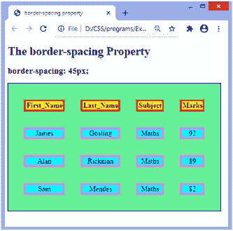
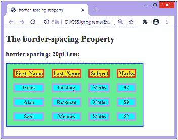

# CSS 边框间距属性

> 原文:[https://www.javatpoint.com/css-border-spacing-property](https://www.javatpoint.com/css-border-spacing-property)

此 CSS 属性用于设置表格中相邻单元格边框之间的距离。仅当**边界折叠**属性设置为**分隔**时，它才适用。如果 [**边框折叠**](https://www.javatpoint.com/css-border-collapse-property) 设置为**折叠**，则边框之间不会有任何空间。

它可以定义为一个或两个用于确定垂直和水平间距的值。

*   当只指定一个值时，它将设置水平和垂直间距。
*   当我们使用双值语法时，第一个值用于设置水平间距(即相邻列之间的间距)，第二个值用于设置垂直间距(即相邻行之间的间距)。

### 句法

```

border-spacing: length | initial | inherit;

```

### 属性值

该 [CSS](https://www.javatpoint.com/css-tutorial) 属性的值定义如下。

**长度:**该值以 px、cm、pt 等为单位设置相邻表格单元格边框之间的距离。不允许负值。

**初始值:**将属性设置为默认值。

**inherit:** 它从其父元素继承属性。

让我们通过一些例子来理解这个 CSS 属性。在第一个示例中，我们使用了**边框间距**属性的单个值，在第二个示例中，我们使用了**边框间距**属性的两个值。

### 例子

这里，我们使用的是**边框间距**属性的单一值。**边框折叠**属性设置为**分隔**，而**边框间距**的值设置为 **45px** 。

```

<!DOCTYPE html>
<html>

<head>
<title> border-spacing property </title>
<style>
table{
border: 2px solid blue;
text-align: center;
font-size: 20px;
background-color: lightgreen;
}
th{
border: 5px solid red;
background-color: yellow;
}
td{
border: 5px solid violet;
background-color: cyan;
}
#space{
border-collapse: separate;
border-spacing: 45px;
}
</style>
</head>

<body>

<h1> The border-spacing Property </h1>
<h2> border-spacing: 45px; </h2>
<table id = "space">
<tr>
<th> First_Name </th>
<th> Last_Name </th>
<th> Subject </th>
<th> Marks </th>
</tr>
<tr>
<td> James </td>
<td> Gosling </td>
<td> Maths </td>
<td> 92 </td>
</tr>
<tr>
<td> Alan </td>
<td> Rickman </td>
<td> Maths </td>
<td> 89 </td>
</tr>
<tr>
<td> Sam </td>
<td> Mendes </td>
<td> Maths </td>
<td> 82 </td>
</tr>
</table>
</body>

</html>

```

[Test it Now](https://www.javatpoint.com/oprweb/test.jsp?filename=css-border-spacing-property1)

**输出**



### 例子

这里，我们使用两个**边框间距**属性的值。**边框折叠**属性设置为**分隔**，而**边框间距**的值设置为 **20pt 1em** 。第一个值，即 **20pt** 设置水平间距，值 **1em** 设置垂直间距。

```

<!DOCTYPE html>
<html>

<head>
<title> border-spacing property </title>
<style>
table{
border: 2px solid blue;
text-align: center;
font-size: 20px;
background-color: lightgreen;
}
th{
border: 5px solid red;
background-color: yellow;
}
td{
border: 5px solid violet;
background-color: cyan;
}
#space{
border-collapse: separate;
border-spacing: 20pt 1em;
}
</style>
</head>

<body>

<h1> The border-spacing Property </h1>
<h2> border-spacing: 20pt 1em; </h2>
<table id = "space">
<tr>
<th> First_Name </th>
<th> Last_Name </th>
<th> Subject </th>
<th> Marks </th>
</tr>
<tr>
<td> James </td>
<td> Gosling </td>
<td> Maths </td>
<td> 92 </td>
</tr>
<tr>
<td> Alan </td>
<td> Rickman </td>
<td> Maths </td>
<td> 89 </td>
</tr>
<tr>
<td> Sam </td>
<td> Mendes </td>
<td> Maths </td>
<td> 82 </td>
</tr>
</table>
</body>

</html>

```

[Test it Now](https://www.javatpoint.com/oprweb/test.jsp?filename=css-border-spacing-property2)

**输出**



* * *