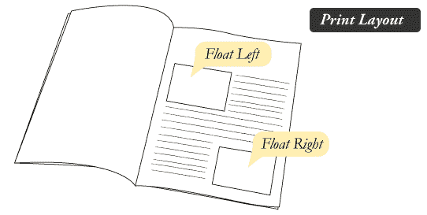
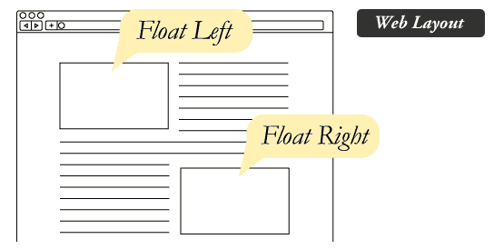

# CSS 浮动

> 原文：<https://www.javatpoint.com/css-float>

**CSS 浮动属性**是*的一个定位属性*。它用于*向左或向右推动一个元素*，允许其他元素环绕它。它通常用于图像和布局。

为了了解它的用途和起源，让我们来看看它的打印显示。在打印显示中，图像被设置到页面中，以便文本根据需要环绕页面。



它的网页布局也类似于印刷布局。



## 它是如何工作的

元素仅水平浮动。所以只能向左或向右浮动元素，不能上下浮动。

1.  浮动元素可以尽可能向左或向右移动。简单地说，它意味着浮动元素可以显示在最左边或最右边。
2.  浮动元素之后的元素将围绕它流动。
3.  浮动元素之前的元素不会受到影响。
4.  如果图像向右浮动，文本将围绕它向左流动；如果图像向左浮动，文本将围绕它向右流动。

## CSS 浮动属性

| 财产 | 描述 | 价值观念 |
| 清楚的 | clear 属性用于避免在其周围流动的浮动元素之后的元素。 | 左，右，两个，无，继承 |
| 漂浮物 | 它指定框是否应该浮动。 | 左，右，无，继承 |

## CSS 浮动属性值

| 价值 | 描述 |
| 没有人 | 它指定元素不浮动，只显示在文本中出现的位置。这是默认值。 |
| 左边的 | 它用于将元素向左浮动。 |
| 正确 | 它用于将元素向右浮动。 |
| 最初的 | 它将属性设置为初始值。 |
| 继承 | 它用于从其父元素继承该属性。 |

## CSS 浮动属性示例

让我们看一个简单的例子来理解 [CSS](https://www.javatpoint.com/css-tutorial) float 属性。

```
<!DOCTYPE html>
<html>
<head>
<style>
img {
    float: right;
}
</style>
</head>
<body>
<p>The following paragraph contains an image with style 
<b>float:right</b>. The result is that the image will float to the right in the paragraph.</p>
 
This is some text. This is some text. This is some text.
This is some text. This is some text. This is some text.
This is some text. This is some text. This is some text.
This is some text. This is some text. This is some text.
This is some text. This is some text. This is some text.
This is some text. This is some text. This is some text.
This is some text. This is some text. This is some text.
This is some text. This is some text. This is some text.
This is some text. This is some text. This is some text.
This is some text. This is some text. This is some text.
This is some text. This is some text. This is some text.
This is some text. This is some text. This is some text.
This is some text. This is some text. This is some text.
</p>
</body>
</html>

```

[Test it Now](https://www.javatpoint.com/oprweb/test.jsp?filename=cssfloat1)

* * *