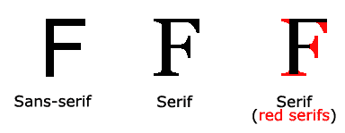

# CSS 字体

> 哎哎哎:# t0]https://www . javatppoint . com/CSS-font

CSS 字体属性用于控制文本的外观。通过使用 CSS 字体属性，您可以更改文本大小、颜色、样式等。您已经学习了如何使文本加粗或加下划线。在这里，您还将知道如何使用百分比来调整字体大小。

以下是一些重要的字体属性:

1.  **CSS 字体颜色**:该属性用于改变文本的颜色。(独立属性)
2.  **CSS 字体家族**:此属性用于改变字体的面貌。
3.  **CSS 字号**:此属性用于增加或减少字体的大小。
4.  **CSS 字体样式**:此属性用于使字体加粗、斜体或倾斜。
5.  **CSS 字体变体**:此属性创建一个小大写效果。
6.  **CSS 字体粗细**:此属性用于增加或减少字体的粗旷度和明度。

* * *

## 1) CSS 字体颜色

CSS 字体颜色在 [CSS](https://www.javatpoint.com/css-tutorial) 中是一个独立的属性，虽然看起来是 CSS 字体的一部分。它用于更改文本的颜色。

定义颜色有三种不同的格式:

*   通过颜色名称
*   按十六进制值
*   按 RGB

在上面的例子中，我们已经定义了所有这些格式。

```html
<!DOCTYPE html>
<html>
<head>
<style>
body {
    font-size: 100%;
}
h1 { color: red; }
h2 { color: #9000A1; } 
p { color:rgb(0, 220, 98); } 
}
</style>
</head>
<body>
<h1>This is heading 1</h1>
<h2>This is heading 2</h2>
<p>This is a paragraph.</p>
</body>
</html>

```

[Test it Now](https://www.javatpoint.com/oprweb/test.jsp?filename=cssfont1)

**输出:**

```html
这是标题 1  
这是标题 2  
这是一段话。 

```

* * *

## 2) CSS 字体系列

CSS 字体系列可以分为两种类型:

*   通用系列:它包括衬线字体、无衬线字体和等宽字体。
*   字体系列:指定字体系列名称，如 Arial、新时代罗马等。

**衬线**:衬线字体包括字符末尾的小线条。衬线字体的例子:新罗马时代，佐治亚州等。

**无衬线**:无衬线字体不包括字符末尾的小线条。无衬线字体的例子:Arial、Verdana 等。



```html
<!DOCTYPE html>
<html>
<head>
<style>
body {
font-size: 100%;
}
h1 { font-family: sans-serif; }
h2 { font-family: serif; } 
p { font-family: monospace; } 
}
</style>
</head>
<body>
<h1>This heading is shown in sans-serif.</h1>
<h2>This heading is shown in serif.</h2>
<p>This paragraph is written in monospace.</p>
</body>
</html>

```

[Test it Now](https://www.javatpoint.com/oprweb/test.jsp?filename=cssfont2)

**输出:**

```html
这个标题用无衬线字体显示。  
这个标题用衬线表示。  
这一段是用等间距写的。  

```

* * *

## 3) CSS 字体大小

CSS 字体大小属性用于更改字体的大小。

以下是可用于设置字体大小的可能值:

| 字体大小值 | 描述 |
| xx-小 | 用于显示极小的文本大小。 |
| x-小 | 用于显示超小的文本大小。 |
| 小的 | 用于显示小尺寸文本。 |
| 媒介 | 用于显示中等大小的文本。 |
| 大的 | 用于显示大尺寸文本。 |
| x-大 | 用于显示超大文本大小。 |
| xx-大型 | 用于显示非常大的文本大小。 |
| 较小的 | 用于显示相对较小的文本大小。 |
| 更大的 | 用于显示相对较大的文本。 |
| 以像素或%为单位的大小 | 用于设置百分比或像素值。 |

```html
<html>
<head>
<title>Practice CSS font-size property</title>
</head>
<body>
<p style="font-size:xx-small;">  This font size is extremely small.</p>  
<p style="font-size:x-small;">  This font size is extra small</p>  
<p style="font-size:small;">  This font size is small</p>  
<p style="font-size:medium;">  This font size is medium. </p>  
<p style="font-size:large;">  This font size is large. </p>  
<p style="font-size:x-large;">  This font size is extra large. </p>  
<p style="font-size:xx-large;">  This font size is extremely large. </p>  
<p style="font-size:smaller;">  This font size is smaller. </p>  
<p style="font-size:larger;">  This font size is larger. </p>  
<p style="font-size:200%;">  This font size is set on 200%. </p>  
<p style="font-size:20px;">  This font size is 20 pixels.  </p>  
</body>
</html>

```

[Test it Now](https://www.javatpoint.com/oprweb/test.jsp?filename=cssfont3)

**输出:**

```html
这个字体非常小。  
这种字体特别小  
这个字体很小  
这个字体大小是中等的。  
这个字体很大。  
这个字体特别大。  
这个字体非常大。  
这种字体较小。  
这个字体比较大。  
该字体大小设置为 200%。  
该字体大小为 20 像素。  

```

* * *

## 4) CSS 字体样式

CSS 字体样式属性定义您想要显示的字体类型。可能是[斜体](https://www.javatpoint.com/html-em-tag)、倾斜或正常。

```html
<!DOCTYPE html>
<html>
<head>
<style>
body {
font-size: 100%;
}
h2 { font-style: italic; }
h3 { font-style: oblique; }
h4 { font-style: normal; } 
}
</style>
</head>
<body>
<h2>This heading is shown in italic font.</h2>
<h3>This heading is shown in oblique font.</h3>
<h4>This heading is shown in normal font.</h4>
</body>
</html>

```

[Test it Now](https://www.javatpoint.com/oprweb/test.jsp?filename=cssfont4)

**输出:**

```html
该标题以斜体显示。  
该标题以倾斜字体显示。  
该标题以普通字体显示。 

```

* * *

## 5) CSS 字体变体

CSS 字体变体属性指定如何设置元素的字体变体。可能是普通和小盘股。

```html
<!DOCTYPE html>
<html>
<head>
<style>
p { font-variant: small-caps; }
h3 { font-variant: normal; }
</style>
</head>
<body>
<h3>This heading is shown in normal font.</h3>
<p>This paragraph is shown in small font.</p>
</body>
</html>

```

[Test it Now](https://www.javatpoint.com/oprweb/test.jsp?filename=cssfont5)

**输出:**

```html
该标题以普通字体显示。  
这一段用小字体显示。

```

* * *

## 6) CSS 字体粗细

CSS 字体粗细属性定义字体的粗细，并指定字体的加粗程度。字体粗细的可能值可以是普通、粗体、粗体、较浅或数字(100，200.....高达 900)。

```html
<!DOCTYPE html>
<html>
<body>
<p style="font-weight:bold;">This font is bold.</p>
<p style="font-weight:bolder;">This font is bolder.</p>
<p style="font-weight:lighter;">This font is lighter.</p>
<p style="font-weight:100;">This font is 100 weight.</p>
<p style="font-weight:200;">This font is 200 weight.</p>
<p style="font-weight:300;">This font is 300 weight.</p>
<p style="font-weight:400;">This font is 400 weight.</p>
<p style="font-weight:500;">This font is 500 weight.</p>
<p style="font-weight:600;">This font is 600 weight.</p>
<p style="font-weight:700;">This font is 700 weight.</p>
<p style="font-weight:800;">This font is 800 weight.</p>
<p style="font-weight:900;">This font is 900 weight.</p>
</body>
</html>

```

[Test it Now](https://www.javatpoint.com/oprweb/test.jsp?filename=cssfont6)

**输出:**

```html
这种字体是粗体。
这种字体更粗。
这种字体比较浅。
这种字体 100 磅重。
这个字体 200 重。
这个字体 300 重。
这种字体 400 磅重。
这种字体有 500 磅重。
这个字体是 600 重。
这种字体重 700。
这个字体 800 重。
这个字体 900 重。

```

* * *