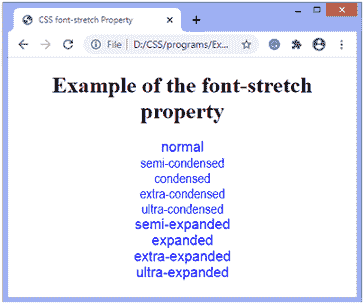

# CSS 字体拉伸属性

> 原文：<https://www.javatpoint.com/css-font-stretch-property>

CSS 中的**字体拉伸**属性允许我们从字体系列中选择一个**普通、扩展的**或**压缩的**人脸。此属性将文本设置为比默认字体宽度更宽或更窄。它不适用于任何字体，但仅适用于宽度可变的字体系列。

此 CSS 属性仅适用于具有扩展面和压缩面等附加面的字体；否则，对于没有压缩或扩展面的字体来说，它将是无效的。

以下语法给出了选择字体宽度的九个关键字值。

### 句法

```

font-stretch: normal | semi-condensed | condensed | extra-condensed | ultra-condensed | semi-expanded | expanded | extra-expanded | ultra-expanded

```

### 属性值

该 [CSS](https://www.javatpoint.com/css-tutorial) 属性的属性值列表如下:

| 关键字 | 描述 |
| **正常** | 这是默认值，不会拉伸任何字体。 |
| **半凝聚** | 它稍微压缩了元素的文本字符。该值使文本窄于**正常**，但不窄于**浓缩**。 |
| **浓缩** | 该值使文本窄于**半浓缩**，但不窄于**超浓缩**。 |
| **超浓缩** | 该值使文本比**浓缩**窄，但不比**超浓缩**窄。 |
| **超浓缩** | 该值使文本变得极其狭窄。 |
| **半膨胀** | 它略微扩展了元素的文本字符。该值使文本比**正常的**宽，但不会比**扩展的**宽。 |
| **展开** | 该值使文本比**半展开的**宽，但不比**超展开的**宽。 |
| **额外膨胀** | 该值使文本比**扩展的**更宽，但不会比**超扩展的**更宽。 |
| **超膨胀** | 该值使文本变得非常宽。 |

让我们通过一个例子来理解上面的属性值。

### 例子

```

<!DOCTYPE html>
<html>
<head>
<title>
CSS font-stretch Property
</title>

<style>
body{
text-align: center;
}
div{
font-family: Arial, Helvetica, sans-serif;
font-size: 20px;
color: blue;
}
.normal {
font-stretch: normal;
}
.semi-condensed {
font-stretch: semi-condensed;
}
.condensed {
font-stretch: condensed;
}
.extra-condensed {
font-stretch: extra-condensed;
}
.ultra-condensed {
font-stretch: ultra-condensed;
}

.semi-expanded {
font-stretch: semi-expanded;
}

.expanded {
font-stretch: expanded;
}
.extra-expanded {
font-stretch: extra-expanded;
}

.ultra-expanded {
font-stretch: ultra-expanded;
}
</style>
</head>

<body>
<h1> Example of the font-stretch property </h1>
<div class = "normal">
normal
</div>

<div class = "semi-condensed">
semi-condensed
</div>
<div class = "condensed">
condensed
</div>

<div class = "extra-condensed">
extra-condensed
</div>

<div class = "ultra-condensed">
ultra-condensed
</div>
<div class = "semi-expanded">
semi-expanded
</div>

<div class = "expanded">
expanded
</div>

<div class = "extra-expanded">
extra-expanded
</div>

<div class = "ultra-expanded">
ultra-expanded
</div>
</body>

</html>

```

[Test it Now](https://www.javatpoint.com/oprweb/test.jsp?filename=css-font-stretch-property1)

**输出**



* * *