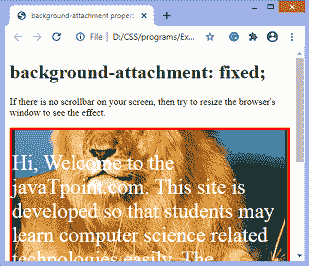

# CSS 背景-附件属性

> 原文：<https://www.javatpoint.com/css-background-attachment-property>

background-attachment 属性用于指定背景图像是固定的，或者在浏览器窗口中与页面的其余部分一起滚动。

该属性有三个值**滚动、固定、**和**本地**。其默认值为**滚动**，这将导致元素不随其内容滚动。该属性的**局部**值导致元素随内容滚动。如果我们将数值设置为**固定**，则[背景图像](https://www.javatpoint.com/how-to-add-background-image-in-css)在[浏览器](https://www.javatpoint.com/browsers)中滚动时不会移动。

这个 [CSS](https://www.javatpoint.com/css-tutorial) 属性可以支持多张背景图。我们可以为每个背景图像指定不同的**背景-附件**属性的值，用逗号分隔。每个图像都将与该属性的相应值匹配。

### 句法

```css

background-attachment: scroll | fixed | local | initial | inherit;

```

该属性的值定义如下。

### 属性值

**滚动:**是阻止元素随内容滚动，但随页面滚动的默认值。

**固定:**使用该值，背景图像不会随元素移动，甚至元素还有滚动机制。它会导致图像被锁定在一个位置，甚至文档的其余部分也会滚动。

**local:** 使用该值，如果元素有滚动机制，背景图像会随元素内容一起滚动。

**初始值:**将属性设置为默认值。

**inherit:** 它从其父元素继承属性。

让我们通过一些例子来理解这个特性。

### 例子

在本例中，我们使用**背景-附件**属性的**滚动**值，这是默认行为。所以当页面滚动时，背景也会随之滚动。

```css

<!DOCTYPE html>
<html>
<head>
<title>
background-attachment property
</title>

<style>
#example {
background-image:  url("lion.png");
font-size: 35px;
border: 4px solid red;
color: white;
background-position: center;
background-color: green;	
background-repeat: no-repeat;
background-attachment: scroll;
}

</style>
</head>

<body>
<h1> background-attachment: scroll;</h1>
<p> If there is no scrollbar on your screen, then try to resize the browser's window to see the effect. </p>
<div id="example">
<p>
Hi, Welcome to the javaTpoint.com. This site is developed so that students may learn computer science related technologies easily. The javaTpoint.com is always providing an easy and in-depth tutorial on various technologies. No one is perfect in this world, and nothing is eternally best. But we can try to be better.
</p>
</div>

</body>
</html>

```

[Test it Now](https://www.javatpoint.com/oprweb/test.jsp?filename=css-background-attachment-property1)

**输出**


### 示例-使用固定值

在这个例子中，我们使用的是**背景-附件**属性的**固定**值。该值固定了背景图像，即使文档的其余部分滚动，图像也不会移动。

```css

<!DOCTYPE html>
<html>
<head>
<title>
background-attachment property
</title>

<style>
#example {
background-image:  url("lion.png");
font-size: 35px;
border: 4px solid red;
color: white;
background-position: center;
background-color: green;	
background-repeat: no-repeat;
background-attachment: fixed;
}

</style>
</head>

<body>
<h1> background-attachment: fixed;</h1>
<p> If there is no scrollbar on your screen, then try to resize the browser's window to see the effect. </p>
<div id="example">
<p>
Hi, Welcome to the javaTpoint.com. This site is developed so that students may learn computer science related technologies easily. The javaTpoint.com is always providing an easy and in-depth tutorial on various technologies. No one is perfect in this world, and nothing is eternally best. But we can try to be better.
</p>
</div>

</body>
</html>

```

[Test it Now](https://www.javatpoint.com/oprweb/test.jsp?filename=css-background-attachment-property2)

**输出**



### 示例-使用本地值

在这个例子中，我们使用的是**背景-附件**属性的**局部**值。这里，背景图像将随着元素内容的滚动而滚动。

```css

<!DOCTYPE html>
<html>
<head>
<title>
background-attachment property
</title>

<style>
#example {
background-image:  url("lion.png");
font-size: 35px;
border: 4px solid red;
color: white;
background-position: center;
background-color: green;	
background-repeat: no-repeat;
background-attachment: local;
}

</style>
</head>

<body>
<h1> background-attachment: local;</h1>
<p> If there is no scrollbar on your screen, then try to resize the browser's window to see the effect. </p>
<div id="example">
<p>
Hi, Welcome to the javaTpoint.com. This site is developed so that students may learn computer science related technologies easily. The javaTpoint.com is always providing an easy and in-depth tutorial on various technologies. No one is perfect in this world, and nothing is eternally best. But we can try to be better.
</p>
</div>

</body>
</html>

```

[Test it Now](https://www.javatpoint.com/oprweb/test.jsp?filename=css-background-attachment-property3)

**输出**


现在，让我们来看另一个例子，在这个例子中，我们为一个元素使用了多个背景图像。

### 例子

这里，有两个背景图像，我们在其上应用**背景-附件**属性。第一张图片的附件设置为**固定**，而第二张图片的附件设置为**滚动**。

```css

<!DOCTYPE html>
<html>
<head>
<title>
background-attachment property
</title>

<style>
#example {
background-image:  url("jtp.png"), url("forest.jpg");
height: 500px;
border: 4px solid red;
background-position: center;
background-repeat: no-repeat;
background-attachment: fixed, scroll;
}

</style>
</head>

<body>
<h1> background-attachment: scroll;</h1>
<p> If there is no scrollbar on your screen, then try to resize the browser's window to see the effect. </p>
<div id="example">
</div>
</body>
</html>

```

[Test it Now](https://www.javatpoint.com/oprweb/test.jsp?filename=css-background-attachment-property4)

**输出**


* * *