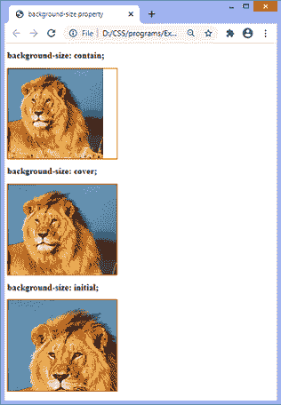

# CSS 背景大小属性

> 原文：<https://www.javatpoint.com/css-background-size-property>

**背景尺寸** CSS 属性用于设置元素背景图像的尺寸。背景图像可以拉伸或约束以适合现有空间。它允许我们控制背景图像的缩放比例。

可以使用**长度、百分比、**或**关键字**值来定义该属性。它有两个可能的关键字值，分别是**包含**和**覆盖**。它的单值语法定义了图像的宽度(在本例中，高度设置为自动)，而双值定义了高度和宽度的值，其中第一个值设置宽度，第二个值设置高度。

如果一个元素有多个背景图像，我们可以定义逗号分隔的值来定义每个图像的不同大小。

**背景尺寸**属性的**覆盖**值用于覆盖元素的整个背景区域。相比之下，**包含该属性的**值，在不剪切图像的情况下尽可能缩放图像。

### 句法

```

background-size: auto | length | cover | contain | initial | inherit;

```

该属性的值定义如下。

### 属性值

**自动:**这是默认值，以原始尺寸显示背景图像。

**长度:**用于设置背景图像的宽度和高度。该值在给定长度的相应维度上拉伸图像。它的单个值指定图像的宽度，高度设置为自动。如果给定两个值，第一个值设置宽度，第二个值设置高度。它不允许负值。

**百分比:**该值定义背景图像的宽度和高度占背景定位区域的百分比(%)。不允许负值。

**覆盖:**此值用于调整背景图像的大小，以覆盖整个容器。有时，它会从其中一个边缘剪下一点点，或者拉伸图像。它会调整图像的大小，以确保元素被完全覆盖。

**contain:** 无需拉伸或裁剪，它会调整背景图像的大小，以确保图像完全可见。

**初始值:**将属性设置为默认值。

**inherit:** 它从其父元素继承属性。

我们用一些插图来理解这个 [CSS](https://www.javatpoint.com/css-tutorial) 属性。

### 例子

在本例中，有三个宽度为 300px、高度为 200px 的 div 元素。每个 div 元素都有一个背景图像，我们在其上应用**背景大小**属性。

这里我们使用长度和百分比值来设置 div 元素的背景大小。第一个 div 元素的**背景尺寸**设置为**自动**，第二个 div 元素设置为 **150px 150px** ，第三个 div 元素的**背景尺寸**设置为 **30%** 。

```

<!DOCTYPE html>
<html>
<head>
<title>
background-size property
</title>
<style>
div {
width: 300px;
height: 200px;
border: 2px solid red;
}
#div1{
background-image: url('lion.png');
background-size: auto;
}
#div2{
background-image: url('lion.png');
background-size: 150px 150px;
}
#div3{
background-image: url('lion.png');
background-size: 30%;
}
</style>
</head>

<body>
<h2> background-size: auto; </h2>
<div id = "div1"></div>
<h2> background-size: 150px 150px; </h2>
<div id = "div2"></div>
<h2> background-size: 30%; </h2>
<div id = "div3"></div>
</body>
</html>

```

[Test it Now](https://www.javatpoint.com/oprweb/test.jsp?filename=css-background-size-property1)

**输出**


现在，在下一个示例中，我们将使用**背景尺寸**属性的**覆盖、包含、**和**初始**值。

### 例子

```

<!DOCTYPE html>
<html>
<head>
<title>
background-size property
</title>
<style>
div {
width: 300px;
height: 250px;
border: 2px solid red;
background-repeat: no-repeat;
}
#div1{
background-image: url('lion.png');
background-size: contain;
}
#div2{
background-image: url('lion.png');
background-size: cover;
}
#div3{
background-image: url('lion.png');
background-size: initial;
}
</style>
</head>

<body>
<h2> background-size: contain; </h2>
<div id = "div1"></div>
<h2> background-size: cover; </h2>
<div id = "div2"></div>
<h2> background-size: initial; </h2>
<div id = "div3"></div>
</body>
</html>

```

[Test it Now](https://www.javatpoint.com/oprweb/test.jsp?filename=css-background-size-property2)

**输出**



### 示例-组合多个图像

我们还可以组合该属性值，并将其应用于多个图像。这可以通过逗号分隔的语法来完成。

在这个例子中，有三个 div 元素，每个元素有两个背景图像。现在，我们在两幅图像上应用**背景尺寸**属性。

```

<!DOCTYPE html>
<html>
<head>
<title>
background-size property
</title>
<style>
div {
width: 250px;
height: 250px;
border: 2px solid red;
background-repeat: no-repeat;
background-position: center;
}
#div1{
background-image: url('lion.png'), url('forest.jpg');
background-size: 300px 150px, cover;
}
#div2{
background-image: url('lion.png'), url('forest.jpg');
background-size: 200px 150px, 300px 200px;
}
#div3{
background-image: url('lion.png'), url('forest.jpg');
background-size: 150px 175px, contain;
}
</style>
</head>

<body>
<h2> background-size: 300px 150px, cover; </h2>
<div id = "div1"></div>
<h2> background-size: 200px 150px, 300px 200px; </h2>
<div id = "div2"></div>
<h2> background-size: 150px 175px, contain; </h2>
<div id = "div3"></div>

</body>
</html>

```

[Test it Now](https://www.javatpoint.com/oprweb/test.jsp?filename=css-background-size-property3)

**输出**


* * *