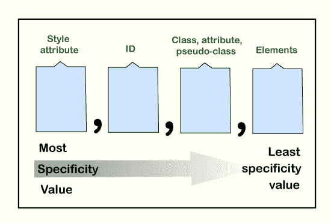

# CSS 特异性

> 原文：<https://www.javatpoint.com/css-specificity>

当 CSS 的多个冲突规则指示同一元素时，浏览器将遵循一些规则来确定特定的规则。特定性是帮助浏览器决定哪个属性值与元素最相关的方式。它确定应用于元素的样式声明。

在深入探讨特异性之前，让我们讨论一下它的一些要点:

*   只有当不同的选择器影响同一个元素时，CSS 的特异性才是重要的。在这种情况下，浏览器需要一种方法来识别要应用于匹配元素的样式，而 CSS 特定性就是这样做的。
*   当两个或多个选择器具有相同的特性值时，则考虑最新的一个。
*   通用选择器(*)和继承值具有较低的特异性，即 0 特异性。
*   与选择器相比，**样式**属性具有更大的特异性值(除了**！样式表选择器中的重要**。
*   **！重要**改变选择器特异性。当两个选择器具有相同的特异性时，则选择器具有**！重要**

## 特异性层次

每个选择器在层次结构中都有一席之地。定义选择器特定级别的主要有四个类别:

**内嵌样式:**它直接附加到要设置样式的元素上。例如:< p style= "颜色:红色>。它具有最高优先级。

**id:**它是具有第二高优先级的页面元素的唯一标识符。例如:#para。

**类、属性和伪类:**包括类、属性和伪类(如:focus、:hover 等。).

**元素和伪元素:**包括元素名称(div，h1)和伪元素(如:after 和:before)。他们的优先级最低。



## 特异性规则

特异性是权重，应用于 CSS 声明。它由匹配选择器中每个选择器类型的数量决定。让我们看看特异性的计算。

下面将结合一个例子讨论特异性规则。

### **T**ID 选择器的特异性高于属性选择器

让我们试着用一个例子来理解它。

### 例子

在本例中，我们将使用带有背景色属性的 id 选择器。

```css

<!DOCTYPE html>
<html>
<head>
<style>
body{
text-align: center;
font-size: 30px;
color: blue;
background-color: red;
}
#div1 {
background-color: red;
}
div#div1        /*Higher specificity*/
{
background-color: yellow;
}
div[id=div1] {
background-color: blue;
}
</style>
</head>
<body>

<div id="div1"> Welcome to the javaTpoint.com </div>
</body>
</html>

```

[Test it Now](https://www.javatpoint.com/oprweb/test.jsp?filename=CSSSpecificity1)

### 同样具体地说，最新的规则将会起作用

在外部样式表中，如果相同的规则应用了两次，那么将应用最新的(或最后的)规则。

### 例子

在这个例子中，元素名称的特殊性是相同的。在这种情况下，将考虑最新指定的元素名称。

```css

<!DOCTYPE html>
<html>
<head>
<style>
body{
font-size: 30px;
text-align: center;
}
div 
{
background-color: yellow;
color: red;
}
div 
{
background-color: red;
color: yellow;
}
</style>
</head>
<body>
<h2> Example of equal specificity </h2>
<div> Welcome to the javaTpoint.com </div>

</body>
</html>

```

[Test it Now](https://www.javatpoint.com/oprweb/test.jsp?filename=CSSSpecificity2)

### 类选择器的特殊性大于元素选择器

类选择器(。导航。高等等。)比元素选择器(如 div、h1、p 等)更具体。)

### 例子

```css

<!DOCTYPE html>
<html>
<head>
<style> 
.intro {
background-color: blue;
text-align: center;
color: yellow;
font-size :40px;
}
div {
background-color: red;
text-align: right;
color: blue;
}
</style>
</head>
<body>
<h1>Hello World</h1>
<div class="intro">Welcome to the javaTpoint.com</div>

</body>
</html>

```

[Test it Now](https://www.javatpoint.com/oprweb/test.jsp?filename=CSSSpecificity3)

* * *