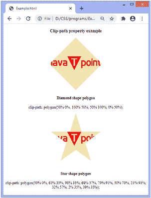
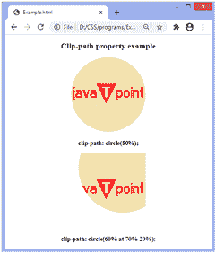
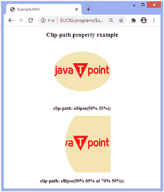
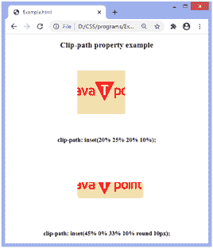
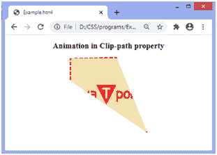

# CSS 剪辑路径

> 原文:[https://www.javatpoint.com/css-clip-path](https://www.javatpoint.com/css-clip-path)

这个 CSS 属性用于创建一个裁剪区域，并指定元素的可见区域。区域内部的区域将是可见的，而外部区域是隐藏的。剪辑之外的任何内容都会被浏览器剪辑，包括边框、[文本阴影](https://www.javatpoint.com/css-text-shadow)等等。

它允许我们定义要显示的元素的特定区域，而不是显示整个区域。通过使用椭圆、圆、多边形或插入关键字，可以更容易地裁剪基本形状。

### 句法

```

clip-path: <clip-source> | [ <basic-shape> || <geometry-box> || none

```

[CSS](https://www.javatpoint.com/css-tutorial) 剪辑路径属性有四个值:

*   剪辑源
*   基本形状
*   几何盒
*   没有人

我们来讨论一下上面的属性值。

**剪辑源:**这是一个引用 SVG **<剪辑路径>** 元素的 url。

**基本形状:**它将元素剪辑为基本形状。它有四种基本形状:圆形、椭圆形、多边形和插图。

这是一个形状，其中 **<几何框>** 的值定义了位置和大小。如果没有定义几何框，则边框框将用作参考框。

**几何框:****<几何框>** 定义了基本形状的参考框。如果是结合 **<基本形状>** 定义的，那么它将作为 **<基本形状>** 进行裁剪的参考框。

它可以具有以下值:

**边距框:**可以作为参考框。它可以定义为由外部边距边缘指定的形状，并包括形状的角半径。

**边框框:**可以作为参考框。它是由外部边框边缘定义的值。

**填充框:**可以作为参考框..它指定由外部填充边缘包围的形状。

**内容框:**可以作为参考框。

**填充框:**对象边界框可以作为参考框。

**描边框:**描边边框可以作为参考框。

**视图框:**使用最近的 SVG 视口作为参考框。

## 使用剪辑路径定义基本形状

如上所述，有四种基本形状。让我们用一个例子来讨论它们。

## 多边形

它是可用的基本形状之一。它允许我们定义任意数量的点。给定点位于任意单位的一对 **X** 和 **Y** 坐标中(例如基于百分比或基于像素)。

我们可以通过下面的例子来理解这个基本形状。在下面的例子中，我们定义了两种多边形:菱形多边形和星形多边形。

### 例子

```

<!DOCTYPE html>
<html>
  <head>
  </head>
  <style>
    .example {
    clip-path: polygon(50% 0%, 100% 50%, 50% 100%, 0% 50%);
    }
	.example1{
	clip-path: polygon(50% 0%, 61% 35%, 98% 35%, 68% 57%, 79% 91%, 50% 70%, 21% 91%, 32% 57%, 2% 35%, 39% 35%);
	 }
  </style>
  <body>
  <center>
    <h3> Clip-path property example </h3>
      
	  <h4>Diamond shape polygon</h4>
	  <p>clip-path: polygon(50% 0%, 100% 50%, 50% 100%, 0% 50%);</p>
	  
	  <h4>Star shape polygon</h4>
	  <p>clip-path: polygon(50% 0%, 61% 35%, 98% 35%, 68% 57%, 79% 91%, 50% 70%, 21% 91%, 32% 57%, 2% 35%, 39% 35%);</p>
	</center>
  </body>
</html>

```

[Test it Now](https://www.javatpoint.com/oprweb/test.jsp?filename=css-clip-path1)

**输出**



## 圆

定义圆的默认语法是**圆(在 posX posY 处的半径)**。该位置可选，默认值为 **50% 50%** 。

### 例子

```

<!DOCTYPE html>
<html>
  <head>
  </head>
  <style>
    .example {
    clip-path: circle(50%);
    }
	.example1{
    clip-path: circle(60% at 70% 20%);	
	}
  </style>
  <body>
  <center>
    <h2> Clip-path property example </h2>
	  
      <h3>clip-path: circle(50%);</h3>
	  
	  <h3>clip-path: circle(60% at 70% 20%);</h3>	  
	  </center>
  </body>
</html>

```

[Test it Now](https://www.javatpoint.com/oprweb/test.jsp?filename=css-clip-path2)

**输出**



## 椭圆

定义椭圆的语法是:**椭圆(半径在 posX posY 处为 radiusX radiusY)**。像圆圈一样，它的位置是可选的，默认为 50% 50%。

### 例子

```

<!DOCTYPE html>
<html>
  <head>
  </head>
  <style>
    .example {
 clip-path: ellipse(50% 35%);
    }
	.example1{
  clip-path: ellipse(50% 65% at 70% 50%);
	}
  </style>
  <body>
  <center>
    <h2> Clip-path property example </h2>
	  
      <h3> clip-path: ellipse(50% 35%);</h3>
	  
	  <h3>  clip-path: ellipse(50% 65% at 70% 50%);</h3>	  
	  </center>
  </body>
</html>

```

[Test it Now](https://www.javatpoint.com/oprweb/test.jsp?filename=css-clip-path3)

**输出**



## 插入物

使用 inset，我们可以定义一个内部矩形，外部的任何东西都将被丢弃。它使图像或元素的裁剪更容易。

### 例子

```

<!DOCTYPE html>
<html>
  <head>
  </head>
  <style>
    .example 
	{
 clip-path: inset(20% 25% 20% 10%);    
 }
	.example1
	{
 clip-path: inset(45% 0% 33% 10% round 10px);	
 }
 </style>
  <body>
  <center>
    <h2> Clip-path property example </h2>
	  
      <h3>clip-path: inset(20% 25% 20% 10%);</h3>
	  
	  <h3>clip-path: inset(45% 0% 33% 10% round 10px);</h3>	  
	  </center>
  </body>
</html>

```

[Test it Now](https://www.javatpoint.com/oprweb/test.jsp?filename=css-clip-path4)

**输出**



## 添加动画

我们还可以将动画应用于该属性。动画和过渡将使用这个 CSS 属性创建有趣的效果。

让我们看看同样的插图。

### 例子

```

<!DOCTYPE html>
<html>
  <head>
  </head>
  <style>
img.example {
  animation: anime 4s infinite;
  border: 5px dashed red;
}

@keyframes anime {
  0% {
    clip-path: polygon(0 0, 100% 0, 100% 80%, 0% 70%);
  }
  20% {
    clip-path: polygon(40% 0, 50% 0, 100% 100%, 0% 80%);
  }
  40% {
    clip-path: polygon(0 0, 60% 72%, 100% 100%, 0 35%);
  }
  60% {
    clip-path: polygon(70% 0, 20% 0, 100% 100%, 0% 80%);
  }
  80% {
    clip-path: polygon(0 70%, 60% 0, 100% 32%, 0 40%);
  }
  100% {
    clip-path: polygon(0 0, 60% 0, 100% 100%, 0% 30%);
  }
}
 </style>
  <body>
  <center>
    <h2> Animation in Clip-path property </h2>
	  
	  </center>
  </body>
</html>

```

[Test it Now](https://www.javatpoint.com/oprweb/test.jsp?filename=css-clip-path5)

**输出**



* * *