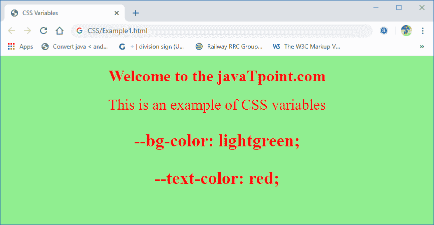
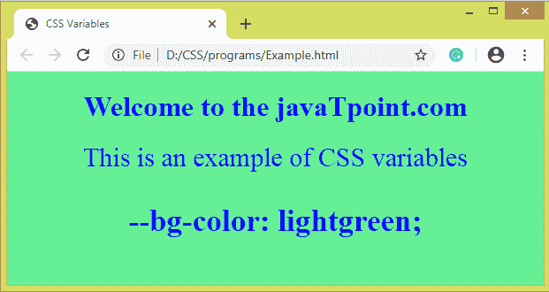
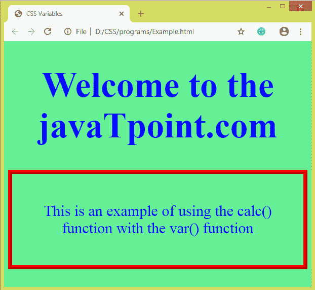

# CSS 变量

> 原文：<https://www.javatpoint.com/css-variables>

CSS 变量用于将自定义属性值添加到我们的网页中。**自定义属性**有时被称为**级联变量**或 **CSS 变量**。作者定义了这些包含特定值的实体，这些实体可以在整个文档中重用。这些实体是使用自定义属性符号设置的，可以使用 **var()** 函数访问。

变量存储这些值，并有一个可以使用它们的范围。

CSS 变量是有利的，因为它们允许我们在多个地方重用同一个值。与颜色值相比，变量名易于理解和使用。

```html

element {
  --main-color: brown;
}

```

CSS 中的变量是通过在开头使用两个破折号(-)来定义的，后面是名称，区分大小写。

在上面的语法中， ***元素*** 表示指定自定义属性范围的选择器。如果我们在**:根**伪类上定义自定义属性，那么它将全局应用于我们的 HTML 文档。自定义属性的名称区分大小写，即 **-主色**和 **-主色**将被视为单独的自定义属性。

## var()函数

CSS 中的 **var()** 函数用于插入自定义属性值。变量的名称可以作为参数传递给 **var()** 函数。

**语法**

```html

var( --custom-name, value )

```

**参数**

**var()** 函数只允许两个参数，定义如下:

**-自定义名称:**此参数接受自定义属性的名称。它必须以两个破折号 **( -)开始。**是必选参数。

**值:**为可选参数，接受回退值。当自定义属性无效时，它用作替代。

回退值不用于修复浏览器的兼容性。当任何浏览器不支持自定义属性时，回退值都没有用。如果变量具有无效值或变量未定义，回退值可替代支持 [CSS](https://www.javatpoint.com/css-tutorial) 自定义属性的浏览器来选择不同的值。

定义回退值有以下几种有效和无效的方法:

```html

element {
  color: var(--main-color, orange); /* orange if --main-color is not defined */
}

element {
  background-color: var(--main-color, var(--main-background, blue)); /* blue if --main-color and --main-background are not defined */
}

element {
  background-color: var(--main-color, --main-background, gray); /* Invalid*/
}

```

现在，让我们通过一些插图来理解 CSS 变量。

**例**

```html

<!DOCTYPE html> 
<html> 
    <head> 
        <title>CSS Variables</title> 

         <style> 
            :root { 
                --bg-color: lightgreen; 
               --text-color: red;
            } 

            /* var() function used here */ 
            body { 
               background-color: var(--bg-color); 
	text-align: center;
            } 
            h1 { 
                color: var(--text-color); 
            } 
            div { 
                color: var(--text-color);
	font-size: 30px;
            } 
        </style> 
    </head> 
    <body> 
        <h1>Welcome to the javaTpoint.com</h1> 

        <div> 
            This is an example of CSS variables
			<h3>--bg-color: lightgreen;</h3>
			<h3>--text-color: red;</h3>

        </div> 
    </body> 
</html>

```

[Test it Now](https://www.javatpoint.com/oprweb/test.jsp?filename=CSSVariables1)

**输出**



在上面的例子中，我们没有使用回退值。现在，在下一个示例中，我们将使用回退值。

**例**

```html

<!DOCTYPE html> 
<html> 
    <head> 
        <title>CSS Variables</title> 

         <style> 
            :root { 
                --bg-color: lightgreen; 
            } 
            body { 
               background-color: var(--bg-color); 
	   text-align: center;
            } 
            h1 { 
                color: var(--text-color, blue); /* --text-color is not set, so the fallback value 'blue' will be used */
            } 
            div { 
                color: var(--text-color, blue);
	font-size: 30px;
            } 
        </style> 
    </head> 

    <body> 
        <h1>Welcome to the javaTpoint.com</h1> 

        <div> 
            This is an example of CSS variables
	<h3>--bg-color: lightgreen;</h3>

        </div> 

    </body> 
</html>

```

[Test it Now](https://www.javatpoint.com/oprweb/test.jsp?filename=CSSVariables2)

在这个例子中，有一个 CSS 变量 **- text-color** ，没有这样设置，回退值将作为变量的替代。

**输出**



## 将 calc()与 var()一起使用

我们可以在变量值上使用 **calc()** 。让我们看一个例子，其中我们使用 calc()函数和 var()函数。

在这个例子中，我们使用 **calc()** 函数和 **var()** 函数来调整元素的填充和字体大小。

**例**

```html

<!DOCTYPE html>
<html>
<head>
<title>CSS Variables</title>

<style>
:root {
--bg-color: lightgreen;
--extra-padding: 1.2em;
--txt-size: 90px;
}
body {
background-color: var(--bg-color);
text-align: center;
}
h1 {
color: var(--text-color, blue); /* --text-color is not set, so the fallback value 'blue' will be used */
font-size: calc(var(--txt-size) - 20px);

}
div {
color: var(--text-color, blue);
font-size: 30px;
border: 8px ridge red;
padding: calc(var(--extra-padding) + 20px);
}
</style>
</head>

<body>
<h1>Welcome to the javaTpoint.com</h1>

<div>
This is an example of using the calc() function with the var() function
</div>

</body>
</html>

```

[Test it Now](https://www.javatpoint.com/oprweb/test.jsp?filename=CSSVariables3)

**输出**



* * *