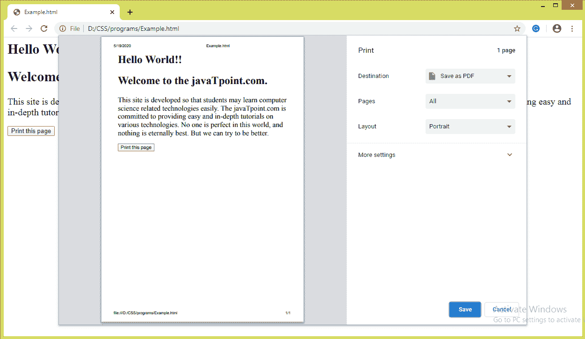
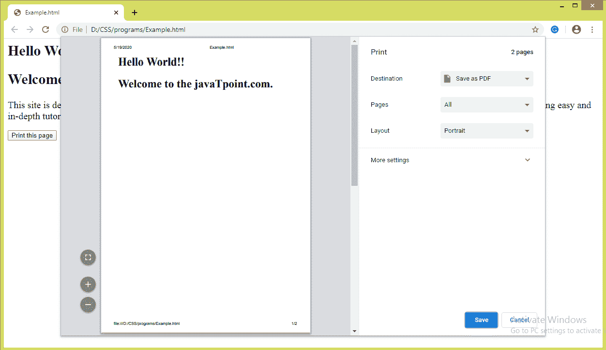

# CSS 分页符属性

> 原文：<https://www.javatpoint.com/css-page-break-before-property>

顾名思义，这个 CSS 属性用于在打印文档时在元素之前添加分页符。在打印文档期间，它会在指定元素之前插入分页符。我们不能在绝对定位的元素或者空的 **< div >** 元素上使用这个 CSS 属性，它不会生成一个盒子。

此 CSS 属性表示元素框前是否允许分页符。包括**前分页符、**CSS 属性**后分页符**和**内分页符**帮助我们定义文档打印时的行为。

### 句法

```css

page-break-before:  auto | always | left | right | avoid | initial | inherit;

```

### 可能的值

这个 [CSS](https://www.javatpoint.com/css-tutorial) 属性的值的简要描述列表如下。

| 价值观念 | 描述 |
| 汽车 | 如果需要，默认值是在元素前插入分页符。 |
| 总是 | 该值总是强制在指定元素之前分页。 |
| 避免 | 它用于尽可能避免元素前的分页符。 |
| 左边的 | 该值强制在元素前有一个或两个分页符，这样下一页将显示为左侧页面。 |
| 正确 | 右边的**值强制元素前面有一个或两个分页符，这样下一页将被描述为右边的页面。** |
| 最初的 | 它将属性设置为默认值。 |
| 继承 | 如果指定了该值，相应的元素将使用其父元素**的计算值-在**属性之前分页。 |

让我们用一个例子来理解上面的值。

### 示例-使用自动值

值 **auto** 是缺省值，需要时会自动插入分页符。在这个例子中，我们使用了两个<元素和一个按钮。按钮负责打印页面。点击按钮后，我们会看到值的效果。

```css

<html>
   <head> 
      <style type = "text/css">
         div{
		 font-size: 20px;
		 page-break-before: auto;
		 }
      </style>
   </head>
   <body>
      <div>
	  <h2>Hello World!!</h2>
	  <h2>Welcome to the javaTpoint.com.</h2>
      </div>
      <div>
This site is developed so that students may learn computer science related technologies easily. The javaTpoint.com is committed to providing easy and in-depth tutorials on various technologies. No one is perfect in this world, and nothing is eternally best. But we can try to be better.      
</div>
      <br>
      <button onclick = "func()">Print this page</button>

      <script>
         function func() {
            window.print();
         }
      </script>

   </body>
</html>

```

[Test it Now](https://www.javatpoint.com/oprweb/test.jsp?filename=CSSpagebreakbeforeproperty1)

**输出**



### 示例-使用始终值

无论是否需要，该值总是会强制我们插入分页符。我们正在用一个按钮打印这一页。我们必须点击那个按钮才能看到效果。

在本例中，分页符应用于 **< div >** 元素之前，因此按钮不会打印在下一页上。如果在元素后应用，那么在 **< div >** 元素后会有一个分页符，这将导致按钮在下一页打印。

```css

<html>
   <head> 
      <style type = "text/css">
          div{
		 font-size: 20px;
		 page-break-before: always;
		 }
      </style>
   </head>
   <body>
      <div>
	  <h2>Hello World!!</h2>
	  <h2>Welcome to the javaTpoint.com.</h2>
      </div>
      <div>
This site is developed so that students may learn computer science related technologies easily. The javaTpoint.com is committed to providing easy and in-depth tutorials on various technologies. No one is perfect in this world, and nothing is eternally best. But we can try to be better.      
</div>
      <br>
      <button onclick = "func()">Print this page</button>

      <script>
         function func() {
            window.print();
         }
      </script>

   </body>
</html>

```

[Test it Now](https://www.javatpoint.com/oprweb/test.jsp?filename=CSSpagebreakbeforeproperty2)

**输出**



### 示例-使用左值

左值**强制插入一两个分页符，这样下一页的格式就和左页一样了。**

```css

<html>
   <head> 
      <style type = "text/css">
         div{
		 font-size: 20px;
		 page-break-before: left;
		 }
      </style>
   </head>
   <body>
      <div>
	  <h2>Hello World!!</h2>
	  <h2>Welcome to the javaTpoint.com.</h2>
      </div>
      <div>
This site is developed so that students may learn computer science related technologies easily. The javaTpoint.com is committed to providing easy and in-depth tutorials on various technologies. No one is perfect in this world, and nothing is eternally best. But we can try to be better.      
</div>
      <br>
      <button onclick = "func()">Print this page</button>

      <script>
         function func() {
            window.print();
         }
      </script>

   </body>
</html>

```

[Test it Now](https://www.javatpoint.com/oprweb/test.jsp?filename=CSSpagebreakbeforeproperty3)

**输出**


### 示例-使用正确的值

右值**强制插入一两个分页符，这样下一页的格式就和右页一样了。**

```css

<html>
   <head> 
      <style type = "text/css">
         div{
		 font-size: 20px;
		 page-break-before: right;
		 }
      </style>
   </head>
   <body>
      <div>
	  <h2>Hello World!!</h2>
	  <h2>Welcome to the javaTpoint.com.</h2>
      </div>
      <div>
This site is developed so that students may learn computer science related technologies easily. The javaTpoint.com is committed to providing easy and in-depth tutorials on various technologies. No one is perfect in this world, and nothing is eternally best. But we can try to be better.      
</div>
      <br>
      <button onclick = "func()">Print this page</button>

      <script>
         function func() {
            window.print();
         }
      </script>

   </body>
</html>

```

[Test it Now](https://www.javatpoint.com/oprweb/test.jsp?filename=CSSpagebreakbeforeproperty4)

**输出**


* * *