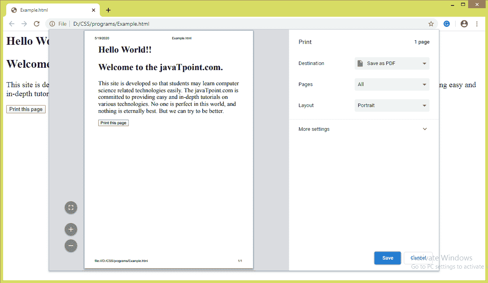
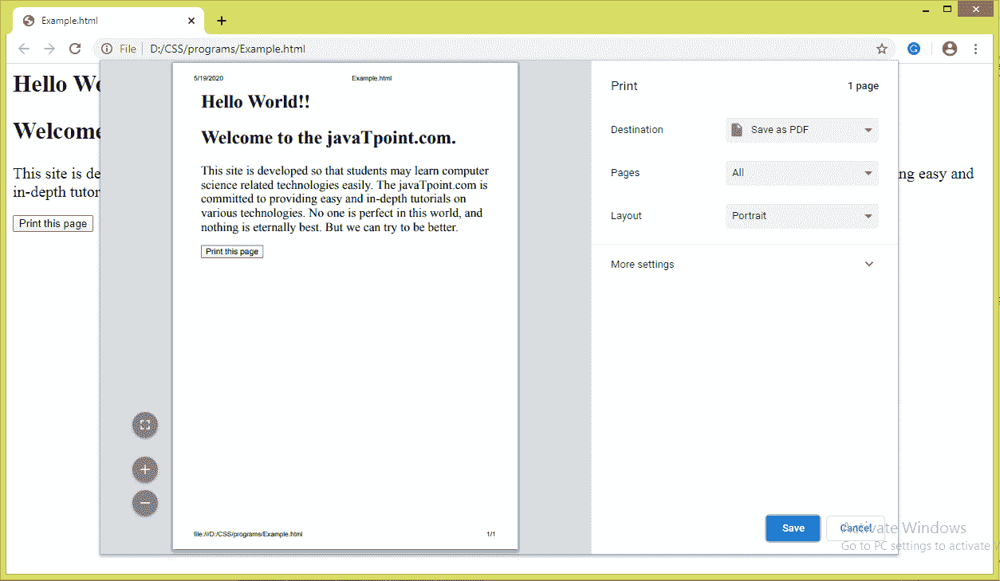

# CSS 分页内属性

> 原文:[https://www.javatpoint.com/css-page-break-inside-property](https://www.javatpoint.com/css-page-break-inside-property)

顾名思义，这个 CSS 属性用于在打印文档时指定元素内部的分页符。此 CSS 属性不能用于绝对定位的元素或不生成框的空 **< div >** 元素。它在打印文档时在指定元素内插入或避免分页符。

如果我们想要避免图像、项目列表、代码片段、表格中的分页符，那么我们可以使用**分页符-在**属性中。

此 CSS 属性表示元素框内是否允许分页符。包括**内分页符、**CSS 属性**前分页符**和**后分页符**帮助我们定义文档打印时的行为。

### 句法

```

page-break-inside:  auto | avoid | initial | inherit;

```

### 可能的值

这个 [CSS](https://www.javatpoint.com/css-tutorial) 属性的值的简要说明列表如下。

| 价值观念 | 描述 |
| 汽车 | 如果需要，它是在元素内插入分页符的默认值。 |
| 避免 | 它用于尽可能避免元素内部出现分页符。 |
| 最初的 | 它将属性设置为默认值。 |
| 继承 | 如果指定了该值，对应的元素将使用其父元素**分页内**属性的计算值。 |

让我们用一个例子来理解上面的值。

### 示例-使用自动值

值 **auto** 是缺省值，需要时会自动插入分页符。该值既不阻止也不强制元素框内的分页符。

在这个例子中，我们使用了两个

元素和一个按钮。按钮负责打印页面。点击按钮后，我们会看到值的效果。

```

<html>
   <head> 
      <style type = "text/css">
         div{
		 font-size: 20px;
		 page-break-inside: auto;
		 }
      </style>
   </head>
   <body>
      <div>
	  <h2>Hello World!!</h2>
	  <h2>Welcome to the javaTpoint.com.</h2>
      </div>
      <div>
This site is developed so that students may learn computer science related technologies easily. The javaTpoint.com is committed to providing easy and in-depth tutorials on various technologies. No one is perfect in this world, and nothing is eternally best. But we can try to be better.      
</div>
      <br>
      <button onclick = "func()">Print this page</button>

      <script>
         function func() {
            window.print();
         }
      </script>

   </body>
</html>

```

[Test it Now](https://www.javatpoint.com/oprweb/test.jsp?filename=CSSpagebreakinsideproperty1)

**输出**



### 示例-使用避免值

如果可能的话，该值避免了元素框内的分页符。这里，我们使用一个按钮来打印页面。我们必须点击那个按钮才能看到效果。

```

<html>
   <head> 
      <style type = "text/css">
          div{
		 font-size: 20px;
		 page-break-inside: avoid;
		 }
      </style>
   </head>
   <body>
      <div>
	  <h2>Hello World!!</h2>
	  <h2>Welcome to the javaTpoint.com.</h2>
      </div>
      <div>
This site is developed so that students may learn computer science related technologies easily. The javaTpoint.com is committed to providing easy and in-depth tutorials on various technologies. No one is perfect in this world, and nothing is eternally best. But we can try to be better.      
</div>
      <br>
      <button onclick = "func()">Print this page</button>

      <script>
         function func() {
            window.print();
         }
      </script>

   </body>
</html>

```

[Test it Now](https://www.javatpoint.com/oprweb/test.jsp?filename=CSSpagebreakinsideproperty2)

**输出**



* * *