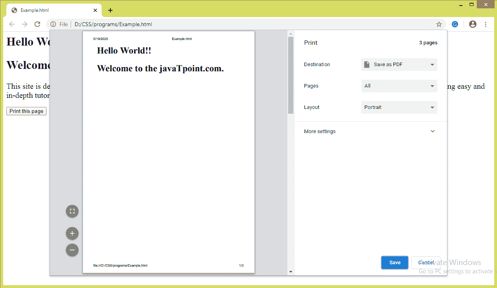

# CSS 分页后属性

> 原文：<https://www.javatpoint.com/css-page-break-after-property>

此 CSS 属性用于在打印文档时调整元素后的分页符。在打印过程中，它会在指定元素后插入一个分页符。我们不能在绝对定位的元素**(位置:绝对；)**或不生成方框的空**<>**元素。

此 CSS 属性表示元素框后是否允许分页符。包括**分页后、**CSS 属性**分页前**和**分页内**帮助我们定义文档打印时的行为。

### 句法

```html

page-break-after:  auto | always | left | right | avoid | initial | inherit;

```

### 可能的值

这个 [CSS](https://www.javatpoint.com/css-tutorial) 属性的值的简要描述列表如下。

| 价值观念 | 描述 |
| 汽车 | 如果需要，默认值是在元素后插入分页符。 |
| 总是 | 它总是在指定的元素后强制分页。 |
| 避免 | 它用于尽可能避免元素后出现分页符。 |
| 左边的 | 它在指定的元素后强制一个或两个分页符，这样下一页将被描述为左侧页面。 |
| 正确 | 它在指定的元素后强制一个或两个分页符，这样下一页将被描述为右边的页面。 |
| 最初的 | 它将属性设置为默认值。 |
| 继承 | 如果指定了此值，对应的元素将使用其父元素的计算值。 |

让我们用一个例子来理解上面的值。

### 示例-使用自动值

值 **auto** 是缺省值，需要时会自动插入分页符。在这个例子中，我们使用了两个<元素和一个按钮。按钮负责打印页面。点击按钮后，我们会看到值的效果。

```html

<html>
   <head> 
      <style type = "text/css">
         div{
		 font-size: 20px;
		 page-break-after: auto;
		 }
      </style>
   </head>
   <body>
      <div>
	  <h2>Hello World!!</h2>
	  <h2>Welcome to the javaTpoint.com.</h2>
      </div>
      <div>
This site is developed so that students may learn computer science related technologies easily. The javaTpoint.com is committed to providing easy and in-depth tutorials on various technologies. No one is perfect in this world, and nothing is eternally best. But we can try to be better.      
</div>
      <br>
      <button onclick = "func()">Print this page</button>

      <script>
         function func() {
            window.print();
         }
      </script>

   </body>
</html>

```

[Test it Now](https://www.javatpoint.com/oprweb/test.jsp?filename=CSSpagebreakafterproperty1)

**输出**


### 示例-使用始终值

无论是否需要，该值总是强制插入分页符。我们正在用一个按钮打印这一页。我们必须点击那个按钮才能看到效果。

```html

<html>
   <head> 
      <style type = "text/css">
         div{
		 font-size: 20px;
		 page-break-after: always;
		 }
      </style>
   </head>
   <body>
      <div>
	  <h2>Hello World!!</h2>
	  <h2>Welcome to the javaTpoint.com.</h2>
      </div>
      <div>
This site is developed so that students may learn computer science related technologies easily. The javaTpoint.com is committed to providing easy and in-depth tutorials on various technologies. No one is perfect in this world, and nothing is eternally best. But we can try to be better.      
</div>
      <br>
      <button onclick = "func()">Print this page</button>

      <script>
         function func() {
            window.print();
         }
      </script>

   </body>
</html>

```

[Test it Now](https://www.javatpoint.com/oprweb/test.jsp?filename=CSSpagebreakafterproperty2)

**输出**



### 示例-使用左值

左值**强制插入一两个分页符，这样下一页的格式就和左页一样了。**

```html

<html>
   <head> 
      <style type = "text/css">
         div{
		 font-size: 20px;
		 page-break-after: left;
		 }
      </style>
   </head>
   <body>
      <div>
	  <h2>Hello World!!</h2>
	  <h2>Welcome to the javaTpoint.com.</h2>
      </div>
      <div>
This site is developed so that students may learn computer science related technologies easily. The javaTpoint.com is committed to providing easy and in-depth tutorials on various technologies. No one is perfect in this world, and nothing is eternally best. But we can try to be better.      
</div>
      <br>
      <button onclick = "func()">Print this page</button>

      <script>
         function func() {
            window.print();
         }
      </script>

   </body>
</html>

```

[Test it Now](https://www.javatpoint.com/oprweb/test.jsp?filename=CSSpagebreakafterproperty3)

**输出**


### 示例-使用正确的值

右值**强制插入一两个分页符，这样下一页的格式就和右页一样了。**

```html

<html>
   <head> 
      <style type = "text/css">
         div{
		 font-size: 20px;
		 page-break-after: right;
		 }
      </style>
   </head>
   <body>
      <div>
	  <h2>Hello World!!</h2>
	  <h2>Welcome to the javaTpoint.com.</h2>
      </div>
      <div>
This site is developed so that students may learn computer science related technologies easily. The javaTpoint.com is committed to providing easy and in-depth tutorials on various technologies. No one is perfect in this world, and nothing is eternally best. But we can try to be better.      
</div>
      <br>
      <button onclick = "func()">Print this page</button>

      <script>
         function func() {
            window.print();
         }
      </script>

   </body>
</html>

```

[Test it Now](https://www.javatpoint.com/oprweb/test.jsp?filename=CSSpagebreakafterproperty4)

**输出**


* * *