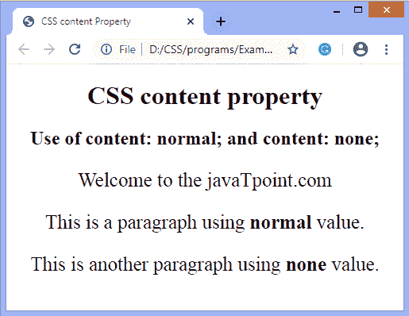
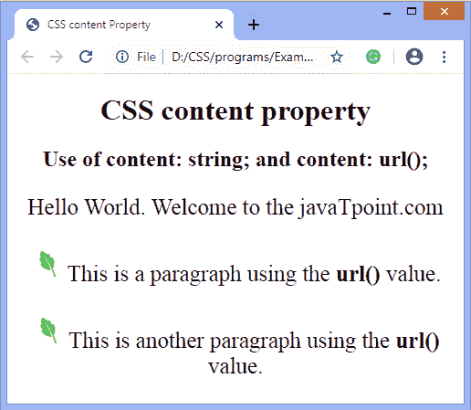
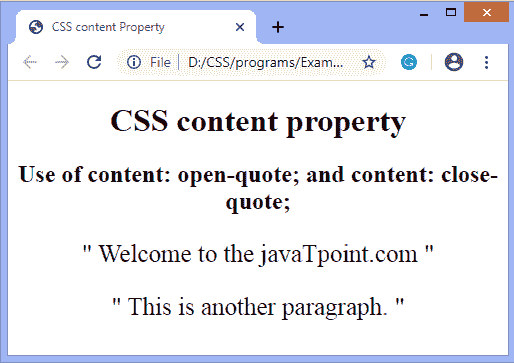
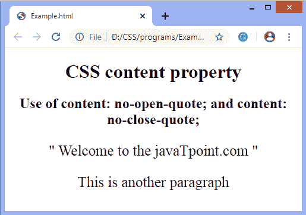
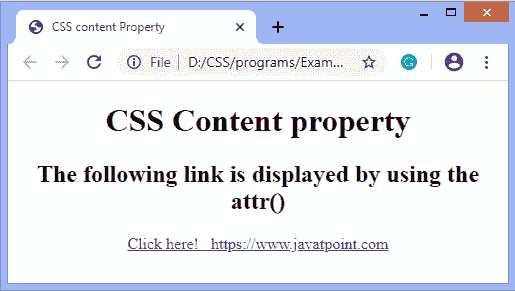

# CSS 内容属性

> 原文:[https://www.javatpoint.com/css-content-property](https://www.javatpoint.com/css-content-property)

这个 CSS 属性生成动态内容。可与伪元素**:**之前、**:**之后配合使用。所有浏览器都完全支持此 CSS 属性，并用于在网页上插入生成的内容。

它用生成的值替换元素。

### 句法

```

content: normal | none | counter | string | attr | open-quote | close-quote | no-close-quote | no-open-quote | url | initial | inherit;

```

### 属性值

该 [CSS](https://www.javatpoint.com/css-tutorial) 属性有许多值，定义如下表:

| 价值观念 | 描述 |
| **正常** | 它用于设置默认值 |
| **无** | 该值不设置内容。 |
| **计数器** | 它将内容设置为计数器。一般是一个数字。使用**计数器()**或**计数器()**功能显示。 |
| **弦** | 它用于设置任何字符串值。它应该始终用引号括起来。它在 HTML 元素之后或之前生成任何字符串。 |
| **attr** | 它在元素之后或之前插入指定属性的值。如果选择器没有特定的属性，那么将插入一个空字符串。 |
| **开报** | 用于插入开头的引号，或者将内容设置为开头的引号。 |
| **收盘报价** | 用于插入结束引号，或者将内容设置为结束引号。 |
| **无成交报价** | 如果指定了结束引号，则使用它从内容中删除结束引号。 |
| **无开报** | 如果指定了开头的引号，则使用它从内容中删除开头的引号。 |
| **url** | 它用于设置某些媒体的内容，这些媒体可以是图像、视频、音频等等。 |
| **初始** | 它用于将属性设置为默认值。 |
| **继承** | 它从其父元素继承属性。 |

让我们看看这个 CSS 属性的一些插图。

**示例-** 使用**正常**和**无**值

在本例中，我们使用伪元素前的**:在段落元素前插入文本**“欢迎”**。文本不会添加到我们应用了值**正常**和**无的段落元素中。****

```

<!DOCTYPE html> 
<html> 
<head> 
    <title> 
        CSS content Property 
    </title> 
    <style>	
	body{
	text-align: center;
	}
	p{
	font-size: 25px;
	}
	p::before {  
            content: "Welcome "; 
        } 

        #para::before {  
            content: normal; 
        } 
        #para1::before {  
            content: none; 
        }
		</style> 
</head> 

<body> 
    <h1> CSS content property </h1> 
    <h2> Use of content: normal; and content: none; </h2> 
    <p> to the javaTpoint.com </p> 
    <p id = "para"> This is a paragraph using <b>normal</b> value. </p> 
    <p id = "para1"> This is another paragraph using <b>none</b> value. </p> 	
	</body> 
</html>

```

[Test it Now](https://www.javatpoint.com/oprweb/test.jsp?filename=CSScontentproperty1)

**输出**



**示例-** 使用**字符串**和 **url** 值

在这个例子中文本**“你好世界。在**伪元素前，使用内容属性和**添加欢迎“**”。

```

<!DOCTYPE html> 
<html> 
<head> 
    <title> 
        CSS content Property 
    </title> 
    <style>	
	body{
	text-align: center;
	}
	p{
	font-size: 25px;
	}
	p::before {  
            content: "Hello World. Welcome "; 
        } 

        #para::before {  
            content: url("img.png"); 
        } 
        #para1::before {  
            content: url("img.png"); 
        }
		</style> 
</head> 

<body> 
    <h1> CSS content property </h1> 
    <h2> Use of content: string; and content: url(); </h2> 
    <p> to the javaTpoint.com </p> 
    <p id = "para"> This is a paragraph using the <b>url()</b> value. </p> 
    <p id = "para1"> This is another paragraph using the <b>url()</b> value. </p> 	
	</body> 
</html>

```

[Test it Now](https://www.javatpoint.com/oprweb/test.jsp?filename=CSScontentproperty2)

**输出**



**示例-** 使用**开盘价**和**收盘价**值

没有**开报**，我们无法应用**闭报**。

```

<!DOCTYPE html> 
<html> 
<head> 
    <title> 
        CSS content Property 
    </title> 
    <style> 
	body{
	text-align: center;
	}
	p{
	font-size: 25px;
	}
        p::before { 
            content: open-quote; 
        } 
		        p::after { 
            content: close-quote; 
        } 
    </style> 
</head> 

<body> 
    <h1> CSS content property </h1> 
    <h2> Use of content: open-quote; and content: close-quote; </h2> 
    <p> Welcome to the javaTpoint.com </p> 
    <p> This is another paragraph. </p> 
</body> 
</html>

```

[Test it Now](https://www.javatpoint.com/oprweb/test.jsp?filename=CSScontentproperty3)

**输出**



**示例-** 使用**不开报**和**不闭报**值

在本例中，我们对段落元素应用了**开引号**和**闭引号**，对带有类的段落应用了**。第**段我们应用了**无开盘**和**无收盘。**

```

<!DOCTYPE html>
<html>
<head>
<style>
body{
text-align: center;
}
p{
font-size: 25px;
}
p::before {
  content: open-quote;
}

p::after {
  content: close-quote;
}

p.para::before {
  content: no-open-quote;
}

p.para::after {
  content: no-close-quote;
}
</style>
</head>
<body>
    <h1> CSS content property </h1> 
    <h2> Use of content: no-open-quote; and content: no-close-quote; </h2> 
<p> Welcome to the javaTpoint.com </p>
<p class="para"> This is another paragraph </p>

</body>
</html>

```

[Test it Now](https://www.javatpoint.com/oprweb/test.jsp?filename=CSScontentproperty4)

**输出**



**示例-** 使用 **attr()**

**attr()** 功能允许我们插入特定属性的值。如果对应的元素没有属性，那么将返回一个空字符串。

在本例中，屏幕上显示的链接是通过使用 **attr()** 功能获得的。

```

<!DOCTYPE html> 
<html> 
<head> 
    <title> 
        CSS content Property 
    </title> 
    <style> 
	body{
	text-align: center;
	}
        a::after { 
            content: attr(href); 
        } 
    </style> 
</head> 

<body>
<h1> CSS Content property </h1>
<h2> The following link is displayed by using the <b>attr()</b> </h2>
    <a href= https://www.javatpoint.com>Click here! 
    </a> 
</body> 
</html>

```

[Test it Now](https://www.javatpoint.com/oprweb/test.jsp?filename=CSScontentproperty5)

**输出**



* * *