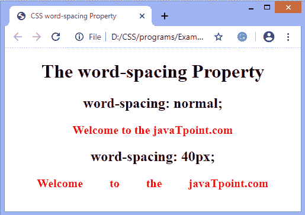
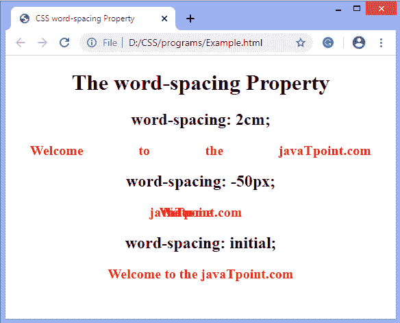

# CSS 字间距

> 原文：<https://www.javatpoint.com/css-word-spacing>

这个 CSS 属性用于控制单词之间的间距。使用这个属性，我们可以增加或减少单词之间的间距。

它修改了单词之间的间距。它类似于**字母间距**属性，但是这个 [CSS](https://www.javatpoint.com/css-tutorial) 属性不是指定单个字符之间的间距，而是定义文本中单词之间的间距。

**字间距**的大的负值或正值会使该字不可读。如果我们应用一个非常大的正值，那么它会导致单词的出现，就像一系列不相关的单个单词。非常大的负值会使单词相互重叠，从而使单词无法识别。

### 句法

```

word-spacing: normal | length | initial | inherit;

```

### 属性值

**正常:**定义字与字之间的正常间距(0.25em)是默认值。它用于指定由浏览器定义的空间。

**长度:**根据长度指定单词之间的额外空间(在 **pt、px、em、cm、**等中)。).它允许负值。

**初始值:**用于将属性设置为默认值。

**inherit:** 它从其父元素继承值。

### 例子

```

<!DOCTYPE html> 
<html> 
<head> 
    <title> 
      CSS word-spacing Property 
    </title> 
<style>
body{
text-align: center;
}
#space{
word-spacing: 40px; 
}
p{
color: red;  
font-weight: bold; 
font-size: 20px;
}
</style>
</head> 
<body> 
    <h1>The word-spacing Property</h1> 
	<div>
    <h2>word-spacing: normal;</h2> 
    <p> 
       Welcome to the javaTpoint.com
    </p> 
	</div>
		<div>
    <h2>word-spacing: 40px;</h2> 
    <p id= "space"> 
       Welcome to the javaTpoint.com
    </p> 
	</div>
</body> 
</html>

```

[Test it Now](https://www.javatpoint.com/oprweb/test.jsp?filename=CSSwordspacing1)

**输出**



### 例子

```

<!DOCTYPE html> 
<html> 
<head> 
    <title> 
      CSS word-spacing Property 
    </title> 
<style>
body{
text-align: center;
}
#space{
word-spacing: 2cm; 
}
#space1{
word-spacing: -50px; 
}
#space2{
word-spacing: initial; 
}
p{
color: red;  
font-weight: bold; 
font-size: 20px;
}
</style>
</head> 
<body> 
    <h1>The word-spacing Property</h1> 
	<div>
    <h2>word-spacing: 2cm;</h2> 
    <p id = "space"> 
       Welcome to the javaTpoint.com
    </p> 
	</div>
		<div>
    <h2>word-spacing: -50px;</h2> 
    <p id= "space1"> 
       Welcome to the javaTpoint.com
    </p> 
	</div>
		<div>
    <h2>word-spacing: initial;</h2> 
    <p id= "space2"> 
       Welcome to the javaTpoint.com
    </p> 
	</div>
	</body> 
</html>

```

[Test it Now](https://www.javatpoint.com/oprweb/test.jsp?filename=CSSwordspacing2)

**输出**



* * *