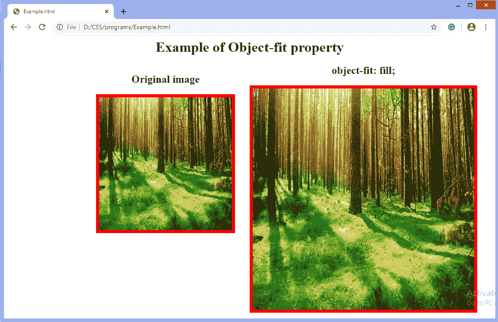
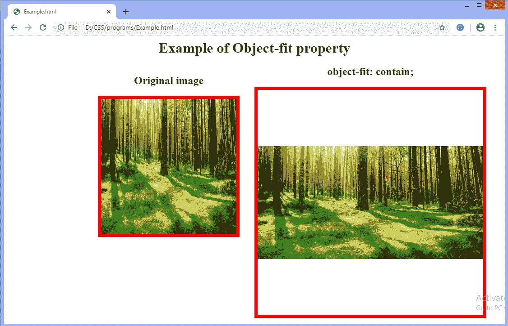
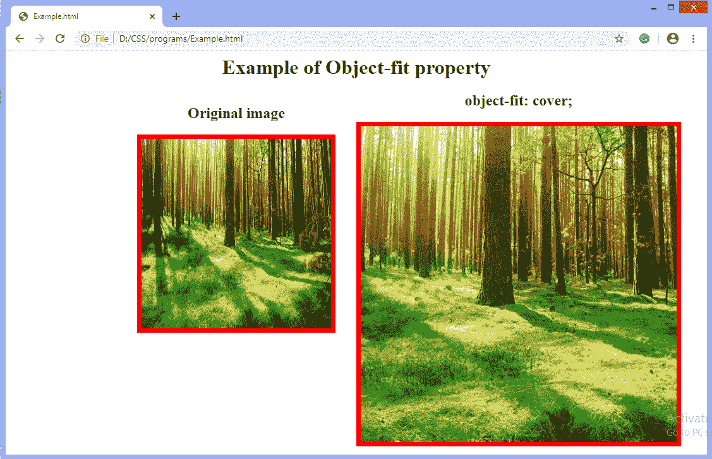
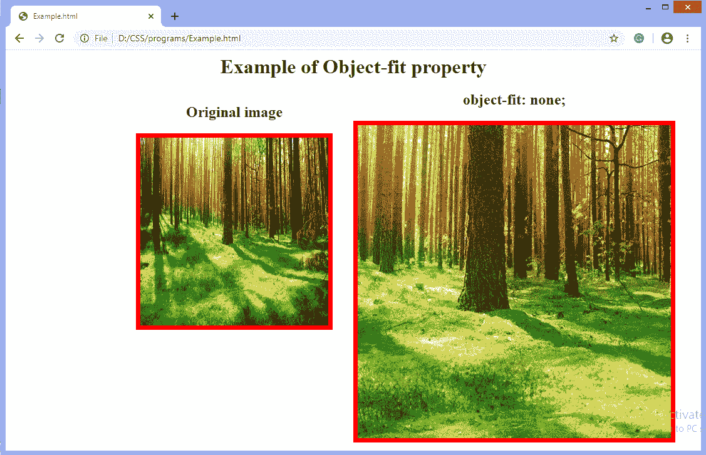
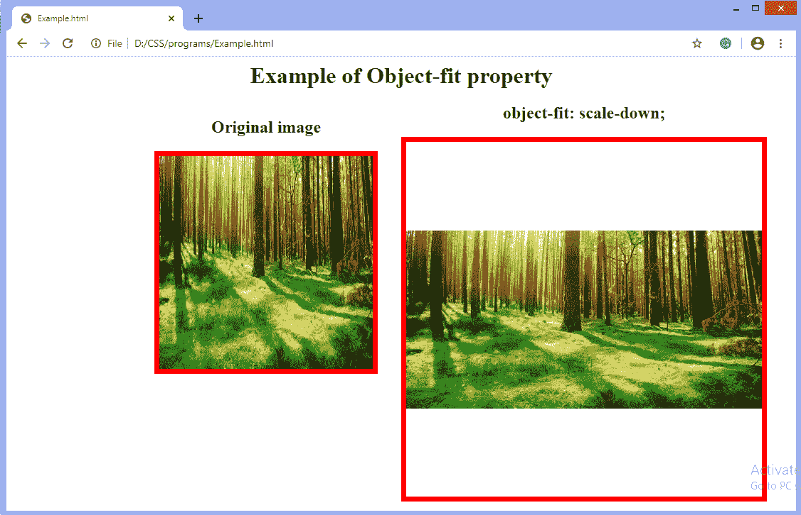

# CSS 对象适配属性

> 原文:[https://www.javatpoint.com/css-object-fit-property](https://www.javatpoint.com/css-object-fit-property)

此 CSS 属性指定如何调整视频或图像的大小以适合其内容框。它定义了元素如何以既定的宽度和高度放入容器中。

它通常应用于图像或视频。此属性指定元素如何对其容器的宽度和高度做出反应。

### 句法

```

object-fit:  fill | contain | cover | none | scale-down | initial | inherit;

```

### 价值观念

该属性的主要五个值定义如下:

**填充:**为默认值。使用该值，整个对象填充到容器中。被替换的内容被调整大小以填充内容框。如果对象的纵横比与框的纵横比不匹配，对象将被压扁或拉伸以适合框。图像将填充该区域；甚至它的长宽比也不匹配。

**contain:** 它调整元素的内容大小，使其保持包含在容器中。它在保持图像长宽比的同时，使图像适合盒子的宽度和高度。被替换的内容被缩放以保持纵横比，同时适合元素的内容框。

**cover:** 它会调整元素的内容大小以覆盖其容器。它用图像填充整个盒子。如果对象的长宽比与框的长宽比不匹配，它会裁剪对象以适合。

**无:**不调整替换内容的大小。图像保持其原始大小，并忽略父图像的高度和宽度。

**缩小:**它将内容定为**无**或**包含**。它导致最小的对象大小。通过比较**无**和**含**找到最小的混凝土物体尺寸。

**初始值:**它将属性设置为默认值，即图像被拉伸以适合容器，因为默认值是**填充**。

**inherit:** 它从其父元素继承值。

现在，让我们通过使用每个属性值的示例来理解上面的属性值。

### 示例:使用填充值

```

<html>
<head>
<style>
body{
text-align: center;
}
#img1{
width: 300px;
height: 300px;
border: 7px solid red;
}
#obj {
width: 500px;
height: 500px;
object-fit: fill;
border: 7px solid red;
}
#left{
float: left;
text-align: center;
padding-left: 200px;
}
#center{
float: center;
text-align: center;
}

</style>
</head>
<body>
<h1> Example of Object-fit property </h1>
<div id = "left">
<h2> Original image </h2>

</div>
<div id= "center">
<h2> object-fit: fill; </h2>

</body>
</html>

```

[Test it Now](https://www.javatpoint.com/oprweb/test.jsp?filename=CSS-object-fit-property1)

**输出**



### 示例-使用包含值

```

<html>
<head>
<style>
body{
text-align: center;
}
#img1{
width: 300px;
height: 300px;
border: 7px solid red;
}
#obj {
width: 500px;
height: 500px;
object-fit: contain;
border: 7px solid red;
}
#left{
float: left;
text-align: center;
padding-left: 200px;
}
#center{
float: center;
text-align: center;
}

</style>
</head>
<body>
<h1> Example of Object-fit property </h1>
<div id = "left">
<h2> Original image </h2>

</div>
<div id= "center">
<h2> object-fit: contain; </h2>

</body>
</html>

```

[Test it Now](https://www.javatpoint.com/oprweb/test.jsp?filename=CSS-object-fit-property2)

**输出**



### 示例-使用覆盖值

```

Example- Using cover value
<html>
<head>
<style>
body{
text-align: center;
}
#img1{
width: 300px;
height: 300px;
border: 7px solid red;
}
#obj {
width: 500px;
height: 500px;
object-fit: cover;
border: 7px solid red;
}
#left{
float: left;
text-align: center;
padding-left: 200px;
}
#center{
float: center;
text-align: center;
}

</style>
</head>
<body>
<h1> Example of Object-fit property </h1>
<div id = "left">
<h2> Original image </h2>

</div>
<div id= "center">
<h2> object-fit: cover; </h2>

</body>
</html>

```

[Test it Now](https://www.javatpoint.com/oprweb/test.jsp?filename=CSS-object-fit-property3)

**输出**



### 示例-不使用任何值

```

<html>
<head>
<style>
body{
text-align: center;
}
#img1{
width: 300px;
height: 300px;
border: 7px solid red;
}
#obj {
width: 500px;
height: 500px;
object-fit: none;
border: 7px solid red;
}
#left{
float: left;
text-align: center;
padding-left: 200px;
}
#center{
float: center;
text-align: center;
}

</style>
</head>
<body>
<h1> Example of Object-fit property </h1>
<div id = "left">
<h2> Original image </h2>

</div>
<div id= "center">
<h2> object-fit: none; </h2>

</body>
</html>

```

[Test it Now](https://www.javatpoint.com/oprweb/test.jsp?filename=CSS-object-fit-property4)

**输出**



### 示例-使用缩小值

```

<html>
<head>
<style>
body{
text-align: center;
}
#img1{
width: 300px;
height: 300px;
border: 7px solid red;
}
#obj {
width: 500px;
height: 500px;
object-fit: scale-down;
border: 7px solid red;
}
#left{
float: left;
text-align: center;
padding-left: 200px;
}
#center{
float: center;
text-align: center;
}

</style>
</head>
<body>
<h1> Example of Object-fit property </h1>
<div id = "left">
<h2> Original image </h2>

</div>
<div id= "center">
<h2> object-fit: scale-down; </h2>

</body>
</html>

```

[Test it Now](https://www.javatpoint.com/oprweb/test.jsp?filename=CSS-object-fit-property5)

**输出**



* * *