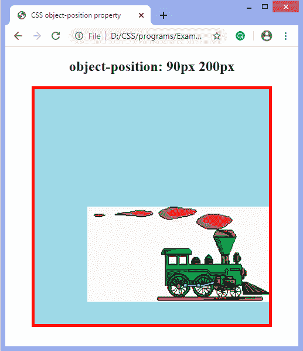

# CSS 对象位置属性

> 原文：<https://www.javatpoint.com/css-object-position-property>

该 [CSS](https://www.javatpoint.com/css-tutorial) 属性用于指定容器内内容的对齐方式。它与**对象拟合**属性一起使用，描述像<视频>或< img >这样的元素是如何在其容器内用 x/y 坐标定位的。

当使用[对象拟合属性](css-object-fit-property)时，**对象位置**的默认值为 **50% 50%** ，因此，默认情况下，所有图像都位于其容器的中心。我们可以通过使用**对象位置**属性来更改默认对齐方式。

### 句法

```css

object-position: <position> | inherit | initial;

```

#### 价值观念

**位置:**定义视频或图像在容器内的位置。它采用两个数值(如 **0 10px** ，其中第一个值管理 x 轴，而第二个值控制 y 轴。它可以是字符串(左、右或中间)，也可以是数字(以%或 px 为单位)。它允许负值。其默认值为 **50% 50%** 。我们可以使用像**右上，左下**等字符串值。

**初始值:**将属性设置为默认值。

**inherit:** 它从其父元素继承属性。

现在，让我们看一些例子来说明**对象位置**属性。

### 例子

```css

<!DOCTYPE html>
<head>

<title>CSS object-position property</title>
<style>
body{
text-align: center;
}
img {
width: 400px;
height: 400px;
border: 5px solid red;
background-color: lightblue;
object-fit: none;
object-position: 90px 200px;
}
</style>
</head>

<body>
<h2> object-position: 90px 200px </h2>

</body>
</html>

```

[Test it Now](https://www.javatpoint.com/oprweb/test.jsp?filename=CSS-object-position-property1)

**输出**

程序执行后，我们会得到如下图所示的输出。



### 示例-使用“中央顶部”

```css

<!DOCTYPE html>
<head>
<title>CSS object-position property</title>
<style>
body{
text-align: center;
}
img {
width: 400px;
height: 300px;
border: 5px solid red;
background-color: lightblue;
object-fit: none;
object-position: center top;
}
</style>
</head>

<body>
<h2>object-position: center top</h2>

</body>
</html>

```

[Test it Now](https://www.javatpoint.com/oprweb/test.jsp?filename=CSS-object-position-property2)

**输出**


#### 示例-使用“右上”

```css

<!DOCTYPE html>
<head>
<title>CSS object-position property</title>
<style>
body{
text-align: center;
}
img {
width: 400px;
height: 300px;
border: 5px solid red;
background-color: lightblue;
object-fit: none;
object-position: center top;
}
</style>
</head>

<body>
<h2>object-position: center top</h2>

</body>
</html>

```

[Test it Now](https://www.javatpoint.com/oprweb/test.jsp?filename=CSS-object-position-property3)

**输出**


### 示例-使用“左上方”

```css

<!DOCTYPE html>
<head>
<title>CSS object-position property</title>
<style>
body{
text-align: center;
}
img {
width: 400px;
height: 300px;
border: 5px solid red;
background-color: lightblue;
object-fit: none;
object-position: left top;
}
</style>
</head>

<body>
<h2>object-position: left top</h2>

</body>
</html>

```

[Test it Now](https://www.javatpoint.com/oprweb/test.jsp?filename=CSS-object-position-property4)

**输出**


### 示例-使用“初始”

当我们使用初始值时，那么图像将被定位到中心。这是因为初始值将属性设置为默认值，即 **50% 50%** 。

```css

<!DOCTYPE html>
<head>
<title>CSS object-position property</title>
<style>
body{
text-align: center;
}
img {
width: 400px;
height: 400px;
border: 5px solid red;
background-color: lightblue;
object-fit: none;
object-position: initial;
}
</style>
</head>

<body>
<h2> object-position: initial</h2>

</body>
</html>

```

[Test it Now](https://www.javatpoint.com/oprweb/test.jsp?filename=CSS-object-position-property5)

**输出**


* * *