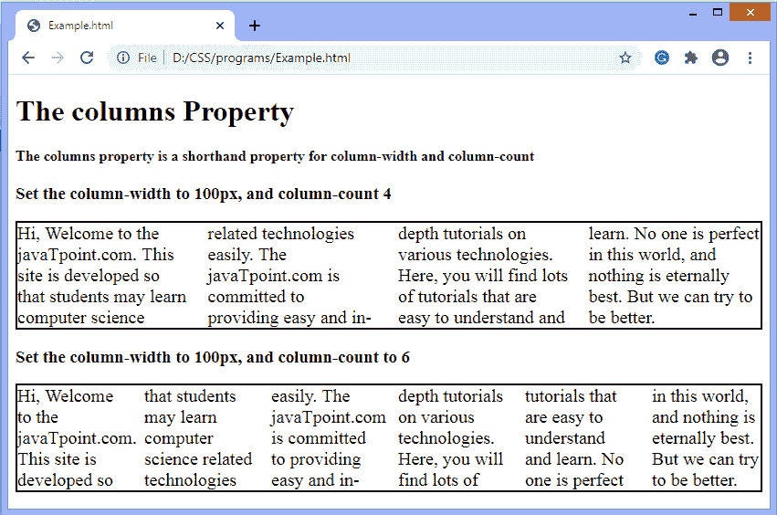

# CSS 列

> 原文：<https://www.javatpoint.com/css-columns>

[CSS](https://www.javatpoint.com/css-tutorial) 中的**列**属性设置单个声明中的列数和宽度。它是一个速记属性，一次可以取几个值。

用于同时设置**列数**和**列宽**属性。这两个属性都用于控制将出现多少列。**列数**属性用于设置列数，而**列宽**属性指定列的宽度。

使用**列数**和**列宽**属性可以创建一个多列布局，该布局在浏览器宽度较窄时自动拆分为一列，而无需使用媒体查询。使用两者并不总是有帮助的，因为它会限制布局的响应性和灵活性。

如果列数和宽度不符合元素的宽度，则浏览器会自动减少列数以符合指定的列宽。

### 句法

```

columns: auto | column-width column-count| initial | inherit;	

```

### 价值观念

属性值及其描述如下表所示。

| 价值 | 描述 |
| **自动** | 默认值将**列数**和**列宽**的值设置为默认浏览器值。 |
| **列宽** | 它用于设置列的最小宽度。然而，根据可用空间，柱的实际宽度可以更窄或更宽。 |
| **列数** | 它指定最大列数。 |
| **初始** | 它用于将属性设置为默认值。 |
| **继承** | 它从其父元素继承属性。 |

如果省略其中任何一个值，那么默认情况下，浏览器会将相应的值设为**自动**。

### 例子

在这个例子中，我们定义了两个 **< div >** 元素，包括文本。对于第一个 div 元素，最小宽度是 100px，最大列数可以是 4。而对于第二个 div 元素，最小宽度是 100px，最大列数可以是 6。

```

<!DOCTYPE html>
<html>
<head>
<style> 
.div1 {
  columns: 100px 4;
  border: solid 2px black;
  font-size: 20px;
}

.div2 {
  columns: 100px 6;
  border: solid 2px black;
  font-size: 20px;
  }
</style>
</head>
<body>

<h1> The columns Property </h1>
<h4> The columns property is a shorthand property for column-width and column-count </h4>

<h3> Set the column-width to 100px, and column-count 4 </h3>
<div class="div1">
Hi, Welcome to the javaTpoint.com. This site is developed so that students may learn computer science related technologies easily. The javaTpoint.com is committed to providing easy and in-depth tutorials on various technologies. Here, you will find lots of tutorials that are easy to understand and learn.
No one is perfect in this world, and nothing is eternally best. But we can try to be better.
</div>

<h3> Set the column-width to 100px, and column-count to 6 </h3>
<div class="div2">
Hi, Welcome to the javaTpoint.com. This site is developed so that students may learn computer science related technologies easily. The javaTpoint.com is committed to providing easy and in-depth tutorials on various technologies. Here, you will find lots of tutorials that are easy to understand and learn.
No one is perfect in this world, and nothing is eternally best. But we can try to be better.
</div>

</body>
</html>

```

**输出**

[Test it Now](https://www.javatpoint.com/oprweb/test.jsp?filename=css-columns1) 

* * *