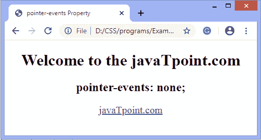

# CSS 指针事件属性

> 原文：<https://www.javatpoint.com/css-pointer-events-property>

这个 CSS 属性指定当指针事件被触发时元素是否显示一些动作。指针事件由触摸、触笔、鼠标点击等等触发。

**指针事件**属性控制 HTML 元素如何响应事件，如 [CSS](https://www.javatpoint.com/css-tutorial) 活动/悬停状态、鼠标/触摸事件、JavaScript 点击/点击事件，还控制光标是否可见。

该属性的 **none** 值用于停用点击目标，并允许元素瞄准该元素下的任何对象。

### 句法

```css

pointer-events: none | auto |initial | inherit;

```

虽然这个属性包括 11 个可能的值，但是上面语法中给出的值是 [HTML](https://www.javatpoint.com/html-tutorial) 元素的有效值，其他值保留给 SVG 使用。

### 属性值

**无:**该值表示元素对指针事件没有反应。它避免了指定 HTML 元素上的所有状态、单击和光标选项。

**自动:**为默认值。它表示元素必须对指针事件做出反应，例如**点击**和**:悬停**。

让我们通过一些例子来理解这些价值。

### 示例-不使用任何值

在这个例子中，我们使用的是 none 值，它不针对指针事件。

```css

<!DOCTYPE html>
<html>
<head>
<title>
pointer-events Property
</title>
<style>
body {
text-align:center;
}
p{
font-size: 20px;
pointer-events: none;
}

</style>
</head>
<body>
<CENTER>
<h1> Welcome to the javaTpoint.com  </h1>
<h2> pointer-events:auto; </h2>
<p>
<a href="https://www.javatpoint.com/"> javaTpoint.com </a>
</p>
</body>
</html>

```

[Test it Now](https://www.javatpoint.com/oprweb/test.jsp?filename=CSSpointer-eventsproperty1)

**输出**



### 示例-使用自动值

这里，我们使用**指针事件**属性的自动**值**，它对指针事件做出反应。

```css

<!DOCTYPE html>
<html>
<head>
<title>
pointer-events Property
</title>
<style>
body {
text-align:center;
}
p{
font-size: 20px;
pointer-events: auto;
}

</style>
</head>
<body>
<CENTER>
<h1> Welcome to the javaTpoint.com  </h1>
<h2> pointer-events:auto; </h2>
<p>
<a href="https://www.javatpoint.com/"> javaTpoint.com </a>
</p>
</body>
</html>

```

[Test it Now](https://www.javatpoint.com/oprweb/test.jsp?filename=CSSpointer-eventsproperty2)

**输出**


* * *