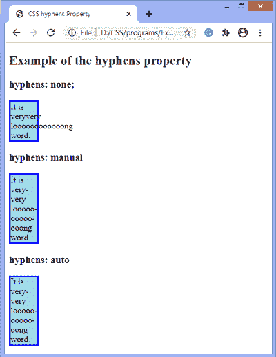

# CSS 连字符属性

> 原文：<https://www.javatpoint.com/css-hyphens-property>

此 CSS 属性用于控制块级元素中文本的断字。它定义了如果单词太长或文本换行时如何断字。

这个属性允许我们将单词分成两行来改善文本布局。

### 句法

```

hyphens: none | manual | auto | initial | inherit;

```

该 [CSS](https://www.javatpoint.com/css-tutorial) 属性的值定义如下。

### 属性值

**无:**该值不为单词断字。即使单词太长，它也不会在换行符处用连字符连接单词。

**手动:**只有当单词中的字符提示断字机会时，才断字是默认值。下面定义了两个 Unicode 字符，可以手动使用它们来指定文本中可能的行断点。

**U+2010(连字符)-** 是‘硬’连字符指定可见的断线机会。即使线没有在该点断开，也会呈现连字符。

**U+00AD (SHY) -** 是一个看不见的‘软’连字符。它没有明显的渲染；取而代之的是，它指出了应该要求这个词中断的地方。在 [html](https://www.javatpoint.com/html-tutorial) 中，对于软连字符，我们可以使用**&amp shy；**。

**自动:**在该值中，算法决定单词的连字符位置。

**初始值:**将属性设置为默认值。

**inherit:** 它从其父元素继承值。

让我们通过一个例子来理解这个 CSS 属性。

### 例子

```

<!DOCTYPE html>
<html>

<head>
<title>
CSS hyphens Property
</title>
<style>

div {
width: 50px;
border: 3px solid blue;
background-color: lightblue;
}

.none{
hyphens: none;
}

.manual{
hyphens: manual;
}

.auto{
hyphens: auto;
}
</style>
</head>

<body>
<h2> Example of the hyphens property </h2>

<h3> hyphens: none; </h3>
<div class="none">
It is veryvery loooooooooooong word.
</div>

<h3>hyphens: manual</h3>
<div class="manual">
It is veryvery looooooooooooong word.
</div>

<h3>hyphens: auto</h3>
<div class="auto">
It is very-very looooo-ooooo-oong word.
</div>

</body>

</html>

```

[Test it Now](https://www.javatpoint.com/oprweb/test.jsp?filename=css-hyphens-property1)

**输出**



* * *