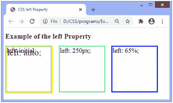
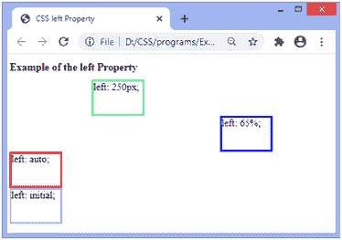

# CSS 左侧属性

> 原文：<https://www.javatpoint.com/css-left-property>

此 CSS 属性指定水平定位元素的左偏移量，并且不影响非定位元素。是**右、上、**和**下**四个偏移属性之一。

当**左**和**右**属性都被定义时，如果容器是从右向左的，则右值优先，如果容器是从左向右的，则左值优先。

该属性的效果取决于相应元素的位置，即**位置**属性的值。当 [**位置**属性](https://www.javatpoint.com/css-position)设置为值**静态**时，**左侧**属性不影响。

除了值**静态**之外，该属性对定位元素的影响如下:

*   当元素绝对或固定定位时(即**位置:绝对；****位置:固定；**)，left 属性指定元素左边缘与其包含块(元素相对定位的祖先)左边缘之间的距离。
*   如果元素相对定位(即**位置:相对；**)，左属性将元素的左边缘从其正常位置设置为左/右。
*   如果**位置**设置为**粘性，**即**位置:粘性；**那么定位上下文就是视口。当元素位于视口内时，左侧属性的行为就像它的位置是相对的一样。当元素在外部时，左属性的行为就像它的位置是固定的一样。

### 句法

```html

left: auto | length | percentage | initial | inherit;

```

### 属性值

该属性的值定义如下:

**自动:**这是默认值。它允许浏览器计算左边缘位置。

**长度:**该值定义左属性在 px、cm、pt 等中的位置。它允许负值。

**百分比:**该值以百分比(%)定义左侧属性的位置。它是根据元素包含块的宽度计算的。它也允许负值。

**初始值:**将属性设置为默认值。

**inherit:** 它从其父元素继承属性。

### 例子

在这个例子中，有四个绝对定位(即**位置:绝对；** ) div 元素。我们将把**留下的**房产转让给他们。**左边的 div 元素:初始；**和**左:自动；**会因为尺寸和默认值相似而重叠。

在输出中，我们可以看到黄色边框的 div 元素左边是**:auto；**浅蓝色边框的 div 元素是**左边:初始；**。

```html

<!DOCTYPE html>
<html>
<head>
<title>
CSS left Property
</title>
<style>

div{
position: absolute;
width: 200px;
height: 200px;
font-size: 30px;
}
#len {
left: 250px;
border: 5px solid lightgreen;
}
#per {
left: 65%;
border: 5px solid blue;
}
#auto {
left: auto;
border: 8px solid yellow;
font-size: 40px;
}

#init {
left: initial;
border: 5px solid lightblue;
}

</style>
</head>

<body>
<h1> Example of the left Property </h1>

<div id = "len"> left: 250px; </div>
<div id = "per"> left: 65%; </div>
<div id = "auto"> left: auto; </div>
<div id = "init"> left: initial; </div>
</body>
</html>

```

[Test it Now](https://www.javatpoint.com/oprweb/test.jsp?filename=css-left-property1)

**输出**



### 例子

在这个例子中，有四个相对定位(即**位置:相对；** ) div 元素。我们正在申请他们的**左侧**房产。

```html

<!DOCTYPE html>
<html>
<head>
<title>
CSS left Property
</title>
<style>

div{
position: relative;
width: 150px;
height: 100px;
font-size: 30px;
}
#len {
left: 250px;
border: 5px solid lightgreen;
}
#per {
left: 65%;
border: 5px solid blue;
}
#auto {
left: auto;
border: 5px solid red;
}

#init {
left: initial;
border: 5px solid lightblue;
}

</style>
</head>

<body>
<h1> Example of the left Property </h1>

<div id = "len"> left: 250px; </div>
<div id = "per"> left: 65%; </div>
<div id = "auto"> left: auto; </div>
<div id = "init"> left: initial; </div>
</body>
</html>

```

[Test it Now](https://www.javatpoint.com/oprweb/test.jsp?filename=css-left-property2)

**输出**



* * *