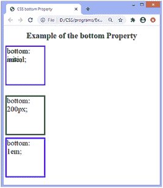
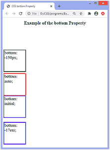

# CSS 底部属性

> 原文：<https://www.javatpoint.com/css-bottom-property>

CSS 中的**底部**属性用于指定垂直定位元素的底部位置。它不影响未定位的元素。是**左、**右、**顶**四个偏移属性之一。

该属性的效果取决于对应元素的位置，即**位置**属性的值。当**位置**属性设置为值**静态**时，**底部**属性不影响。

### 句法

```

bottom: auto | length | percentage | initial | inherit;

```

### 属性值

该属性的值定义如下:

**自动:**这是默认值。它允许浏览器计算底边位置。

**长度:**该值定义了**底部**属性在 px、cm、pt 等中的位置。它允许负值。

**百分比:**该值以百分比(%)定义**底部**属性的位置。它被计算到元素的包含块的高度。它也允许负值。

**初始值:**将属性设置为默认值。

**inherit:** 它从其父元素继承属性。

除了值**静态**之外，该属性对定位元素的影响如下:

*   当元素固定或绝对定位时(即**位置:固定；****位置:绝对；**)，**底部**属性指定元素的底部边缘与其包含块(元素相对定位的祖先)的底部边缘之间的距离。
*   如果元素相对定位(即**位置:相对；**)，底部属性将元素的上边缘从其正常位置移动到上方/下方。
*   如果**位置**设置为**粘性**，即**位置:粘性；**那么，定位上下文就是视口。当元素位于视口内时，**底部**属性的行为就像它的位置是相对的一样。当元素在外部时，**底部**属性的行为就像它的位置是固定的一样。

现在，让我们通过一些例子来理解这个属性。

### 例子

在这个例子中，有四个绝对定位的 div 元素。我们正在对它们应用**底部**属性。底部带有**的 div 元素:初始；**和**底部:汽车；**会因为尺寸和默认值相似而重叠。

这里**底部**属性的长度在 **px** 和 **em** 中定义。

```

<!DOCTYPE html>
<html>
<head>
<title>
CSS bottom Property
</title>
<style>

div{
position: absolute;
width: 150px;
height: 150px;
font-size: 30px;
}
#len {
bottom: 200px;
border: 5px solid green;
}
#em {
bottom: 1em;
border: 5px solid blue;
}
#auto {
bottom: auto;
border: 5px solid red;
}

#init {
bottom: initial;
border: 5px solid darkviolet;
}
h1{
text-align: center;
}
</style>
</head>

<body>
<h1> Example of the bottom Property </h1>
<div id = "len"> bottom: 200px; </div>
<div id = "em"> bottom: 1em; </div>
<div id = "auto"> bottom: auto; </div>
<div id = "init"> bottom: initial; </div>
</body>
</html>

```

[Test it Now](https://www.javatpoint.com/oprweb/test.jsp?filename=css-bottom-property1)

**输出**



### 示例-使用负值

在这个例子中，有四个相对定位的 div 元素。我们用负值对它们应用**底部**属性。这里，**底部**属性的负长度值在 **px** 和 **em** 中定义。

```

<!DOCTYPE html>
<html>
<head>
<title>
CSS bottom Property
</title>
<style>

div{
position: relative;
width: 150px;
height: 150px;
font-size: 30px;
}
#len {
bottom: -150px;
border: 5px solid green;
}
#em {
bottom: -17em;
border: 5px solid blue;
}
#auto {
bottom: auto;
border: 5px solid red;
}

#init {
bottom: initial;
border: 5px solid darkviolet;
}
h1{
text-align: center;
}
</style>
</head>

<body>
<h1> Example of the bottom Property </h1>
<div id = "len"> bottom: -150px; </div>
<div id = "em"> bottom: -17em; </div>
<div id = "auto"> bottom: auto; </div>
<div id = "init"> bottom: initial; </div>
</body>
</html>

```

[Test it Now](https://www.javatpoint.com/oprweb/test.jsp?filename=css-bottom-property2)

**输出**



* * *