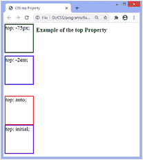
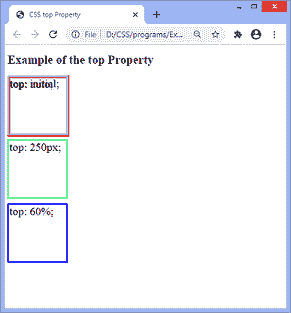

# CSS 顶级属性

> 原文:[https://www.javatpoint.com/css-top-property](https://www.javatpoint.com/css-top-property)

[CSS](https://www.javatpoint.com/css-tutorial) 中的 **top** 属性用于指定垂直定位元素的顶部位置。它不影响未定位的元素。是**左、**右、**底**四个偏移属性之一。

该属性的效果取决于相应元素的位置，即**位置**属性的值。当 [**位置**](https://www.javatpoint.com/css-position) 属性设置为静态值时，**顶部**属性不起作用。

除了值**静态**之外，该属性对定位元素的影响如下:

*   当元素绝对或固定定位时(即**位置:绝对；****位置:固定**；)，顶部**属性指定元素的顶部边缘与其包含块(元素相对定位的祖先)的顶部边缘之间的距离。**
*   如果元件相对定位(即**位置:相对**；)，top 属性将元素的上边缘从其正常位置移动到上方/下方。
*   如果**位置**设置为**粘性**(即**位置:粘性**；)然后，定位上下文就是视口。当元素位于视口内时，**顶部**属性的行为就像它的位置是相对的一样。当元素在外部时，**顶部**属性的行为就像它的位置是固定的一样。

### 句法

```

top: auto | length | percentage | initial | inherit;

```

### 属性值

该属性的值定义如下:

**自动:**这是默认值。它允许浏览器计算顶部边缘位置。

**长度:**该值定义了**顶部**属性在 px、cm、pt 等中的位置。它允许负值。

**百分比:**该值以百分比(%)定义**顶部**属性的位置。它是根据元素包含块的高度计算的。它也允许负值。

**初始值:**将属性设置为默认值。

**inherit:** 它从其父元素继承属性。

现在，让我们通过一些例子来理解这个属性。

### 示例-使用负值

在这个例子中，有四个相对定位的 div 元素。我们用负值对它们应用 **top** 属性。这里，**顶部**属性的负长度值在 **px** 和 **em** 中定义。

```

<!DOCTYPE html>
<html>
<head>
<title>
CSS top Property
</title>
<style>

div{
position: relative;
width: 150px;
height: 150px;
font-size: 30px;
}
#len {
top: -75px;
border: 5px solid green;
}
#em {
top: -2em;
border: 5px solid blue;
}
#auto {
top: auto;
border: 5px solid red;
}

#init {
top: initial;
border: 5px solid darkviolet;
}
h1{
text-align: center;
}
</style>
</head>

<body>
<h1> Example of the top Property </h1>
<div id = "len"> top: -75px; </div>
<div id = "em"> top: -2em; </div>
<div id = "auto"> top: auto; </div>
<div id = "init"> top: initial; </div>
</body>
</html>

```

[Test it Now](https://www.javatpoint.com/oprweb/test.jsp?filename=css-top-property1)

**输出**



### 例子

本例中有四个绝对定位(即**位置:绝对**；)div 元素。我们正在申请**顶级**房产给他们。带有**的 div 元素顶部:初始；****顶:自动；**会因为尺寸和默认值相似而重叠。这里，**顶部**属性的长度在 **px** 和%中定义。

```

<!DOCTYPE html>
<html>
<head>
<title>
CSS top Property
</title>
<style>

div{
position: absolute;
width: 150px;
height: 150px;
font-size: 30px;
}
#len {
top: 250px;
border: 5px solid lightgreen;
}
#per {
top: 60%;
border: 5px solid blue;
}
#auto {
top: auto;
border: 7px solid red;
}

#init {
top: initial;
border: 5px solid lightblue;
}

</style>
</head>

<body>
<h1> Example of the top Property </h1>

<div id = "len"> top: 250px; </div>
<div id = "per"> top: 60%; </div>
<div id = "auto"> top: auto; </div>
<div id = "init"> top: initial; </div>
</body>
</html>

```

[Test it Now](https://www.javatpoint.com/oprweb/test.jsp?filename=css-top-property2)

**输出**



* * *