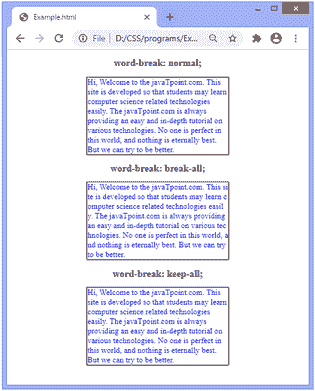

# CSS 断字属性

> 原文：<https://www.javatpoint.com/css-word-break-property>

这个 CSS 属性指定单词应该如何在行尾换行。它定义了换行规则。使用此属性，内容框中不适合的行将在某个点断开。

### 句法

```css

word-break: normal |keep-all |  break-all | inherit ;  

```

该属性的默认值为**正常**。因此，当我们不指定任何值时，它会自动使用。

### 价值观念

**keep-all:** 以默认样式断字。它不应该用于日文/中文/韩文(CJK)文本。

**断字:**在字符之间插入断字，防止字溢出。应用此值时，浏览器将在任何点断开线条。如果单词太长而不适合，它可以从中间断开，并出现在行尾。它不适用连字符。

**初始值:**将属性设置为默认值。

**inherit:** 它从其父元素继承属性。

### 例子

在这个例子中，有三个容器。我们对第一个容器的内容应用**正常**值，对第二个容器的内容应用**全断**值，对第三个容器的内容应用**全保**值。

```css

<!DOCTYPE html>
<html>
<head>
<style>
p{
width: 350px;
border: 2px solid black;
text-align: left;
font-size: 20px;
color: blue;
}
.jtp{
word-break: normal;
}
.jtp1{
word-break: break-all;
}
.jtp2{
word-break: keep-all;
}
</style>
</head>
<center>
<body>
<h2>word-break: normal;</h2>
<p class="jtp">
Hi, Welcome to the javaTpoint.com. This site is developed so that students may learn computer science related technologies easily. The javaTpoint.com is always providing an easy and in-depth tutorial on various technologies. No one is perfect in this world, and nothing is eternally best. But we can try to be better.
</p>
<h2>word-break: break-all;</h2>
<p class="jtp1">
Hi, Welcome to the javaTpoint.com. This site is developed so that students may learn computer science related technologies easily. The javaTpoint.com is always providing an easy and in-depth tutorial on various technologies. No one is perfect in this world, and nothing is eternally best. But we can try to be better.
</p>
<h2>word-break: keep-all;</h2>
<p class="jtp2">
Hi, Welcome to the javaTpoint.com. This site is developed so that students may learn computer science related technologies easily. The javaTpoint.com is always providing an easy and in-depth tutorial on various technologies. No one is perfect in this world, and nothing is eternally best. But we can try to be better.
</p>
</center>
</body>
</html>

```

[Test it Now](https://www.javatpoint.com/oprweb/test.jsp?filename=css-word-break-property1)

**输出**



* * *