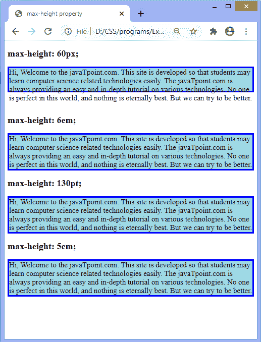

# CSS 最大高度属性

> 原文:[https://www.javatpoint.com/css-max-height-property](https://www.javatpoint.com/css-max-height-property)

它设置元素内容框的最大高度。这意味着内容框的高度可以小于最大高度值，但不能大于该值。它设置元素高度的上限。

当内容大于最大高度时，就会溢出。如果内容小于**最大高度**，该属性不影响。该属性确保高度属性的值不能大于**最大高度**属性的值。它不允许负值。

有时将元素的高度限制在某个范围内很有用。

### 句法

```

max-height: none | length | initial | inherit;

```

该 [CSS](https://www.javatpoint.com/css-tutorial) 属性的值定义如下。

**无:**是不限制内容框大小的默认值。

**长度:**该值以像素、厘米、点等为单位定义最大高度。

**初始值:**将属性设置为默认值。

**inherit:** 它从其父元素继承属性。

现在，让我们看看这个 CSS 属性的一个例子。

### 例子

在本例中，内容包含四个段落元素。我们使用**最大高度**属性的长度值来定义这些段落的最大高度。第一段最大高度为 **60px** ，第二段为 **6em** ，第三段为 **130pt** ，第四段为 **5cm** 。

第一段的内容大于 **max-height** 属性的值，所以在输出中我们可以看到第一段的内容溢出了内容框。

```

<!DOCTYPE html>
<html>
<head>
<title>
max-height property
</title>

<style>
p{
border: 4px solid blue;
background-color: lightblue;
font-size: 20px;
}
#px {
max-height: 60px;
}
#em {
max-height: 6em;

}
#pt {
max-height: 130pt;

}
#cm {
max-height: 5cm;

}
</style>
</head>
<body>
<h2> max-height: 60px; </h2>
<p id = "px">
Hi, Welcome to the javaTpoint.com. This site is developed so that students may learn computer science related technologies easily. The javaTpoint.com is always providing an easy and in-depth tutorial on various technologies. No one is perfect in this world, and nothing is eternally best. But we can try to be better.
</p>
<br>
<h2> max-height: 6em; </h2>
<p id = "em">
Hi, Welcome to the javaTpoint.com. This site is developed so that students may learn computer science related technologies easily. The javaTpoint.com is always providing an easy and in-depth tutorial on various technologies. No one is perfect in this world, and nothing is eternally best. But we can try to be better.
</p>
<h2> max-height: 130pt; </h2>
<p id = "pt">
Hi, Welcome to the javaTpoint.com. This site is developed so that students may learn computer science related technologies easily. The javaTpoint.com is always providing an easy and in-depth tutorial on various technologies. No one is perfect in this world, and nothing is eternally best. But we can try to be better.
</p>
<h2> max-height: 5cm; </h2>
<p id = "cm">
Hi, Welcome to the javaTpoint.com. This site is developed so that students may learn computer science related technologies easily. The javaTpoint.com is always providing an easy and in-depth tutorial on various technologies. No one is perfect in this world, and nothing is eternally best. But we can try to be better.
</p>

</body>
</html>

```

[Test it Now](https://www.javatpoint.com/oprweb/test.jsp?filename=css-max-height-property1)

**输出**



* * *