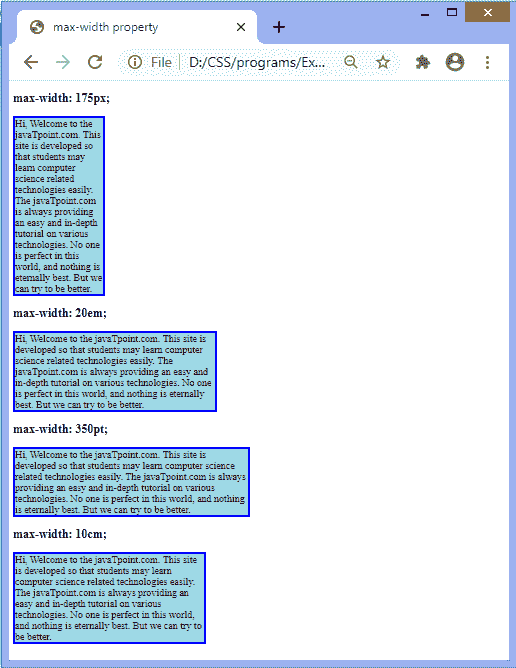

# CSS 最大宽度属性

> 原文：<https://www.javatpoint.com/css-max-width-property>

有时将元素的宽度限制在一定范围内是有用的。有两个属性**最大宽度**和**最小宽度**用于设置元素的最大和最小宽度。

[CSS](https://www.javatpoint.com/css-tutorial) 中的**最大宽度**属性用于设置元素内容框的最大宽度。这意味着内容框的宽度可以小于**最大宽度**值，但不能大于该值。它设置元素宽度的上限。

当内容大于最大宽度时，它将自动改变元素的高度。如果内容小于**最大宽度**，则该属性无效。该属性确保宽度属性的值不能大于**最大宽度**属性的值。它不允许负值。

### 句法

```

max-width: none | length | initial | inherit;

```

这个 CSS 属性的值定义如下。

**无:**是不限制内容框宽度的默认值。

**长度:**该值定义最大宽度的长度，单位为像素、厘米、点等。

**初始值:**将属性设置为默认值。

**inherit:** 它从其父元素继承属性。

现在，让我们看看这个 CSS 属性的一个例子。

### 例子

在本例中，内容包含四个段落元素。我们使用**最大宽度**属性的长度值来定义这些段落的最大宽度。第一段最大宽度为 **175px** ，第二段为 **20em** ，第三段为 **350pt** ，第四段为 **10cm** 。

第一段的内容大于**最大宽度**属性的值，所以在输出中，我们可以看到第一段的高度是自动变化的。

```

<!DOCTYPE html>
<html>
<head>
<title>
max-width property
</title>

<style>
p{
border: 4px solid blue;
background-color: lightblue;
font-size: 20px;
}
#px {
max-width: 175px;
}
#em {
max-width: 20em;
}
#pt {
max-width: 350pt;

}
#cm {
max-width: 10cm;

}
</style>
</head>
<body>
<h2> max-width: 175px; </h2>
<p id = "px">
Hi, Welcome to the javaTpoint.com. This site is developed so that students may learn computer science related technologies easily. The javaTpoint.com is always providing an easy and in-depth tutorial on various technologies. No one is perfect in this world, and nothing is eternally best. But we can try to be better.
</p>
<h2> max-width: 20em; </h2>
<p id = "em">
Hi, Welcome to the javaTpoint.com. This site is developed so that students may learn computer science related technologies easily. The javaTpoint.com is always providing an easy and in-depth tutorial on various technologies. No one is perfect in this world, and nothing is eternally best. But we can try to be better.
</p>
<h2> max-width: 350pt; </h2>
<p id = "pt">
Hi, Welcome to the javaTpoint.com. This site is developed so that students may learn computer science related technologies easily. The javaTpoint.com is always providing an easy and in-depth tutorial on various technologies. No one is perfect in this world, and nothing is eternally best. But we can try to be better.
</p>
<h2> max-width: 10cm; </h2>
<p id = "cm">
Hi, Welcome to the javaTpoint.com. This site is developed so that students may learn computer science related technologies easily. The javaTpoint.com is always providing an easy and in-depth tutorial on various technologies. No one is perfect in this world, and nothing is eternally best. But we can try to be better.
</p>

</body>
</html>

```

[Test it Now](https://www.javatpoint.com/oprweb/test.jsp?filename=css-max-width-property1)

**输出**



* * *