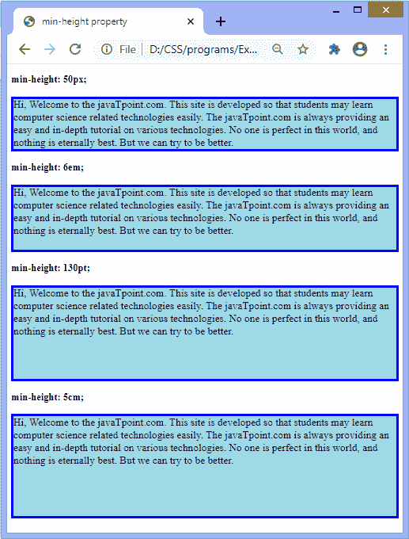

# CSS 最小高度属性

> 原文：<https://www.javatpoint.com/css-min-height-property>

它设置元素内容框的最小高度。这意味着内容框的高度可以大于**最小高度**值，但不能更短。它设置元素高度的下限。

它将在内容小于最小高度时应用；否则，如果内容较大，此属性没有任何作用。该属性确保高度属性的值不能小于**最小高度**属性的值。它不允许负值。

### 句法

```

min-height: none | length | initial | inherit;

```

此 CSS 属性的值定义如下:

**无:**是不限制内容框大小的默认值。

**长度:**该值以像素、厘米、点等为单位定义最小高度。其默认值为 0。

**初始值:**将属性设置为默认值。

**inherit:** 它从其父元素继承属性。

现在，让我们看一个使用这个 [CSS](https://www.javatpoint.com/css-tutorial) 属性的例子。

### 例子

在本例中，内容包含四个段落元素。我们使用**最小高度**属性的长度值来定义这些段落的最小高度。第一段最小高度为 **50px** ，第二段为 **6em** ，第三段为 **130pt** ，第四段为 **5cm** 。

```

<!DOCTYPE html>
<html>
<head>
<title>
min-height property
</title>

<style>
p{
border: 4px solid blue;
background-color: lightblue;
font-size: 20px;
}
#px {
min-height: 50px;
}
#em {
min-height: 6em;

}
#pt {
min-height: 130pt;

}
#cm {
min-height: 5cm;

}
</style>
</head>
<body>
<h3> min-height: 50px; </h3>
<p id = "px">
Hi, Welcome to the javaTpoint.com. This site is developed so that students may learn computer science related technologies easily. The javaTpoint.com is always providing an easy and in-depth tutorial on various technologies. No one is perfect in this world, and nothing is eternally best. But we can try to be better.
</p>
<h3> min-height: 6em; </h3>
<p id = "em">
Hi, Welcome to the javaTpoint.com. This site is developed so that students may learn computer science related technologies easily. The javaTpoint.com is always providing an easy and in-depth tutorial on various technologies. No one is perfect in this world, and nothing is eternally best. But we can try to be better.
</p>
<h3> min-height: 130pt; </h3>
<p id = "pt">
Hi, Welcome to the javaTpoint.com. This site is developed so that students may learn computer science related technologies easily. The javaTpoint.com is always providing an easy and in-depth tutorial on various technologies. No one is perfect in this world, and nothing is eternally best. But we can try to be better.
</p>
<h3> min-height: 5cm; </h3>
<p id = "cm">
Hi, Welcome to the javaTpoint.com. This site is developed so that students may learn computer science related technologies easily. The javaTpoint.com is always providing an easy and in-depth tutorial on various technologies. No one is perfect in this world, and nothing is eternally best. But we can try to be better.
</p>

</body>
</html>

```

[Test it Now](https://www.javatpoint.com/oprweb/test.jsp?filename=css-min-height-property1)

**输出**



* * *