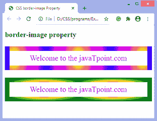

# CSS 边框-图像属性

> 原文：<https://www.javatpoint.com/css-border-image-property>

这个 CSS 属性定义了一个用作元素边框的图像。它在元素外部绘制一个图像，并用相应的图像替换元素的边框。用图像替换元素的边框是一项有趣的任务。

当 [**边框折叠**](https://www.javatpoint.com/css-border-collapse-property) 设置为**折叠**时，**边框图像**属性可应用于除内部表格元素(如 tr、th、td)之外的所有元素。

它是**边界图像源、边界图像切片、边界图像宽度、边界图像开始**和**边界图像重复**的简写属性。我们可以使用**边框图像**属性一次性设置所有这些属性。如果没有指定任何值，则它们将设置为默认值。此属性的默认值为:

```css

border-image: none 100% 1 0 stretch

```

### 句法

```css

border-image: source slice width outset repeat | initial | inherit;

```

该属性的值列表如下。

| 价值观念 | 描述 |
| **边框-图像-来源:** | 它指定边框图像的来源。它设置了图像的路径，或者我们可以说，它指定了要用作边框的图像位置。 |
| **边框-图像-切片:** | 用于分割或切片图像，由**边框-图像-源**属性指定。此属性的值指定如何分割图像以创建边框片段。该属性将图像分为九个部分:

*   [Four corners]
*   Four sides,
*   A central area

它可以接受四个无单位的正值。其默认值为 **100%** 。 |
| **边框-图像-宽度:** | 它设置边框图像的宽度。它可以接受无单位正值、百分比值或关键字 **auto** 。其默认值为 **1** 。我们最多可以指定四个值来提供单个边的宽度。 |
| **边框-图像-开头:** | 它设置边框图像从其边框框中突出的空间量。 |
| **边框-图像-重复:** | 它控制图像的重复以填充边框区域。我们最多可以为此属性指定两个值。如果我们指定一个值，那么它将应用于垂直和水平两侧。但是如果我们指定两个值，那么第一个值应用于水平边，第二个值应用于垂直边。
该属性的值如下所示。

*   stretching
*   repeat
*   circle
*   space

此属性的默认值为**拉伸**。 |
| **初始** | 它将属性设置为默认值(**边框图像:**无 100% 1 0 拉伸)。 |
| **继承** | 它从其父元素继承属性。 |

现在，让我们看一些例子来理解如何使用**边框图像**属性设置边框图像。

### 例子

在本例中，我们将段落元素的边框替换为图像。在第一段中，我们指定了**边框-图像-重复**属性的单个值(即**舍入**)，而在第二段中，我们指定了它的两个值(**舍入，拉伸**)，第一个值用于水平边，第二个值用于垂直边。

```css

<!DOCTYPE html>
<html>
<head>
<title>
CSS border-image Property
</title>

<style>
p{
border: 10px solid transparent;
padding: 15px;
text-align:center;
font-size: 25px;
color: darkviolet;
}
#border {
border-image: url('border.png')  60 / 20px 20px round;

}
#border1 {
border-image: url('diamond.png')  43 / 10px 15px round stretch;

}
</style>
</head>

<body>
<h2>border-image property</h2>

<p id = "border">
Welcome to the javaTpoint.com
</p>
<p id = "border1">
Welcome to the javaTpoint.com
</p>
</body>
</html>

```

[Test it Now](https://www.javatpoint.com/oprweb/test.jsp?filename=css-border-image-property1)

**输出**


我们也可以将渐变指定为边框图像。

### 示例-使用线性梯度

在这个例子中，我们使用**线性渐变**和**重复线性渐变**作为段落元素的边界图像。

```css

<!DOCTYPE html>
<html>
<head>
<title>
CSS border-image Property
</title>

<style>
p{
border: 10px solid transparent;
padding: 15px;
text-align:center;
font-size: 25px;
color: darkviolet;
}

#border {
border-image: url('diamond.png') 40 round stretch;

}
#border1 {
border-image: linear-gradient(orange, yellow, green) 40 / 30px 10px  stretch;

}
#border2 {
border-image: repeating-linear-gradient(50deg, blue, yellow, lightgreen 20px) 30 / 20px 30px round;

}

</style>
</head>

<body>
<h2>border-image property</h2>

<p id = "border">
Welcome to the javaTpoint.com
</p>
<p id = "border1">
Welcome to the javaTpoint.com
</p>
<p id = "border2">
Welcome to the javaTpoint.com
</p>
</body>
</html>

```

[Test it Now](https://www.javatpoint.com/oprweb/test.jsp?filename=css-border-image-property2)

**输出**


### 示例-使用径向梯度

在这个例子中，我们使用**径向渐变**作为段落元素的边界图像。

```css

<!DOCTYPE html>
<html>
<head>
<title>
CSS border-image Property
</title>

<style>
p{
border: 10px solid transparent;
padding: 15px;
text-align:center;
font-size: 25px;

color: darkviolet;
}

#border1 {
border-image: radial-gradient(circle, yellow, magenta, blue) 30 / 15px repeat;
}
#border2 {
border-image: radial-gradient(farthest-side, red, yellow, green) 30 / 15px round;

}

</style>
</head>

<body>
<h2>border-image property</h2>

<p id = "border1">
Welcome to the javaTpoint.com
</p>
<p id = "border2">
Welcome to the javaTpoint.com
</p>
</body>
</html>

```

[Test it Now](https://www.javatpoint.com/oprweb/test.jsp?filename=css-border-image-property3)

**输出**



* * *