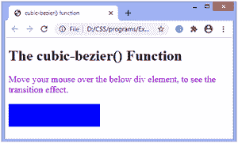

# CSS 三次贝塞尔()函数

> 原文:[https://www.javatpoint.com/css-cubic-bezier-function](https://www.javatpoint.com/css-cubic-bezier-function)

它是 CSS 中定义三次贝塞尔曲线的内置函数。贝塞尔曲线是数学定义的曲线，用于 2D 图形应用程序，如(inkspace、adobe illustrator 等)。).这个 CSS 函数是过渡定时函数，用于平滑和自定义过渡。

它由四个点(P0、P1、P2 和 P3)定义。P0 点和 P3 点(称为*锚点*)是起点和终点，P1 点和 P2 点(称为*手柄*)是中间点。

对于 CSS 贝塞尔曲线，点 P0 和 P3 总是在同一个点。P0 在(0，0)表示初始状态和初始时间，P3 在(1，1)表示最终状态和最终时间。这意味着传递给三次贝塞尔()函数的参数只能在 0 和 1 之间。

### 句法

```

cubic-bezier( x1, y1, x2, y2 )

```

这个 CSS 函数接受四个强制的数值。x1 和 x2 的值必须介于 0 和 1 之间，否则该值将无效。如果我们传递不在此区间的参数，函数将设置为其默认值，即具有值**三次贝塞尔曲线(0，0，1，1)** 的线性过渡。

我们可以用下图来理解这个 [CSS](https://javatpoint.com/css-tutorial) 函数。

### 例子

该功能可以与**动画-定时-功能**和**过渡-定时-功能**属性一起使用。

这里，我们使用的是**过渡-定时-功能**属性。

```

<!DOCTYPE html>
<html>
<head>
<title> cubic-bezier() function </title>
<style>
.jtp {
width: 200px;
height: 50px;
background: blue;
transition: width 3s;
animation-timing-function: cubic-bezier(.59,1.01,0,.01)
}
div:hover {
width:300px;
}
p{
font-size: 20px;
color: darkviolet;
}

</style>
</head>
<body>
<h1> The cubic-bezier() Function </h1>
<p> Move your mouse over the below div element, to see the transition effect. </p>
<div class = "jtp">
</div>
</body>
</html>

```

[Test it Now](https://www.javatpoint.com/oprweb/test.jsp?filename=css-cubic-bezier-function)

**输出**



* * *