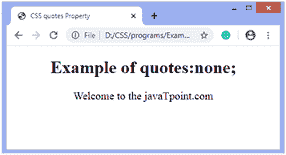
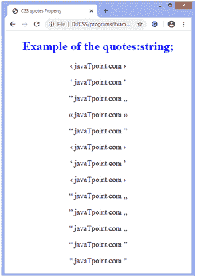
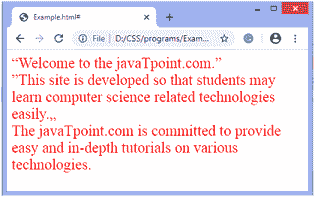

# CSS 引号

> 原文：<https://www.javatpoint.com/css-quotes>

CSS 中的**引号**属性为句子中使用的引号指定了引号的类型。它通过使用**内容**属性的**开报**和**闭报**值来定义插入报价时要使用哪个引号。

### 句法

```html

quotes: none | string | initial;

```

### 价值观念

**无:**是默认值，指定 [**内容**属性](https://www.javatpoint.com/css-content-property)的**开报**和**闭报**值不生成任何引号。

**字符串:**该值指定句子中要使用的引号类型。第一对表示外层报价；第二对表示第一个嵌套级别，第三对表示第三个级别，依此类推。

**初始值:**将属性设置为默认值。

下面列出了一些引号字符。

|  | 描述 | 实体编号 |
| **”** | 双引号 | \0022 |
| **'** | 单引号 | \0027 |
|  | 双引号(双低-9) | \201E |
|  | 双左引号 | \00AB |
|  | 双，直角引用 | \00BB |
| **‹** | 单引号，左引号 | \2039 |
|  | 单个直角引用 | \203A |
| **'** | 左引号(单高-6) | \2018 |
| **'** | 右引号(单高-9) | \2019 |
| **”** | 左引号(双高-6) | \201C |
| **”** | 右引号(双高-9) | \201D |

通过一些例子，我们可以更清楚地理解**引用**的性质。

### 示例-不使用任何值

在本例中，我们使用了**报价**属性的无**值**和**开报**和**闭报**内容属性的值。**无**值阻止**内容**属性的值生成引号。

```html

<!DOCTYPE html>
<html>
<head>
<title>
CSS quotes Property
</title>
<style>
p {
quotes: none;
font-size: 20px;
}
p:before{
content: open-quote;
}
p:after{
content: close-quote;
}
</style>
</head>
<body>
<center>
<h1> Example of quotes: none; </h1>
<p> Welcome to the javaTpoint.com </p>
</center>
</body>
</html>

```

[Test it Now](https://www.javatpoint.com/oprweb/test.jsp?filename=css-quotes1)

**输出**



### 示例-使用字符串值

```html

 CSS quotes Property 

引号示例:字符串；
<q id="j1">推荐点. com</q> 
<q id="j2">推荐点. com</q> 
<q id="j3">推荐点. com</q> 
<q id="j4">推荐点. com</q> 
<q id="j5">推荐点. com</q> 
<q id="j6">推荐点. com</q> 
<q id="j7">推荐点. com</q> 
<q id="j8">推荐点. com</q> 
<q id="j9">推荐点. com</q> 
<q id="j10">推荐点. com</q> 
<q id="j11">推荐点. com</q> 
<q id="j12">推荐点. com</q> 
<q id="j13">推荐点. com</q> 

```

[Test it Now](https://www.javatpoint.com/oprweb/test.jsp?filename=css-quotes2)

**输出**



我们也可以使用: **lang** [伪类](https://www.javatpoint.com/css-pseudo-classes)来更改引号。它可以应用于文档中的所有元素，但不是所有元素都使用 quotes 属性，因此它将应用于大多数元素。让我们看一个同样的例子。

### 示例-使用:lang 伪类

```html

欢迎来到 javaTpoint.com。 
 
 <q lang="fr">这个网站的开发是为了让学生可以轻松学习计算机科学相关技术。</q>

javaTpoint.com 致力于提供各种技术的简单深入的教程。

```

[Test it Now](https://www.javatpoint.com/oprweb/test.jsp?filename=css-quotes3)

**输出**



* * *