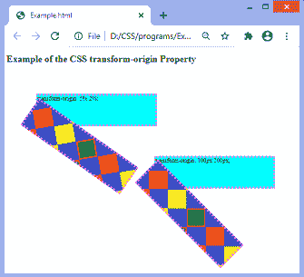
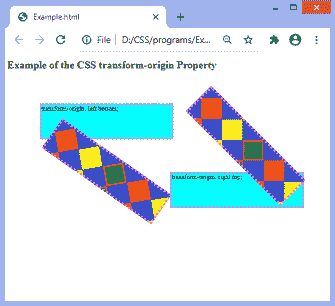
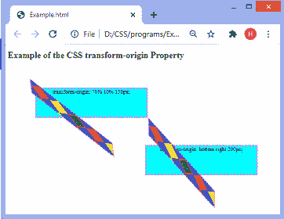

# CSS 转换-原始属性

> 原文：<https://www.javatpoint.com/css-transform-origin-property>

这个 CSS 属性用于改变变换元素的位置。这是一个应用转换的点。它确定了元素变换的原点。它可以应用于 2D 和三维旋转。

**变换原点**属性必须与**变换**属性一起使用。2d 变换可以改变元素的 x 轴和 y 轴，而 [3D 变换](https://www.javatpoint.com/css-3d-transforms)可以改变 z 轴以及 x 轴和 y 轴。

可以通过使用一个、两个或三个值来指定此属性。第一个值影响水平位置，第二个值影响垂直位置，第三个值指示 z 轴的位置。第三个值也可以用于三维变换，不能使用百分比来定义。

*   如果我们只指定一个值，该值必须是长度或百分比，或者是关键字值之一**左、中、右、上、**和**下**。
*   如果我们指定两个值，第一个值必须是长度或百分比或者关键字值**左、右、**和**中心**。第二个值必须是长度或百分比，或者是关键字值**中心、**顶部和**底部**之一。
*   当我们指定三个值时，前两个值与二值语法相同，但第三个值代表 z 偏移，因此它必须是一个长度。

**变换原点**属性的默认值为 **50% 50%** ，代表元素的中心。

### 句法

```css

transform-origin: x-axis y-axis z-axis | initial | inherit;

```

该属性的值列表如下。

| 价值观念 | 描述 |
| **x 轴** | 它代表水平位置。该值指定视图在 x 轴上的位置。它的可能值是长度、百分比、**左侧、右侧**和**中心**。 |
| **y 轴** | 它代表垂直位置。该值指定视图在 y 轴的位置。其可能值为**长度、百分比、顶部、底部、**和**中心**。 |
| **z 轴** | 该值用于三维变换。该值指定视图在 z 轴上的位置。可以使用**长度**值来定义。它不允许百分比值。 |
| **初始** | 它将属性设置为默认值。 |
| **继承** | 它从其父元素继承属性。 |

让我们通过一些例子来理解这个特性。

### 例子

在本例中，我们使用长度和百分比值应用**变换原点**属性。两个元素都有 45°的旋转。这里，有元素的 [2D 变换](https://www.javatpoint.com/css-2d-transforms)。

```css

<!DOCTYPE html>
<html>

<head>
<style>
div{
height: 100px;
width: 400px;
border: 5px dotted violet;
font-size: 20px;
}
.outer {
margin: 100px;
background-color: cyan;
}
.box {
background: url( "diamond.png");
transform: rotate(35deg);
transform-origin: 5% 2%;
}
.outer1{
margin-left: 500px;
background-color: cyan;
}
.box1 {
background: url( "diamond.png");
transform: rotate(45deg);
transform-origin: 5% 2%;
}
</style>
</head>

<body>
<h1> Example of the CSS transform-origin Property </h1>

<div class="outer"> transform-origin: 5% 2%;
<div class="box"></div>
</div>
<div class="outer1"> transform-origin: 100px 200px;
<div class="box1"></div>
</div>
</body>

</html>

```

[Test it Now](https://www.javatpoint.com/oprweb/test.jsp?filename=css-transform-origin-property1)

**输出**



现在，在下一个示例中，我们将使用关键字值指定位置。

### 例子

在本例中，我们使用关键字值应用**变换原点**属性。

```css

<!DOCTYPE html>
<html>

<head>
<style>
div{
height: 100px;
width: 400px;
border: 5px dotted violet;
font-size: 20px;
}
.outer {
margin: 100px;
background-color: cyan;
}
.box {
background: url( "diamond.png");
transform: rotate(35deg);
transform-origin: left bottom;
}
.outer1{
margin-left: 500px;
background-color: cyan;
}
.box1 {
background: url( "diamond.png");
transform: rotate(45deg);
transform-origin: right top;
}
</style>
</head>

<body>
<h1> Example of the CSS transform-origin Property </h1>

<div class="outer"> transform-origin: left bottom;
<div class="box"></div>
</div>
<div class="outer1"> transform-origin: right top;
<div class="box1"></div>
</div>
</body>

</html>

```

[Test it Now](https://www.javatpoint.com/oprweb/test.jsp?filename=css-transform-origin-property2)

**输出**



现在，让我们将**变换-原点**属性应用于具有三维变换的元素。

### 例子

在本例中，我们将**变换原点**属性应用于三维变换元素。

```css

<!DOCTYPE html>
<html>

<head>
<style>
div{
height: 100px;
width: 400px;
border: 5px dotted violet;
font-size: 20px;
}
.outer {
margin: 100px;
background-color: cyan;
text-align: center;
}
.box {
background: url( "diamond.png");
  transform: rotate3d(3, 2, 1, 75deg);
  transform-origin: 70% 10% 150px;
}
.outer1{
margin-left: 500px;
background-color: cyan;
text-align: center;
}
.box1 {
background: url( "diamond.png");
  transform: rotate3d(2, 2, 1, 75deg);
  transform-origin: bottom right 200px;
}
</style>
</head>

<body>
<h1> Example of the CSS transform-origin Property </h1>

<div class="outer"> transform-origin: 70% 10% 150px;
<div class="box"></div>
</div>
<div class="outer1"> transform-origin: bottom right 200px;
<div class="box1"></div>
</div>
</body>

</html>

```

[Test it Now](https://www.javatpoint.com/oprweb/test.jsp?filename=css-transform-origin-property3)

**输出**



* * *