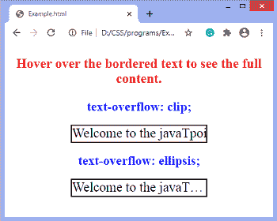
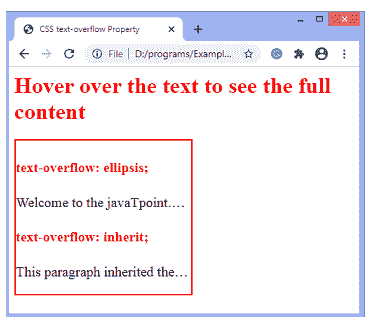
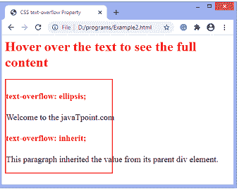

# CSS 文本溢出属性

> 原文：<https://www.javatpoint.com/css-text-overflow-property>

此属性指定溢出文本的表示形式，用户看不到它。它向用户发出不可见内容的信号。这个属性帮助我们决定是否应该剪切文本，显示一些点(省略号)，或者显示一个自定义字符串。

该属性不能独立工作。我们必须使用**空格:nowrap 和溢出:隐藏；**具有此属性

### 句法

```css

text-overflow: clip | ellipsis | string | initial | inherit;  

```

### 属性值

**剪辑:**是剪辑溢出文本的默认值。它会在内容区域的限制处截断文本，以便可以截断字符中间的文本。

**省略号:**该值显示省略号(？)或三个点来显示剪切的文本。它显示在区域内，减少了文本量。

**字符串:**用于使用程序员选择的字符串向用户表示裁剪后的文本。它只在火狐浏览器中工作。

**初始值:**将属性设置为默认值。

**inherit:** 它从其父元素继承属性。

### 例子

```css

<!DOCTYPE html>
<html>
<head>
<style>
div{
white-space: nowrap;
height: 30px;
width: 250px;
overflow: hidden;
border: 2px solid black;
font-size: 25px;

}
.jtp{
text-overflow: clip;
}
.jtp1 {
text-overflow: ellipsis;
}

h2{
color: blue;
}
div:hover {
overflow: visible;
}
p{
font-size: 25px;
font-weight: bold;
color: red;
}
</style>
</head>
<center>
<body>
<p> Hover over the bordered text to see the full content. </p>

<h2>
text-overflow: clip;
</h2>

<div class="jtp">
Welcome to the javaTpoint.com
</div>
<h2>
text-overflow: ellipsis;
</h2>

<div class="jtp1">
Welcome to the javaTpoint.com
</div>
</center>
</body>
</html>

```

[Test it Now](https://www.javatpoint.com/oprweb/test.jsp?filename=css-text-overflow-property1)

**输出**



### 例子

在本例中，我们使用**省略号**和**继承**文本溢出**属性的**值。有一个 div 元素，我们在上面应用了文本溢出:省略号；在 div 内部，有一个段落元素，我们在上面应用了文本溢出:inherit 财产。

我们可以通过悬停在元素上来查看全部内容。当我们将鼠标悬停在段落元素的内容上时，div 元素的内容将自动可见，因为段落元素是 div 元素的子元素。

```css

<html>

<head>
<title>
CSS text-overflow Property
</title>
<style>
div {
width: 250px;
font-size: 20px;
white-space: nowrap;
border: 2px solid red;
overflow: hidden;
text-overflow: ellipsis;
}
h1, h4{
color: red;
}
p{
white-space: nowrap;
overflow: hidden;
text-overflow: inherit;
}
div:hover{
overflow: visible;
}
p:hover{
overflow: visible;
}
</style>
</head>

<body>
<h1> Hover over the text to see the full content </h1>
<div>
<h4> text-overflow: ellipsis; </h4>
Welcome to the javaTpoint.com
<h4> text-overflow: inherit; </h4>
<p>
This paragraph inherited the value from its parent div element.
</p>
</div>
</body>

</html>

```

[Test it Now](https://www.javatpoint.com/oprweb/test.jsp?filename=css-text-overflow-property2)

**输出**



在元素上移动鼠标，输出将是-



* * *