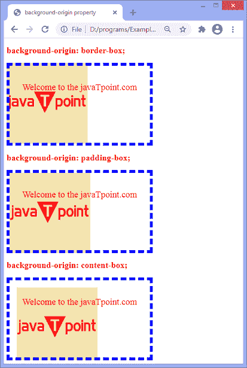

# CSS 背景-原始属性

> 原文:[https://www.javatpoint.com/css-background-origin-property](https://www.javatpoint.com/css-background-origin-property)

这个 CSS 属性帮助我们调整网页的背景图像。它指定背景位置区域，即背景图像的原点。当**背景-附件**的值设置为**固定**时，此 [CSS](https://www.javatpoint.com/css-tutorial) 属性将不起作用。

**背景-原点**属性类似于 [**背景-剪辑**属性](https://www.javatpoint.com/css-background-clip)，但它调整背景大小而不是剪辑背景。默认情况下，元素的原点是屏幕的左上角。

如果元素有多个背景图像，那么我们可以为每个背景图像指定不同的**背景原点**属性的值，用逗号分隔。每个图像都将与**背景来源**属性的相应值相匹配。

### 句法

```

background-origin: padding-box | border-box | content-box | initial | inherit;

```

该属性的值列表如下。

| 价值观念 | 描述 |
| **填充盒** | 它是相对于填充框定位背景的默认值。背景从填充边缘的左上角开始。 |
| **边框框** | 它相对于边框来定位背景。背景从边框的左上角开始。 |
| **内容框** | 它相对于内容框定位背景。背景从内容的左上角开始。 |
| **初始** | 它将属性设置为默认值。 |
| **继承** | 它从其父元素继承属性。 |

让我们通过一些例子来理解这个特性。

### 示例 1

在本例中，有三个带有背景图像的 div 元素。这里，我们使用的是**背景-原点**属性的 [**填充框**](https://www.javatpoint.com/css-padding)[边框框](https://www.javatpoint.com/css-border)和 **[内容框](https://www.javatpoint.com/css-content-property)** 值。

```

<!DOCTYPE html>
<html>
<head>
<title> background-origin property </title>
<style>
div{
padding: 20px;
width: 350px;
height: 175px;
background-image:  url('jtp.png');
background-repeat: no-repeat;
border: 8px dashed blue;
color: red;
font-size: 25px;
text-align: center;
}
#border{
background-origin: border-box;
}
#padding{
background-origin: padding-box;
}
#content{
background-origin: content-box;
}
h2{
color: red;
}
</style>
</head>

<body>
<h2> background-origin: border-box; </h2>
<div id = "border">
<p>
Welcome to the javaTpoint.com
</p>
</div>
<h2> background-origin: padding-box; </h2>
<div id = "padding">
<p>
Welcome to the javaTpoint.com
</p>
</div>
<h2> background-origin: content-box; </h2>
<div id = "content">
<p>
Welcome to the javaTpoint.com
</p>
</div>
</body>
</html>

```

[Test it Now](https://www.javatpoint.com/oprweb/test.jsp?filename=css-background-origin-property1)

**输出**



在下一个例子中，我们将看到当元素有两个背景图像时，如何指定**背景-原点**属性。

### 示例 2

在这个例子中，我们使用两个背景图像作为 div 元素。这里，有四个 div 元素，我们在其上应用**背景-原点**属性。

```

<!DOCTYPE html>
<html>

<head>
<title>background-origin property</title>
<style>
div{
padding: 20px;
width: 350px;
height: 175px;
background-image:  url('jtp.png'), url('lion.png');
background-repeat: no-repeat;
border: 8px dashed blue;
color: red;
font-size: 25px;
text-align: center;
}

#div1{
background-origin: border-box, content-box;
}
#div2{
background-origin: padding-box, border-box;
}
#div3{
background-origin: content-box, content-box;
}
#div4{
background-origin: content-box, padding-box;
}

h2{
color: red;
}
</style>
</head>

<body>
<h2> background-origin: border-box, content-box; </h2>
<div id = "div1">
<p>
Welcome to the javaTpoint.com
</p>
</div>
<h2> background-origin: padding-box, border-box; </h2>
<div id = "div2">
<p>
Welcome to the javaTpoint.com
</p>
</div>
<h2> background-origin: content-box, content-box; </h2>
<div id = "div3">
<p>
Welcome to the javaTpoint.com
</p>
</div>
<h2> background-origin: content-box, padding-box; </h2>
<div id = "div4">
<p>
Welcome to the javaTpoint.com
</p>
</div>
</body>

</html>

```

[Test it Now](https://www.javatpoint.com/oprweb/test.jsp?filename=css-background-origin-property2)

**输出**

### 示例 3

在这个例子中，我们使用**初始**和**继承**背景-原点**属性的**值。

```

<!DOCTYPE html>
<html>

<head>
<title>background-origin property</title>
<style>
div{
padding: 20px;
width: 350px;
height: 175px;
background-image:  url('jtp.png');
background-repeat: no-repeat;
border: 8px dashed blue;
color: red;
font-size: 25px;
text-align: center;
}

#div1{
background-origin: initial;
}
#div2{
background-origin: inherit;
}
h2{
color: red;
}
</style>
</head>

<body>
<h2> background-origin: initial; </h2>
<div id = "div1">
<p>
Welcome to the javaTpoint.com
</p>
</div>
<h2> background-origin: inherit; </h2>
<div id = "div2">
<p>
Welcome to the javaTpoint.com
</p>
</div>
</body>

</html>

```

[Test it Now](https://www.javatpoint.com/oprweb/test.jsp?filename=css-background-origin-property3)

**输出**


* * *